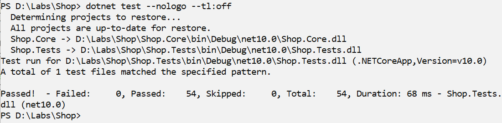
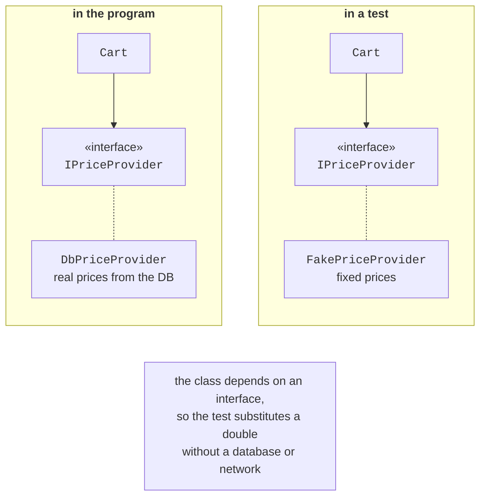
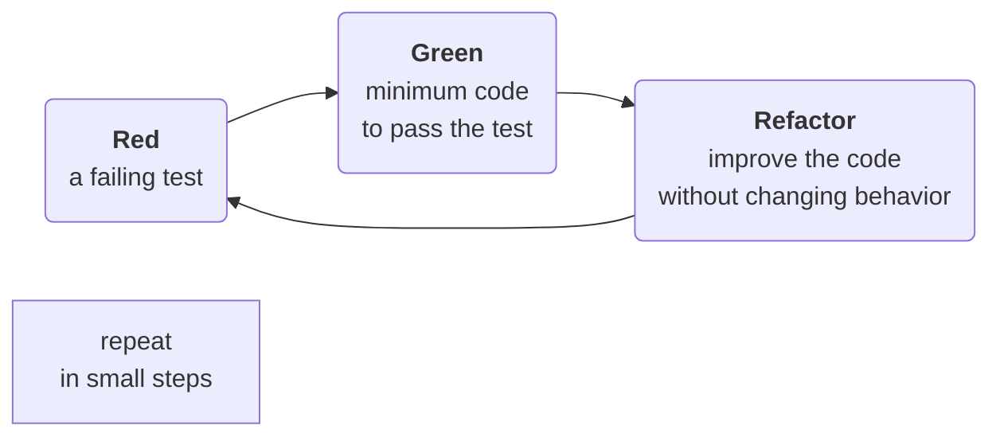

# Running tests, isolation, TDD, and coverage

## Running tests

In Visual Studio, tests are run from the **Test Explorer** window (*Test → Test Explorer*, **Ctrl+E, T**): *Run All* executes all tests, and the tree groups them by project, class, and method (Fig. 18.5). For a failed test, the details pane shows the assertion message and the call stack. A test can be debugged (*Debug*) with breakpoints, you can rerun only the failed tests (*Run Failed Tests*), and you can filter by name.


Figure 18.5. Results in the Test Explorer window {.caption}

From the command line, tests are run with `dotnet test` (Fig. 18.6). The command builds the solution, runs the tests, and prints a summary; messages are printed for failed tests. The `--filter "FullyQualifiedName~Cart"` parameter runs only the tests whose full name contains `Cart`. The message of a failed MSTest 4 assertion contains the expected and actual values and the expressions:

```
  Failed Add_Wrong_Fails [401 ms]
  Error Message:
   Assert.AreEqual failed. Expected:<6>. Actual:<5>.
   'expected' expression: '6', 'actual' expression:
   'calculator.Add(2, 3)'.
Failed!  - Failed:     1, Passed:     7, Skipped:     0,
Total:     8, Duration: 415 ms - Shop.Tests.dll (net10.0)
```



Figure 18.6. Running tests from the command line {.caption}

In .NET 10, `dotnet test` can work with two test platforms: the classic VSTest (the default) and the new Microsoft.Testing.Platform, which is enabled in the `global.json` file. This difference does not matter for writing tests.

## Isolating dependencies

A unit test should not access a database, the network, the file system, or the current time: such tests are slow, depend on the environment, and give different results. That is why a class receives its dependencies through interfaces (DIP, Topic 17), and in a test they are replaced with **test doubles** (Fig. 18.7):

- a **stub** returns fixed values;
- a **fake** has a simplified working implementation, for example, a dictionary instead of a database;
- a **mock** also records calls so that the test can check whether and how they were made.



Figure 18.7. Replacing a dependency with a test double {.caption}

In this course, doubles are written manually as small classes that implement the interface (Example 2). Large projects use mocking libraries (NSubstitute, Moq) that create doubles automatically.

The current time is also a dependency: a test that uses `DateTime.Now` gives different results on different days. The `TimeProvider` class (.NET 8) abstracts time: the program passes `TimeProvider.System`, and a test passes a `FakeTimeProvider` from the `Microsoft.Extensions.TimeProvider.Testing` package, whose time is set and advanced with the `Advance` method (Example 2 of the lab assignment).

## Test-driven development

**Test-driven development** (TDD) is an approach in which a test is written **before** the code. Work proceeds in short “red – green – refactor” cycles (Fig. 18.8):

1. **red**: write a small test for the next requirement; it fails (or does not compile);
2. **green**: write the minimum code sufficient for all tests to pass;
3. **refactor**: improve the code (remove duplication, give clear names) without changing its behavior; the tests confirm that nothing is broken.



Figure 18.8. The test-driven development cycle {.caption}

TDD forces you to think through behavior before implementation and produces a complete set of tests and a simple design: code that is hard to test is usually poorly designed. Example 3 shows the sequence of TDD steps.

## Code coverage

**Code coverage** is the share of lines or branches of code executed during the tests. Visual Studio shows coverage with the *Test → Analyze Code Coverage for All Tests* command (Fig. 18.9), and from the command line it is collected with the `dotnet test --collect "Code Coverage"` parameter.


Figure 18.9. Code coverage results {.caption}

Coverage shows **untested** code but not the quality of the tests: a test without assertions also “covers” lines. That is why 100% is not the goal; what matters is that business rules, boundary values, and error handling are checked.
