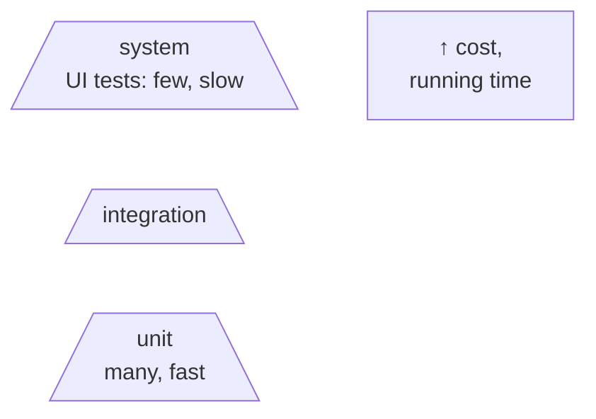
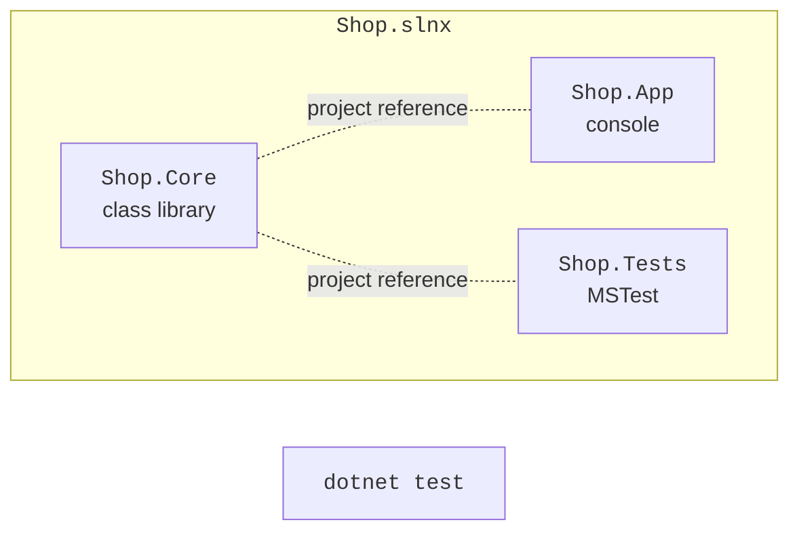
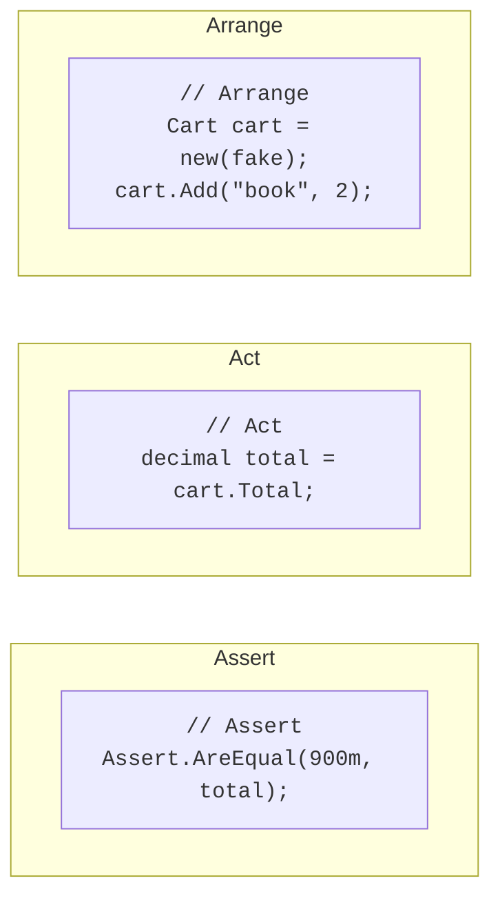

# Tests and MSTest

## Why tests are needed

Checking a program manually after every change is slow and unreliable: it is easy to miss a case that used to work but broke after the change (a **regression**). An **automated test** is code that calls program code with known input data and checks the result. A test suite runs in seconds after every change and immediately shows what exactly broke.

There are several levels of testing:

- **unit** tests check an individual method or class in isolation from the database, files, and network;
- **integration** tests check the interaction of several components, for example, a service and a database;
- **system** (end-to-end, UI) tests check the whole application from the user’s point of view.

There should be the most unit tests: they are fast, cheap, and point precisely to the error (the **testing pyramid**, Fig. 18.1).



Figure 18.1. The testing pyramid {.caption}

Good unit tests follow the **FIRST** principles: they are fast (*Fast*), independent of each other (*Independent*), repeatable with the same result (*Repeatable*), self-validating, that is, the result is “passed/failed” without manual analysis (*Self-validating*), and written in a timely manner, together with the code (*Timely*).

## Frameworks and solution structure

Three unit testing frameworks are common for .NET: **MSTest** (developed by Microsoft, the default Visual Studio template), **xUnit**, and **NUnit**. They have the same capabilities and differ mostly in the names of their attributes (Table 18.1). This course uses MSTest.

Table 18.1. Attributes of testing frameworks {.caption}

| **Purpose** | **MSTest** | **xUnit** | **NUnit** |
| --- | --- | --- | --- |
| test class | `[TestClass]` | – | `[TestFixture]` |
| test | `[TestMethod]` | `[Fact]` | `[Test]` |
| parameterized test | `[DataRow]` | `[Theory]`, `[InlineData]` | `[TestCase]` |
| before each test | `[TestInitialize]` | constructor | `[SetUp]` |

Tests are placed in a **separate test project** that references the project with the code. That is why the code being tested is moved into a **class library**, and the console application only uses it (Fig. 18.2). The commands for creating such a solution (Topic 8):

```
dotnet new sln -n Shop
dotnet new classlib -n Shop.Core
dotnet new mstest -n Shop.Tests
dotnet sln add Shop.Core Shop.Tests
dotnet add Shop.Tests reference Shop.Core
dotnet test
```



Figure 18.2. A solution with a class library and a test project {.caption}

In Visual Studio, a test project is added through *Add → New Project* with the *MSTest Test Project* template (Fig. 18.3). The template adds the `MSTest` NuGet package (version 4.x in .NET 10) and an `MSTestSettings.cs` file that enables parallel test execution.


Figure 18.3. Creating a test project {.caption}

## The first test in MSTest

A test class is marked with the `[TestClass]` attribute, and each test is a public parameterless method with the `[TestMethod]` attribute. A test consists of three parts, the **Arrange–Act–Assert** pattern (Fig. 18.4):

- **Arrange**: create objects and input data;
- **Act**: call the method under test;
- **Assert**: compare the result with the expected one.



Figure 18.4. The Arrange–Act–Assert test structure {.caption}

The name of a test describes what is being checked, following the scheme “method\_scenario\_expected result,” for example, `Divide_ByZero_Throws`. Then, from the name of a failed test, it is clear which behavior is broken. One test checks one behavior.

### Assertions

The `Assert` class contains checking methods; if a condition is not met, the test fails with a message (Table 18.2).

Table 18.2. The main MSTest assertions {.caption}

| **Assertion** | **Checks** |
| --- | --- |
| `Assert.AreEqual(expected, actual)` | equality (the expected value comes first!) |
| `Assert.AreEqual(0.333, x, delta: 0.001)` | equality of `double` values with a tolerance |
| `Assert.IsTrue(c)`, `IsFalse`, `IsNull` | a logical condition, `null` |
| `Assert.ThrowsExactly<T>(() => …)` | that an exception of exactly type `T` is thrown |
| `Assert.HasCount(n, list)`, `IsEmpty` | the number of elements in a collection |
| `CollectionAssert.AreEqual`, `Contains` | collections element by element, whether an element is present |
| `StringAssert.Contains`, `StartsWith` | the contents of a string |

Floating-point numbers are compared with a tolerance because calculations with `double` have errors (Topic 2). `ThrowsExactly` returns the exception, so you can additionally check its message. The `[ExpectedException]` attribute of older MSTest versions was removed in version 4.

### Parameterized tests

To avoid copying a test for each data set, the method takes parameters, and `[DataRow]` attributes specify the values. Each row is executed and displayed as a separate test. Attribute values must be constants, so a `decimal` is passed as a `double` and converted in the test. For complex data (objects, collections), `[DynamicData]` is used with a property or method that returns sets of arguments.

Test data is chosen using **equivalence classes** and **boundary values**: values for which the program behaves the same way form a class, and one value is taken from each class, as well as values at the boundaries of the classes and next to them. For a discount “from 1000 UAH,” these are 999.99, 1000, and 1000.01; for a product quantity, 0, 1, and −1; for conversion to Roman numerals, 0, 1, 3999, and 4000.
