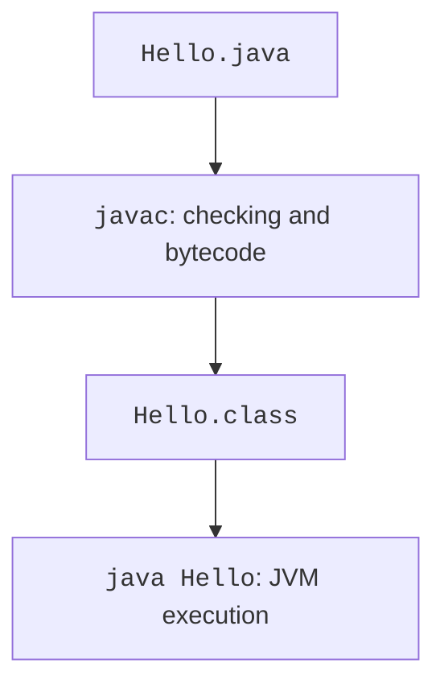

# Compilation, execution, and program structure

## Compiling and running in a terminal

Create a directory named `hello` and a file named `Hello.java` inside it. Your text editor must save UTF-8 and must not add a hidden `.txt` extension. For a public class, the filename must match the class name, including case.

### Example 1. Greeting and arguments

```java
public class Hello {
    public static void main(String[] args) {
        String name = args.length == 0 ? "student" : args[0];
        System.out.println("Hello, " + name + "!");
        System.out.println("Arguments: " + args.length);
    }
}
```

```powershell
javac -encoding UTF-8 Hello.java
java Hello Olena
```

Expected output:

```
Hello, Olena!
Arguments: 1
```

The `javac` command creates `Hello.class`. To run it, specify the class name without the `.class` extension. The directory containing the class file must be accessible through the classpath. You can explicitly specify the current directory:

```powershell
java -cp . Hello Olena
```



Figure 1.3. Stages of compiling and running a class {.caption}

The command `java Hello.java Olena` runs the source file. It still compiles internally during launch but does not require a separate preceding `javac` invocation. This mode is convenient for short examples; it does not turn the language into an “untyped script.”

Do not confuse JVM arguments, the program name, and the program's own arguments. JVM options go before the class name or `-jar`. Words after the class name are passed to `args`. Enclose an argument containing a space in quotes:

```powershell
java Hello "Olena Kovalenko"
```

Here the `args` array contains one element. Quoting rules differ between shells; specify the shell and exact command in your report. Start with ASCII arguments and check Ukrainian output separately.

## Structure of a regular program

`public class Hello` declares a class. The class body contains the `main` method. `public` allows access, `static` marks a class method, and `void` means there is no return value. The `String[] args` parameter is an array of strings. We will study classes in detail starting in Topic 5; for now, this skeleton lets us run programs.

Braces mark block boundaries. A semicolon terminates a statement, and indentation helps readers see the structure. Case matters: `System` and `system` are different identifiers. Class names usually start with an uppercase letter; method and variable names start with a lowercase letter.

A `//` comment continues to the end of the line. A block comment goes between `/*` and `*/`; these comments cannot be nested. A comment should explain why a decision was made rather than simply restating an instruction.

A literal in double quotes is a string. `println` prints and adds a newline; `print` does not add one. Concatenation with `+` depends on operand types: `"Sum: " + 2 + 3` produces text containing the digits `23`, while `"Sum: " + (2 + 3)` produces text containing the number `5`. Here parentheses change how the calculation is grouped.

### Example 2. Compact source file

Since Java 25, compact source files and instance `main` methods have been a finalized feature. They let a teaching program start without an explicit class declaration. Save this separate example as `Welcome.java`:

```java
void main() {
    IO.println("Hello from a compact file!");
    IO.println("JDK " + Runtime.version().feature());
}
```

```powershell
java Welcome.java
```

Output on the target JDK:

```
Hello from a compact file!
JDK 27
```

The compiler still creates an implicit class. A compact file automatically imports accessible public types from `java.base`; in a regular file, import rules remain explicit. `java.lang.IO` is available for simple line-based input and output. Do not mix `IO.readln` and `Scanner` on the same input stream: both may buffer bytes.

Feature specification: <https://openjdk.org/jeps/512>. The compact format is convenient for a first attempt, but the course's main multi-file examples use explicit classes, packages, and a regular `main`. Do not call a finalized feature a preview or add `--enable-preview` unnecessarily.
