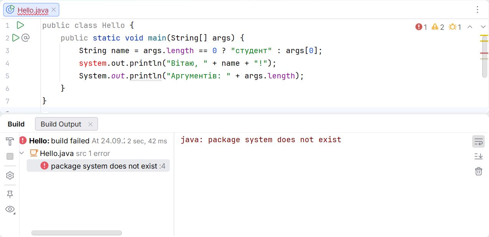

# Git and submitting your work

## Errors and how to check them

Compilation errors occur before execution. For example, `system.out.println` refers to an undeclared name. Read the compiler's first message and the line number; subsequent messages may result from the first unclosed brace or missing semicolon.



Figure 1.9. Compilation error message {.caption}

A runtime error occurs after successful compilation. A logic error may not cause an exception at all: the program prints a number, but it does not match the problem's requirements. Therefore, “it ran” does not mean “it is correct.”

| **Observation** | **What to check** |
| --- | --- |
| `java` not found | Full path, PATH, and a new terminal |
| Main class not found | Directory, classpath, package, and class name |
| UnsupportedClassVersionError | Compiler version and actual JVM version |
| Incorrect characters | File UTF-8 encoding, stream encoding, and font |
| Old output | Run configuration and recompilation |

To check encoding, you can explicitly specify JVM options in PowerShell quotes:

```powershell
java '-Dstdout.encoding=UTF-8' Hello Olena
```

This configures the output stream but does not fix a source file already saved with incorrect encoding. The compiler still uses `javac -encoding UTF-8`. Each layer has its own responsibility: file, JVM, terminal, and font.

Record the main class name, JDK version, compilation and run commands, sample arguments, and expected output in the README. Another student should obtain the same substantive result without copying your `out` folder or using personal absolute paths.

## Sharing a completed example

Check reproducibility outside your usual IDE window. Create a separate directory for compilation output:

```powershell
javac -encoding UTF-8 -d out Hello.java
java -cp out Hello Olena
jar --create --file hello.jar --main-class Hello -C out .
java -jar hello.jar Olena
```

A JAR stores bytecode, and the main class attribute in the manifest enables launching with `-jar`. The archive does not contain the entire JDK and does not guarantee a compatible JVM on someone else's computer. Explicitly state the JDK 27 requirement for this example. Projects with external libraries need separate dependency management.

Switch to a different working directory and run the JAR using its full path. The greeting output should match. If the program works only from the IDE folder, it probably has an implicit dependency on a relative path or an external file. Document or remove that dependency.

The submission package contains source files, `.gitignore`, a README, and local history. Generated classes can be recreated; they do not replace source code. In the README, distinguish commands from expected output: the line `Hello, Olena!` is not a shell command. You should also mention the normal exit code of 0.

Three cases are enough for the first acceptance test: no arguments, one name, and a name containing a space. For each, record the length of `args` and the expected line. These cases test the contract, not just one convenient demonstration. Later topics add invalid numeric input, EOF, and boundary values.

### Isolating the source of an error

Suppose the program works correctly in the IDE, but the terminal command cannot find the class. Start by checking the classpath, not the formula: does the file exist after compilation, does its name match, and is the `-cp` argument correct? Reinstalling the IDE is not a logical first step for this error.

If both the IDE and terminal print the same incorrect number, the cause is probably in the data or algorithm. Write down intermediate values and compare them with a manual calculation. Changing the JDK version will not fix a missing factor or incorrect length units.

If only decimal separators differ, check the formatting locale. If characters differ, check encoding. If the program reads the wrong file, check the working directory. This order makes diagnosis a process of testing hypotheses rather than a series of random changes.

A useful test log has four columns: command, input data, expected result, and actual result. For environment-dependent values, write down the checking rule: “major version 27,” not the author's arbitrary absolute path. After fixing an issue, repeat the specific case that previously failed.

Do not copy a screenshot of someone else's successful run as evidence that your program works. The source code, command, and result must refer to the same repository state. For presenting your work, it is helpful to give the short identifier of a commit that can be run again.
