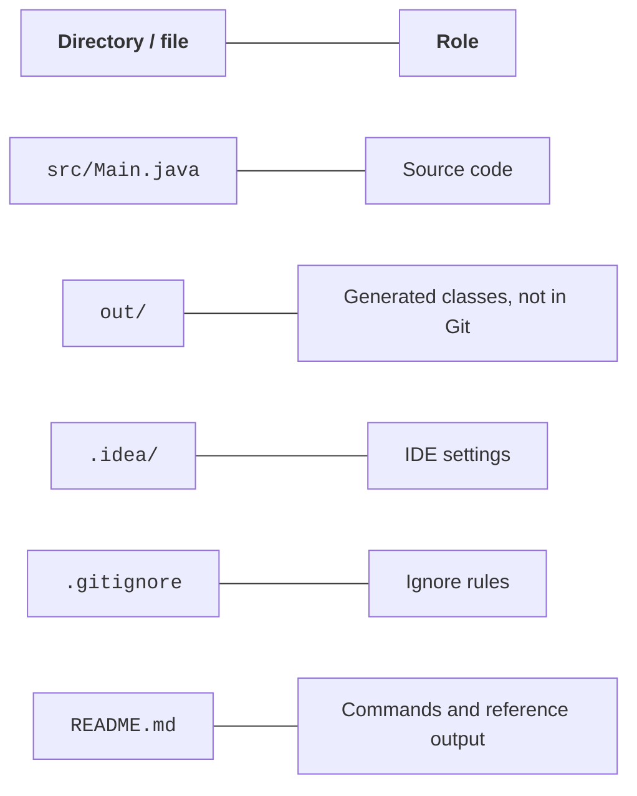
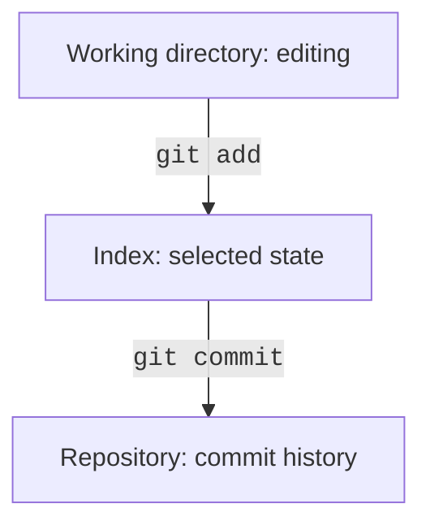

# IntelliJ IDEA, JShell, and errors

## IntelliJ IDEA: project and configuration

IntelliJ IDEA has a unified distribution with free basic Java features; some advanced features require an appropriate license. Current terms and downloads: <https://www.jetbrains.com/idea/download/>. Installation guide: <https://www.jetbrains.com/help/idea/installation-guide.html>.

Download the IDE from an official source. Choose the correct OS and architecture and check the requirements of the current version. A basic Java project is enough for the lab; you do not need to configure an external database or frameworks at this stage.

In *New Project*, set the name to `Hello`, the language to *Java*, the build system to *IntelliJ*, and the JDK to 27. The wizard may offer to download a JDK; choosing a *Project SDK* does not automatically change `JAVA_HOME` in every external terminal.

::: info Screenshot
IntelliJ New Project: Java, IntelliJ build system, SDK27, Hello.
:::

Figure 1.4. Creating a Java project with JDK 27 {.caption}

Open `src/Main.java`. The green button next to `main` runs that class. The *Run* window displays the output and exit code. If an old class runs, check the selected configuration instead of changing code at random.



Figure 1.5. Source files, settings, and compilation output {.caption}

`src` contains source code, and `out` contains generated classes in a project using the IntelliJ build system. `.idea` contains IDE settings. Maven has a different structure: `src/main/java` and `target`. Do not rename directories by analogy with other systems without changing their configuration.

Set arguments in the *Program arguments* field under *Run → Edit Configurations…*. JVM options have their own *VM options* field. The working directory determines the base for relative paths; it does not necessarily match the directory containing a particular `Main.java` file.

::: info Screenshot
Application configuration: Main class, Program arguments Olena, JDK27, working directory.
:::

Figure 1.6. Arguments and working directory for a run {.caption}

### Example 3. Environment information

```java
public class EnvironmentInfo {
    public static void main(String[] args) {
        System.out.println("Java: " + Runtime.version());
        System.out.println("Vendor: "
                + System.getProperty("java.vendor"));
        System.out.println("OS: "
                + System.getProperty("os.name"));
        System.out.println("Working directory: "
                + System.getProperty("user.dir"));
    }
}
```

The build number, OS, and directory depend on the run. The expected invariant is major version 27. Compare the IDE and terminal: different working directories explain many file lookup errors you will encounter later. Do not publish screenshots containing personal paths.

## JShell as an exploration tool

The `jshell` command opens an interactive environment. You can evaluate an expression, declare a variable, inspect its value, and test an assumption. A session is useful for a short experiment but does not replace a saved, reproducible project.

```
jshell> int count = 7;
count ==> 7
jshell> count * count
$2 ==> 49
jshell> Math.sqrt(2)
$3 ==> 1.4142135623730951
jshell> /vars
jshell> /exit
```

Temporary variable numbers depend on the preceding session. Record the expression you checked and your conclusion in the report, rather than treating `$2` as a permanent API identifier. The `/help` command explains the available shell commands.

### Example 4. Room area

```java
import java.util.Locale;

public class Room {
    public static void main(String[] args) {
        double length = 5.2;
        double width = 3.5;
        double area = length * width;
        double perimeter = 2 * (length + width);
        System.out.printf(Locale.US, "Area: %.2f m2%n", area);
        System.out.printf(Locale.US, "Perimeter: %.2f m%n",
                perimeter);
    }
}
```

Output: `Area: 18.20 m2`, then `Perimeter: 17.40 m`. All lengths are given in meters. An explicit locale makes the decimal point reproducible. Two decimal places in the output do not change the internal `double` value. The dimensions in this example are constant input data; the next topic adds input and boundary checks.

## Local Git repository

Git stores a history of coherent changes. It is not a backup of the entire disk and does not check formulas for correctness. Each commit should contain a logically complete step that you can explain.

Official guide: <https://git-scm.com/book/en/v2>. After installing, check `git --version`. Set the author's name and address according to course rules; local configuration for the specific repository is enough for a learning exercise.

```powershell
git init -b main
git config user.name "Course Student"
git config user.email "student@example.test"
```

A `.gitignore` file for a simple IntelliJ project:

```
out/
*.class
.idea/workspace.xml
```

This is not a universal template for all Java projects. In the Maven topic, you need to add `target/`; for Gradle, add `.gradle/` and `build/`. Build system wrapper files, on the other hand, are usually stored in the repository. Do not commit passwords, tokens, or personal files, even to a private repository.



Figure 1.7. Git's three local areas {.caption}

```powershell
git status
git add src .gitignore
git diff --staged
git commit -m "Add greeting program"
git log --oneline
```

`git add` copies the selected state of a file into the index. If the file changes afterward, the commit contains the staged version, not automatically the latest one. Review `git diff` and `git diff --staged` before committing.

After the first working version, add a second small step, such as a name argument, and document how to run it in the README in a third commit. Do not create three commits with arbitrary spaces just to meet a count. The history should show the program's development.

::: info Screenshot
IntelliJ Git Log with three meaningful commits and changed source files; no private identity.
:::

Figure 1.8. Meaningful history of a local project {.caption}

In the *Commit* window, select files and write a message. The *Git Log* view lets you compare states. `git restore` discards uncommitted changes to a selected file: inspect the difference first. In coursework, do not use directory cleanup commands without understanding their scope.

A remote repository is a separate copy of the history. `push` transfers commits; `clone` creates a local copy. Local history is enough for the course; publishing on GitHub is a separate step governed by the instructor's rules. Changing repository visibility does not remove secrets from history that has already been published.
