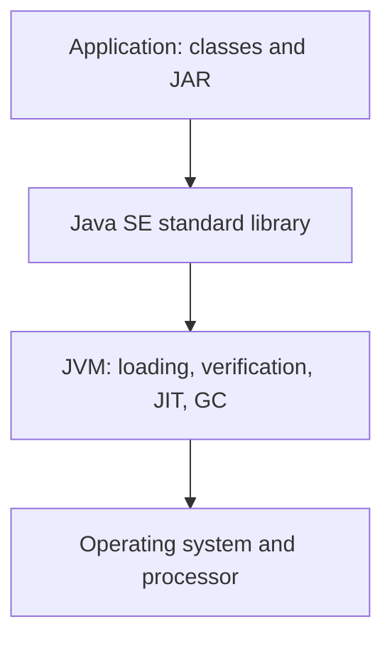

# The Java platform and JDK

## Language and platform

**Java** is a programming language and the name of an execution platform. A file containing program text is not yet a running process. The compiler checks the text and produces bytecode, and the virtual machine loads classes and executes their instructions. This separation allows programs to move between systems with a compatible JVM. However, file access, console encoding, and native libraries remain environment-dependent.

Official learning portal: <https://dev.java/learn/>. Platform documentation: <https://docs.oracle.com/en/java/>. Use the documentation for the version on which you run your code. An arbitrary Java 8 example may be correct but fail to demonstrate modern language features.

Java was introduced in 1995; Java 1.0 was released in 1996. Important milestones include generics, lambda expressions, modules, records, and pattern matching. Learning the language does not mean memorizing every new feature at once: first you need precise concepts of types, values, and calls. We will cover new constructs when they help solve a specific problem.

The course uses **JDK 27**, released on September 15, 2026. Under common vendor policies, this is not an LTS release. LTS refers to a long-term support policy for a particular distribution, not a different language syntax. Check the support and licensing terms of your chosen vendor.

Release development page: <https://openjdk.org/projects/jdk/27/>. Current OpenJDK archive: <https://jdk.java.net/27/>. Release notes: <https://www.oracle.com/java/technologies/javase/27-relnote-issues.html>.

## JDK, JVM, and the class library

The **JVM** executes bytecode. The **JDK** includes the JVM, standard library, and developer tools. Historically, **JRE** referred to a runtime environment without a compiler. You need a JDK for the lab assignments: a separate old JRE installation cannot replace `javac`.



Figure 1.1. Platform components and the operating system boundary {.caption}

The class loader locates bytecode, the verifier checks its structural validity, and the runtime manages memory and threads. HotSpot can interpret code and compile frequently executed sections into machine instructions. **JIT** is not a separate command that students must run manually.

The garbage collector reclaims memory occupied by objects the program no longer needs. It does not replace closing a file or a database connection. The time when an object is reclaimed is not a way to schedule program actions. We will return to this distinction in practice when studying exceptions.

The JDK includes the following tools:

| **Command** | **Purpose** |
| --- | --- |
| `java` | Run a program or source code file |
| `javac` | Compile source files |
| `jshell` | Experiment interactively with expressions |
| `jar` | Create and inspect class archives |
| `javadoc` | Document a public programming interface |
| `jlink` | Build a customized runtime image |

Java SE contains the core platform. JavaFX is distributed separately; having a JDK does not guarantee its modules are available. Jakarta EE and Android have their own environments and constraints. A program for one platform does not become a program for another simply because their syntax is similar.

## Installing the JDK and checking the path

The Windows teaching environment uses the official OpenJDK 27 x64 archive. Extract it to a permanent directory. Do not copy just `java.exe` out of the archive: it needs the other distribution files. For ARM64, Linux, and macOS, choose a build for your architecture and check support on the vendor's website.

An installer and an archive are different ways of distributing the JDK. Not every distribution offers the same formats. Do not enter an unverified WinGet package identifier or assume that `openjdk-27-jdk` is already in every Linux distribution's repository. Check package availability in your selected source.

After extracting the archive, run the commands using their full paths:

```powershell
& 'C:/Tools/jdk-27/bin/java.exe' --version
& 'C:/Tools/jdk-27/bin/javac.exe' --version
```

The path `C:/Tools/jdk-27` is an example: substitute your actual path. The commands should report version 27. Record the full build number and vendor in your report, not just the word Java. The same language version does not imply the same license or the same additional distribution components.

::: info Screenshot
PowerShell: absolute java and javac paths, both version27; hide user home.
:::

Figure 1.2. Tool versions from the selected JDK {.caption}

`JAVA_HOME` points to the JDK root, without a trailing `bin`. `PATH` determines where the shell looks for a command. You can temporarily set these for one terminal:

```powershell
$env:JAVA_HOME = 'C:/Tools/jdk-27'
$env:PATH = "$env:JAVA_HOME/bin;" + $env:PATH
Get-Command java
java --version
javac --version
```

This change affects only the current process and its children. For a permanent setting, use the system environment variables dialog, then open a new terminal. In PowerShell, `where` may be an alias; use `Get-Command java` or `where.exe java` to locate the executable.

If several JDKs are installed, check all three places: the terminal, the IDE's **Project SDK**, and the build system's JVM. In Topic 13, Gradle will run on a compatible JDK 25, while course code will compile and run on JDK 27. Do not conflate build process settings with the target toolchain.
