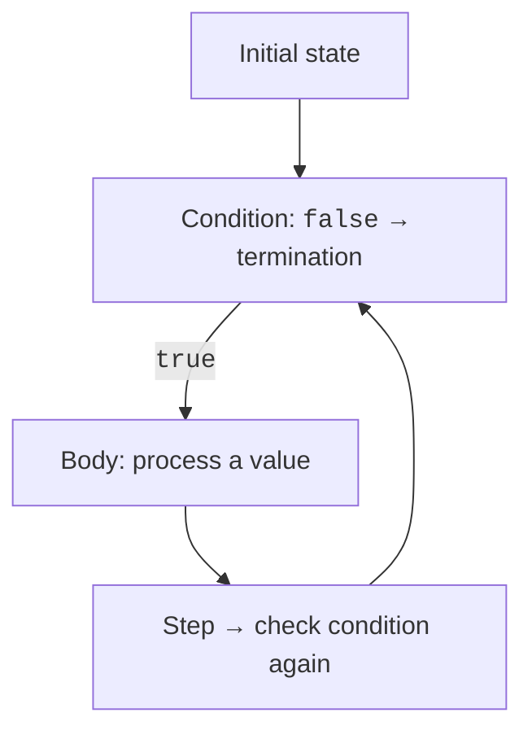

# Loops and invariants

## Loops and computation state

`while` checks the condition before the body. `do-while` executes the body at least once. `for` combines the initial state, condition, and counter update. The construct you choose should emphasize the contract: `for` is convenient for a known range, while `while` suits an unknown number of lines until EOF.



Figure 2.4. Loop state and checking termination {.caption}

`break` exits a loop; `continue` skips the rest of the current iteration. In `for`, the update step executes after `continue`; in `while`, check that a necessary state change is not skipped. A label allows exiting an outer loop, but too many labels make code harder to read.

```java
public class SearchPair {
    public static void main(String[] args) {
        outer:
        for (int a = 1; a <= 5; a++) {
            for (int b = 1; b <= 5; b++) {
                if (a * a + b * b == 25) {
                    System.out.println(a + ", " + b);
                    break outer;
                }
            }
        }
    }
}
```

The first pair is `3, 4`. Exiting only the inner loop would allow the outer loop to continue and print other pairs. Check both the condition's formula and exactly which loop terminates.

### Example 3. Making change

For the teaching denominations 100, 50, 20, and 10 and an amount divisible by 10, greedy decomposition gives the minimum number of banknotes. This statement does not automatically extend to an arbitrary set of denominations.

```java
import java.util.Scanner;

public class Change {
    public static void main(String[] args) {
        Scanner input = new Scanner(System.in);
        if (!input.hasNextInt()) {
            System.out.println("An integer is required");
            return;
        }
        int amount = input.nextInt();
        if (amount < 0 || amount > 100_000 || amount % 10 != 0) {
            System.out.println("Invalid amount");
            return;
        }
        int rest = amount;
        int hundreds = rest / 100;
        rest %= 100;
        int fifties = rest / 50;
        rest %= 50;
        int twenties = rest / 20;
        rest %= 20;
        int tens = rest / 10;
        int count = hundreds + fifties + twenties + tens;
        System.out.printf("100: %d; 50: %d; 20: %d; 10: %d%n",
                hundreds, fifties, twenties, tens);
        System.out.println("Banknotes: " + count);
    }
}
```

For 280, the counts of the respective denominations are 2, 1, 1, and 1, totaling 5 banknotes. Checking that they reconstruct the amount is more important than the table's appearance. For zero, all counts must be zero; input 15 is rejected.

### Example 4. Table of values

Calculate `y = x*x - 2*x + 1` for integer x from −2 to 2. The bounds are integers, so the loop does not accumulate error from repeatedly adding a decimal step. Formatting aligns numbers to the right of each column.

```java
import java.util.Locale;

public class FunctionTable {
    public static void main(String[] args) {
        double total = 0;
        System.out.printf("%5s %10s%n", "x", "y");
        for (int x = -2; x <= 2; x++) {
            double y = (double) x * x - 2 * x + 1;
            total += y;
            System.out.printf(Locale.US, "%5d %10.2f%n", x, y);
        }
        System.out.printf(Locale.US, "Total: %.2f%n", total);
    }
}
```

The y values are 9, 4, 1, 0, and 1; the total is 15.00. `%n` uses the platform's newline, `%d` expects an integer, and `%.2f` expects a floating-point number with two decimal places. Field width is a minimum: a long value can widen the column. Output must not hide values just to maintain an attractive border.

## Invariants, boundaries, and test cases

An **invariant** is a statement about state that remains true between iterations. In the table, before each successive x, `total` contains the sum of rows already printed. If the current value is added twice, the rows will look correct, but the total invariant will be broken.

Loop termination requires measurable progress: a counter approaches a boundary, a remainder decreases, or each iteration consumes a new token. Checking invalid input without consuming it does not provide such progress. Numerical algorithms need an iteration limit even if they usually converge.

::: info Screenshot
Debug FunctionTable at x=0; show x,y,total and selected loop line.
:::

Figure 2.5. Counter and accumulated sum values {.caption}

A test table should contain a normal case, both boundaries of the valid range, values near those boundaries, invalid format, and EOF. For fractional numbers, add `NaN`, `Infinity`, a decimal comma, and a decimal point. Failure behavior is part of the contract too: does the program exit, repeat the prompt, or preserve its previous valid state?

Do not use random numbers as your only check. A random set may miss the most important boundary. First create small examples with manually computed results, then broaden the checks. When adding a new condition, explain which class of errors it rules out.
