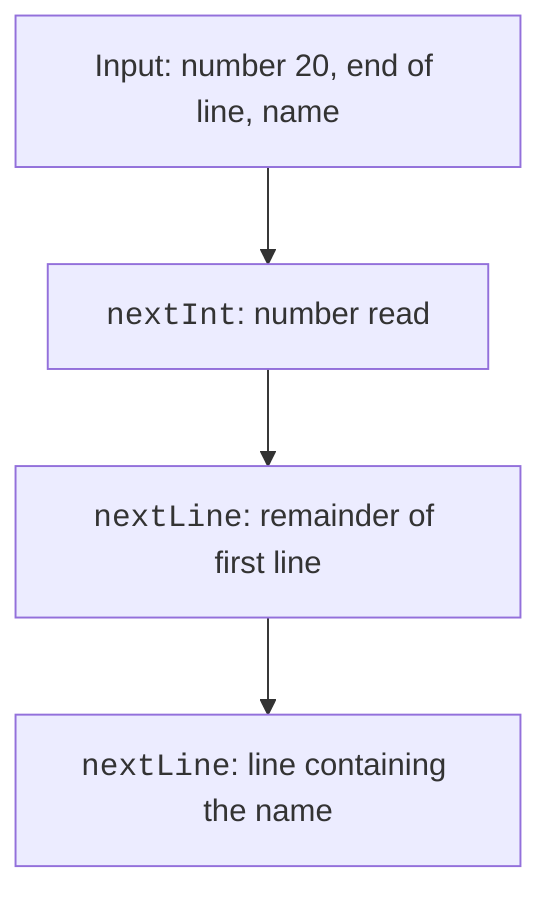

# Operations and console input

## Operations and logical conditions

The arithmetic operations `+`, `-`, `*`, `/`, and `%` depend on types. `7 / 2` yields `3`, while `7 / 2.0` yields `3.5`. The remainder `-7 % 3` is `-1`; `Math.floorMod(-7, 3)`, which yields `2`, is useful for normalizing a cyclic index.

The `++` and `--` operators change a value. Their prefix and postfix forms differ in the expression's value. Do not combine several changes to the same variable in one complex expression: split it into steps. This makes checking easier and reduces reliance on memorized precedence rules.

A comparison produces a `boolean`. The chain `0 <= x <= 10` is not valid Java code; write `x >= 0 && x <= 10`. The `&&` and `||` operators short-circuit: the second operand is evaluated only when needed.

```java
int divisor = 0;
boolean valid = divisor != 0 && 100 / divisor > 2;
```

No division occurs in this fragment. Replacing `&&` with `&` for boolean operands would force both parts to be evaluated. The bitwise operators `&`, `|`, `^`, `~`, `<<`, `>>`, and `>>>` on integers operate on bits, not conditions. `>>` preserves the sign; `>>>` fills the high-order bits with zeros.

The conditional operator `condition ? a : b` returns one of two values. It is useful for a short choice, but nested chains are often harder to read than an ordinary `if`. Do not confuse assignment `=` with equality testing `==`.

## Console input and locale

The main tool in this topic is `Scanner`. For numbers with a decimal point, set `Locale.US` so the contract does not depend on the Windows system language. Prose may use a Ukrainian decimal comma, but the machine input format must be unambiguous.

Scanner documentation: <https://docs.oracle.com/en/java/javase/26/docs/api/java.base/java/util/Scanner.html>. The described API was verified by running it on JDK 27.

By default, `Scanner` separates tokens with whitespace. `hasNextInt` checks the next token but does not consume an invalid one. Repeating the check without `next` leaves the loop stuck on the same text forever. EOF means the end of the stream, not an invalid number.

### Example 1. Reliable count input

```java
import java.util.Scanner;

public class ReadCount {
    public static void main(String[] args) {
        Scanner input = new Scanner(System.in, "UTF-8");
        while (true) {
            System.out.print("Count 1..100: ");
            if (!input.hasNext()) {
                System.out.println("End of input");
                return;
            }
            if (!input.hasNextInt()) {
                System.out.println("Not an integer: " + input.next());
                continue;
            }
            int count = input.nextInt();
            if (count < 1 || count > 100) {
                System.out.println("Out of range");
                continue;
            }
            System.out.println("Accepted: " + count);
            break;
        }
    }
}
```

For the tokens `bad 0 12`, the program rejects the text, then zero, then accepts 12. Each invalid token is consumed. For an empty stream, the program exits instead of repeating the prompt forever. In a simple CLI program, `System.in` belongs to the process; do not close it inside a helper method if other code still needs to read input afterward.


Figure 2.2. Rejecting invalid input in sequence {.caption}

`nextInt()` leaves the delimiter after the token, while `nextLine()` reads the rest of the current line. After a number with no other text, that remainder is often empty. Choose a consistent strategy: tokens for all input, or lines followed by parsing.



Figure 2.3. A numeric token and the remainder of the line {.caption}

```java
import java.util.Scanner;

public class ReadProfile {
    public static void main(String[] args) {
        Scanner input = new Scanner(System.in, "UTF-8");
        if (!input.hasNextInt()) return;
        int age = input.nextInt();
        if (!input.hasNextLine()) return;
        input.nextLine();
        if (!input.hasNextLine()) return;
        String name = input.nextLine();
        System.out.println(name + ": " + age);
    }
}
```

For two lines, `20` and `Olena Koval`, the expected result is `Olena Koval: 20`. The extra `nextLine()` intentionally consumes the remainder of the first line. If the contract allows the name after the number on the same line, you need a different algorithm, not a mechanical copy of this one.
