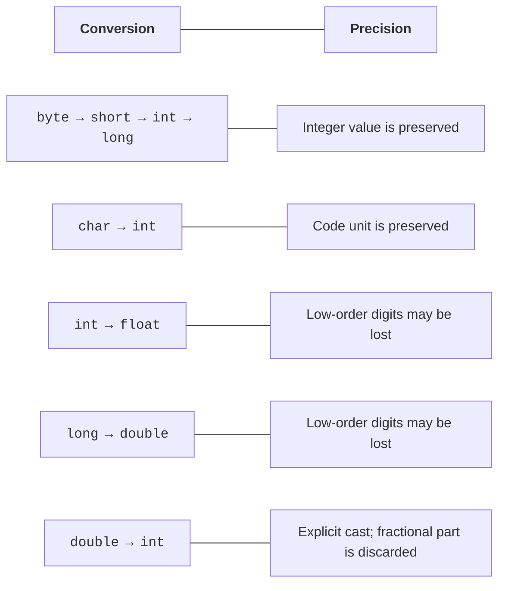

# Types, variables, and conversions

## Values and variable declarations

A variable has a type, a name, and a value. The type determines valid operations and how data is represented. In Java, a local variable's type does not change after declaration. Assigning a new value does not create a new type.

```java
int students = 24;
double distance = 12.5;
boolean finished = false;
char grade = 'A';
String title = "Lab assignment";
```

This is a method body fragment, not a standalone program. A local variable must be initialized before it is read. We will cover default values for fields and array elements separately; do not apply those rules to local variables. The compiler rejects reading a local `int` that has not been assigned a value on every possible path.

`final` prevents reassignment. For a reference, this does not automatically make the object immutable. `var` lets the compiler infer a local variable's type from its initializer. It is not a dynamic type or permission to assign any value later.

```java
final int MAX_ATTEMPTS = 5;
var count = 3;       // int
var ratio = 3.0;     // double
```

The declaration `var value = null` provides insufficient information for type inference. When first reading course examples, explicit types help explain the contract. Use `var` where the type is clear without looking for a distant declaration.

Official language basics: <https://dev.java/learn/language-basics/>. Java specifications: <https://docs.oracle.com/javase/specs/>.

## Primitive types and ranges

Java has eight primitive types. `String` is not one of them: it is a class. Integer type widths are defined by the language and do not depend on whether the OS is 32-bit.

| **Type** | **Size** | **Purpose / bounds** |
| --- | --- | --- |
| `byte` | 8 bits | −128 to 127 |
| `short` | 16 bits | −32768 to 32767 |
| `int` | 32 bits | −2147483648 to 2147483647 |
| `long` | 64 bits | integers with a large range |
| `float` | 32 bits | real numbers, approximately 6–7 significant digits |
| `double` | 64 bits | real numbers, approximately 15–16 significant digits |
| `char` | 16 bits | a UTF-16 code unit |
| `boolean` | logical type | only true or false |

For `boolean`, do not invent a language-guaranteed byte count for an object or array. For `char`, do not promise that every visible character fits in one value: an emoji often requires two code units. Topic 3 covers Unicode in more detail.

The literal `1_000_000` is easier to read than an uninterrupted series of digits. The suffix `L` specifies `long`, and `f` specifies `float`. The hexadecimal prefix is `0x`; the binary prefix is `0b`. A leading zero in an integer literal can denote octal notation; do not add zeros as decoration.

```java
long population = 8_000_000_000L;
int mask = 0b1010;
int color = 0xFF;
float factor = 1.5f;
double scientific = 2.5e3;
```

Wrapper classes `Integer`, `Long`, `Double`, and `Boolean` represent values as objects. A wrapper can be `null`; a primitive cannot. Automatically unboxing `null` causes an exception. Do not use `==` to compare wrapper values because caching may affect the result; prefer primitives in basic numeric algorithms.

## Conversions and overflow

Widening a type does not always preserve precision. Converting `int` to `long` preserves the value, but converting a large `long` to `double` can lose low-order digits. “Widening” describes a permitted type conversion, not a guarantee of an exact result.



Figure 2.1. Numeric conversions and possible loss of precision {.caption}

Narrowing requires an explicit cast. It is not a range check: `(byte) 130` yields `-126`. Converting `double` to `int` truncates the fractional part toward zero. Mathematical rounding has separate operations, such as `Math.round`.

```java
public class NumericLimits {
    public static void main(String[] args) {
        int side = 50_000;
        int wrong = side * side;
        long correct = (long) side * side;
        System.out.println(wrong);
        System.out.println(correct);
        System.out.println((int) -3.9);
        System.out.println(Math.round(-3.9));
    }
}
```

Output: `-1794967296`, `2500000000`, `-3`, `-4`. The cast must happen **before** multiplication. `long value = side * side` first multiplies two `int` values, so the wider variable does not fix the overflow. `Math.multiplyExact` provides checked arithmetic; it reports overflow with an exception.

`double` uses a binary representation. Decimal fractions such as 0.1 cannot always be represented exactly. Compare computed results using a tolerance defined by the problem, not an arbitrary number. Use `long` for whole kopiykas; decimal financial calculations with rounding rules require `BigDecimal`, which is covered later.

```java
public class Approximation {
    public static void main(String[] args) {
        double value = 0.1 + 0.2;
        double expected = 0.3;
        double tolerance = 1e-12;
        System.out.println(value == expected);
        System.out.println(Math.abs(value - expected) < tolerance);
        System.out.println(Double.isFinite(1.0 / 0.0));
    }
}
```

Output: `false`, `true`, `false`. Integer division by zero causes an exception, while `double` operations can produce infinity or `NaN`. Successfully parsing a string does not prove the number is finite. Physical quantities often require both `isFinite` and a domain range check.
