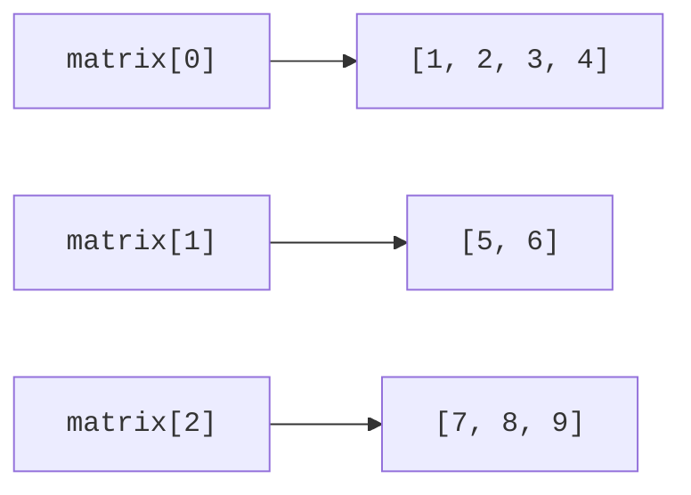

# Two-dimensional arrays and arguments

## Two-dimensional and jagged arrays

`int[][]` is an array of references to int arrays. Rows can have different lengths and can even be null. `new int[3][4]` creates a rectangular structure, while `new int[3][]` creates only an outer array containing three nulls. Each row must then be created separately before accessing its elements.

When traversing, use the current row's own length. The expression matrix[0].length does not guarantee the length of every other row and is unavailable for an empty outer array. A matrix algorithm must first check rectangularity if that is a precondition.



Figure 3.4. Rows of a two-dimensional array have their own lengths {.caption}

## Example 2. Rotating a matrix by 90 degrees

After clockwise rotation, an m by n matrix has n rows and m columns. The element source[row][col] moves to result[col][rows − 1 − row]. The new array shares no rows with the original, so later changes to the result do not change the source.

```java
import java.util.Arrays;

public class Main {
    static int[][] rotate(int[][] source) {
        if (source == null || source.length == 0
                || source[0] == null || source[0].length == 0) {
            throw new IllegalArgumentException("Empty matrix");
        }
        int rows = source.length;
        int cols = source[0].length;
        for (int[] row : source) {
            if (row == null || row.length != cols) {
                throw new IllegalArgumentException("Jagged matrix");
            }
        }
        int[][] result = new int[cols][rows];
        for (int row = 0; row < rows; row++) {
            for (int col = 0; col < cols; col++) {
                result[col][rows - 1 - row] = source[row][col];
            }
        }
        return result;
    }

    public static void main(String[] args) {
        int[][] source = {{1, 2, 3}, {4, 5, 6}};
        int[][] rotated = rotate(source);
        System.out.println(Arrays.deepToString(source));
        System.out.println(Arrays.deepToString(rotated));
        rotated[0][0] = 99;
        System.out.println(source[1][0]);
    }
}
```

```text
[[1, 2, 3], [4, 5, 6]]
[[4, 1], [5, 2], [6, 3]]
4
```

Matrices of size 1 by 1, 1 by n, and m by 1 are useful for checking indices: they quickly reveal confusion between rows and cols. Four successive rotations should restore the original contents. Compare nested arrays with Arrays.deepEquals, not equals.

## Command-line arguments

The main parameter `String[] args` contains arguments after the class or JAR name. The program's own name is not part of the array. Each element is a string; a number must be parsed, for example with Integer.parseInt. Check length before args[0], or launching without arguments will fail.

A console program can accept `--help`, a named option, and a compound value, such as `--marks "70;80;90"`. The shell processes the quotes, and the program receives one string containing separators. With no arguments, you can request the same data through Scanner. Do not duplicate calculations: both input paths should call the same methods.

Error messages belong on System.err; normal results belong on System.out. Document exit codes. For advanced course variants, we use 0 for success, 2 for input errors, and 1 for an unexpected execution failure. The next topic explains exception handling and centralized exit in detail.
