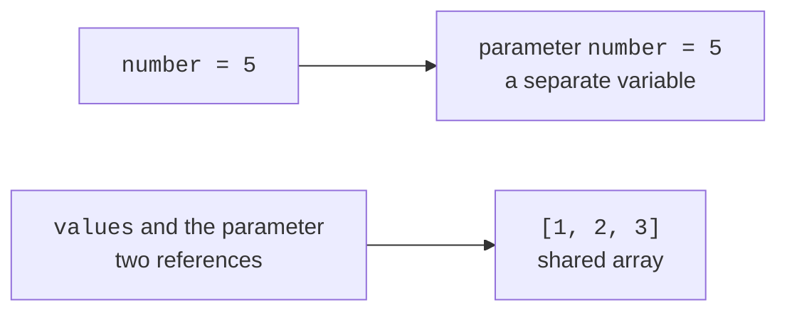

# Methods and parameters

## A method as a separate algorithm step

A program becomes complex long before it reaches thousands of lines: simply mixing input, validation, calculations, and printing in main is enough. A **method** separates an action with its own name, parameters, and result. For example, average computes the mean, while printReport only presents data already calculated. These parts are easier to test separately and reuse.

In this topic, we declare methods static inside Main. They belong to the class and are called without creating an instance. The declaration contains modifiers, a return type, a name, a parameter list, and a body. A parameter is a method's local variable that receives an argument's value for a particular call.

`return` ends the current call. A method with a numeric return type must return a compatible value on every path that completes normally. `void` means there is no result, not that no work occurs: the method can print or change array elements. `return;` in a void method allows an early exit.

Local variables have block scope and do not automatically receive an initial value. The compiler requires assignment before reading. Two calls to the same method have separate parameters and local variables. Names may match those in another method, but the values do not become shared.

A method's contract describes valid arguments, units, the result, and side effects. For an average, define behavior for an empty array. For a search, define what “not found” means. These decisions matter more than a short signature. Language introduction: <https://dev.java/learn/language-basics/>.

## Passing parameters by value

Java always passes arguments **by value**. For int, the number is copied. Changing the parameter does not change the caller's variable. For an array, the reference value is copied: both local variables can point to the same array. This lets the method change an element, but reassigning its parameter to another array does not reassign the caller's variable.

```java
import java.util.Arrays;

public class Main {
    static void change(int number, int[] values) {
        number = 99;
        values[0] = 99;
        values = new int[]{7, 8};
        values[1] = 0;
    }
    public static void main(String[] args) {
        int number = 5;
        int[] values = {1, 2, 3};
        change(number, values);
        System.out.println(number);
        System.out.println(Arrays.toString(values));
    }
}
```

```text
5
[99, 2, 3]
```

The last assignment to values in change changes only the local reference. The new array does not become the call's result because the method is void. To obtain a new array, return it and explicitly assign the result in client code. Trying to “swap” two references merely by reassigning parameters likewise does not change the caller's variables.



Figure 3.1. A copy of a number and a copy of a reference {.caption}

## Overloading, varargs, and documentation

Methods can be overloaded: the same name has different parameter lists. The compiler selects a signature based on argument types. A different return type alone is insufficient for overloading. Do not create many similar variants if readers cannot predict which one will be selected after numeric conversion.

The parameter `int... values` is called varargs. It allows zero or more int arguments or an existing int array. Inside the method, values is an array. A varargs parameter must be last, and a signature can have only one. Zero arguments means an empty array, not null; explicit null is still possible, so the contract must define whether it is valid.

A traditional documentation comment begins with `/**` and ends with `*/`. In JDK 27, you can also use consecutive `///` lines with Markdown. Ordinary `//` comments do not become API documentation. The `@param` and `@return` tags describe parameters and the result; the first sentence briefly states the action. Current javadoc rules: <https://docs.oracle.com/en/java/javase/27/javadoc/using-markdown-documentation-comments.html>.

Documentation should explain boundaries rather than merely repeat an obvious name: “returns the mean of a nonempty array; does not change elements.” If a method sorts the supplied array, this must be stated. Otherwise, the caller can lose an important input order without any compilation error.

## Example 1. Array statistics

The min, max, and average methods work on a nonempty array of scores. For int, average accumulates into a long so that the sum does not overflow int. The double overload of average has separate checks for finiteness and the educational bounds. We report contract violations with IllegalArgumentException; Topic 4 covers catching exceptions in detail.

```java
import java.util.Arrays;

public class Main {
    static void requireData(int[] values) {
        if (values == null || values.length == 0) {
            throw new IllegalArgumentException("Empty data");
        }
    }
    /** Returns the smallest element of a nonempty array.
     * @param values input; not modified
     * @return minimum value
     */
    public static int min(int[] values) {
        requireData(values);
        int result = values[0];
        for (int value : values) {
            if (value < result) { result = value; }
        }
        return result;
    }
    static int max(int[] values) {
        requireData(values);
        int result = values[0];
        for (int value : values) {
            if (value > result) { result = value; }
        }
        return result;
    }
    /// Returns the arithmetic mean without changing the array.
    /// @param values a nonempty array
    /// @return sum divided by element count
    public static double average(int[] values) {
        requireData(values);
        long total = 0;
        for (int value : values) { total += value; }
        return (double) total / values.length;
    }
    static double average(double[] values) {
        if (values == null || values.length == 0) {
            throw new IllegalArgumentException("Empty data");
        }
        double total = 0;
        for (double value : values) {
            if (!Double.isFinite(value) || Math.abs(value) > 1e9) {
                throw new IllegalArgumentException("Invalid value");
            }
            total += value;
        }
        return total / values.length;
    }
    public static void main(String[] args) {
        int[] marks = {70, 90, 80, 100};
        System.out.println(Arrays.toString(marks));
        System.out.println(min(marks));
        System.out.println(max(marks));
        System.out.println(average(marks));
        System.out.println(average(new double[]{1.5, 2.5}));
    }
}
```

```text
[70, 90, 80, 100]
70
100
85.0
2.0
```

The initial minimum is the first element, not zero. Otherwise, an array of positive scores would incorrectly produce a minimum of 0. Similarly, do not initialize a maximum to zero when data may be negative. Separately test a single-element array, all equal values, and extreme int values for the average.

The methods do not sort or modify the array. Their time complexity is linear in the element count, and additional space is constant. Minimum, maximum, and sum can be computed in one combined pass, but separate methods initially demonstrate contracts more clearly.
