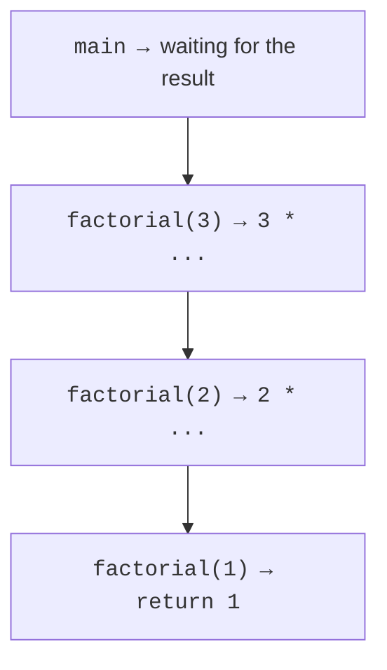
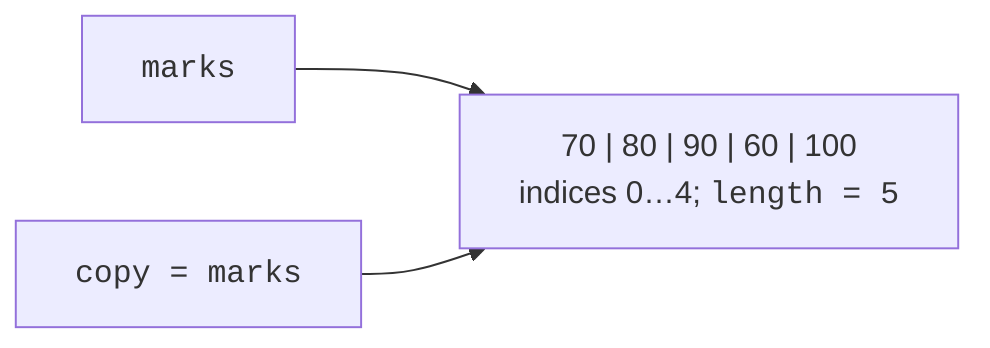

# Recursion and arrays

## Recursion and the call stack

A **recursive method** calls itself for a smaller subproblem. It needs a base case and a step that approaches it. For factorial, the base values 0 and 1 yield 1, while the rest is calculated as n multiplied by factorial(n − 1). The argument must not move away from the base case or remain unchanged.

Each call has its own stack frame containing parameters and a return position. When a deeper call returns, the preceding call continues its unfinished multiplication. This is not one n variable being repeatedly overwritten, but several local values active at the same time.



Figure 3.2. Calls and returns in recursive factorial {.caption}

```java
public class Main {
    static long factorial(int n) {
        if (n < 0 || n > 20) {
            throw new IllegalArgumentException("Expected 0..20");
        }
        if (n <= 1) { return 1; }
        return n * factorial(n - 1);
    }
    static int sum(int... values) {
        int result = 0;
        for (int value : values) {
            result = Math.addExact(result, value);
        }
        return result;
    }
    public static void main(String[] args) {
        System.out.println(factorial(0));
        System.out.println(factorial(3));
        System.out.println(factorial(20));
        System.out.println(sum());
        System.out.println(sum(2, 3, 4));
    }
}
```

```text
1
6
2432902008176640000
0
9
```

The limit of 20 comes from the range of long, not the definition of factorial. Unbounded recursion can cause StackOverflowError before all program memory is exhausted. Do not trigger this error as a normal termination mechanism. For a long linear sequence, a loop is simpler and does not require a separate frame for every element.

## Arrays: length, indices, and references

An array stores a fixed number of elements of one type. `new int[5]` creates five zeros; boolean elements receive false, and reference elements receive null. Indices run from 0 to length − 1. The length field is not a method and does not require parentheses. Array size does not change after creation, but elements can be reassigned.

The initializer `{70, 80, 90}` determines the elements and length. In an arbitrary expression, use `new int[]{70, 80, 90}`. An empty array has length 0 and is a valid object; it is not the same as null. Accessing an out-of-bounds element causes ArrayIndexOutOfBoundsException.

The assignment `copy = marks` creates a second reference to the same array. Changing copy[0] is visible through marks[0]. An independent container requires a copy. A for-each loop reads each value into a local variable; assigning to that local variable does not overwrite the array element. An indexed loop is convenient for changing elements.



Figure 3.3. Two references to one array {.caption}

## Standard Arrays operations

`Arrays.toString` prints a one-dimensional array; `deepToString` prints nested arrays. An ordinary println of an array does not produce the desired element list. `sort` sorts the supplied array itself in ascending order. `binarySearch` requires prior sorting in the same order; unsorted data does not provide the required guarantee.

A successful binarySearch returns an index. If the element is absent, the result is negative and encodes the insertion point as `-(insertionPoint) - 1`. It is not always −1. For duplicates, the first match is not guaranteed. If you need the first one, find it with a separate boundary check or your own search variant.

`fill` fills elements with one value. `copyOf` creates an array of the specified length, padding with default values if necessary. `copyOfRange` uses an inclusive left bound and an exclusive right bound. Check copying parameters, especially if lengths come from the user.

`clone()` copies the array container; for int, the values are independent, while an object array contains the same references inside the new container. `System.arraycopy` copies a section into an existing array and handles overlapping ranges correctly. `Arrays.equals` compares elements of one-dimensional arrays, not container identity.

Do not copy data merely to print or count it: this adds unnecessary cost. A copy is needed when an algorithm changes order but the original order must be preserved, or when independent state is required. Operation documentation: <https://docs.oracle.com/en/java/javase/27/docs/api/java.base/java/util/Arrays.html>.
