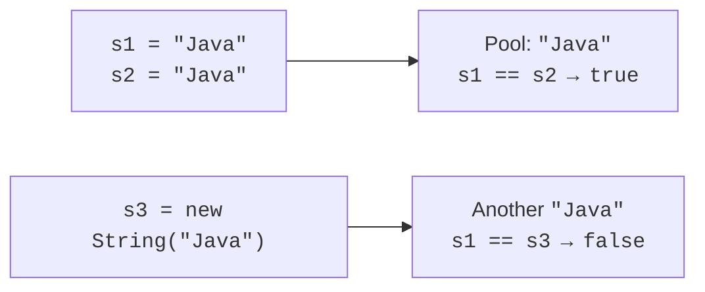

# String and Unicode

## String: immutability and comparison

String is immutable: strip, replace, and toUpperCase do not edit an existing object; they return a result string. If you ignore the result, the variable continues to refer to the previous text. Assigning a new result changes the reference, not the internal characters of the old String.

Literals can refer to the same interned object in the string pool. Consequently, comparing two identical literals with `==` sometimes yields true and creates the false impression that this is how text should be compared. A string read from the console or created using new String has no such guarantee.



Figure 3.5. Identical text does not guarantee an identical reference {.caption}

For contents, use equals, or equalsIgnoreCase when specifically needed. `compareTo` provides UTF-16 lexicographic order, not the full linguistic order of a Ukrainian dictionary. Check the sign of the result rather than expecting only −1 or 1. If null is possible, call equals on a known non-null literal or check null explicitly.

`charAt` reads one code unit at an index; `substring(begin, end)` includes the left bound and excludes the right bound. `indexOf` returns −1 when absent; `contains` returns a boolean. `replace` performs literal replacement, while replaceAll accepts a regular expression. `join` combines elements using the specified separator.

`strip` removes leading and trailing characters that Java defines as whitespace; `isBlank` checks for an empty string or one containing only that whitespace. This does not promise to remove every possible Unicode typographic space. `repeat` repeats text a specified nonnegative number of times. Count limits are needed to avoid excessively large output.

## Unicode: code units and code points

String uses UTF-16. A char value has 16 bits and does not always represent an entire Unicode character: supplementary code points are encoded as surrogate pairs. Thus, length counts code units, not visible characters. For example, an emoji can have length 2.

`chars()` provides a stream of code units; `codePoints()` combines valid surrogate pairs into code points. At this stage, you can obtain an array with toArray and traverse it with an ordinary loop; functional stream operations come later. `Character.isLetter(int)` and isDigit work with code points, not just ASCII.

Even the number of code points does not always equal the number of visible graphemes: a letter can consist of a base character and a combining mark. Explicitly choose the processing level for the problem. Basic Ukrainian letters fit in char, but general text can include emoji and other supplementary characters.

To check Ukrainian stdout in a redirected Windows process, the command used was `java -Dstdout.encoding=UTF-8`. The receiving console or file must also read UTF-8; `javac -encoding UTF-8` separately specifies the source Java file's encoding, not the output channel's encoding.

String case conversion can depend on Locale. Use Locale.ROOT for technical keys and a defined locale for a language-specific interface. Do not compare passwords case-insensitively merely because such a method exists. String API: <https://docs.oracle.com/en/java/javase/27/docs/api/java.base/java/lang/String.html>.

## Example 3. Normalizing words

Educational rule: remove leading and trailing whitespace, split on Java whitespace, convert each word to lowercase, and uppercase its first code point. This is not a complete editor for personal names: hyphens, apostrophes, and language-specific exceptions have separate rules that must be added when needed.

```java
import java.util.Locale;

public class Main {
    static String normalize(String input) {
        if (input == null) {
            throw new IllegalArgumentException("Missing text");
        }
        String clean = input.strip();
        if (clean.isEmpty()) { return ""; }
        String[] words = clean.split("\\p{javaWhitespace}+");
        for (int i = 0; i < words.length; i++) {
            String word = words[i].toLowerCase(Locale.ROOT);
            int count = Character.charCount(word.codePointAt(0));
            String first = word.substring(0, count);
            words[i] = first.toUpperCase(Locale.ROOT)
                    + word.substring(count);
        }
        return String.join(" ", words);
    }

    public static void main(String[] args) {
        System.out.println(normalize("  oLENA\tpETRENKO  "));
        System.out.println("[" + normalize(" \n\t ") + "]");
        String sample = "A😀";
        System.out.println(sample.length());
        System.out.println(sample.codePoints().toArray().length);
        System.out.println(Character.isLetter('Ї'));
    }
}
```

```text
Olena Petrenko
[]
3
2
true
```

The charCount method determines how many UTF-16 positions the first code point occupies. This prevents accidentally cutting a surrogate pair in half. Case conversion is performed on a substring because, in some languages, the result may contain more than one code point.
