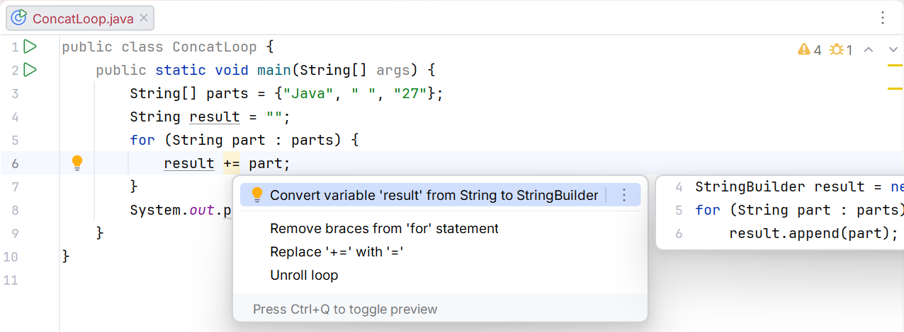
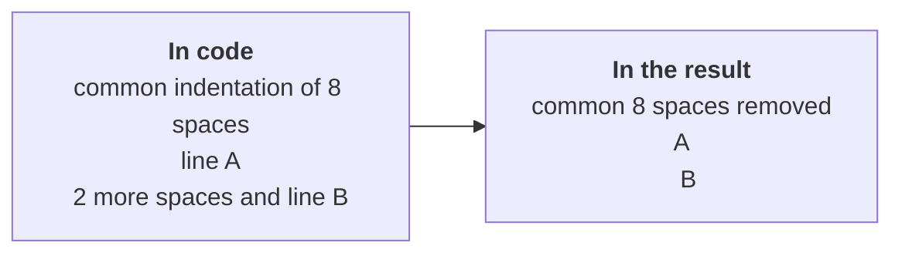

# Building text and regular expressions

## StringBuilder and building text

In a `result += part` loop, each step logically creates a new String by copying the previous contents. For many parts, StringBuilder is a better choice: it has a mutable buffer; append adds data, insert inserts it, deleteCharAt removes a code unit, and reverse changes the order. Obtain the final String with toString.

The capacity is not the same as the current length. The buffer can reserve extra space to avoid reallocating memory for every append. Knowing an approximate capacity in advance is useful, but it must not come from an unchecked huge user-supplied number. StringBuilder is not thread-safe; we mention the synchronized StringBuffer here only as a different tool.

Reverse preserves valid surrogate pairs but does not guarantee reversal of complete visible graphemes. DeleteCharAt can also break a pair if indices are not controlled. For the palindrome problem below, we explicitly restrict the alphabet to make the comparison rule clear.

StringJoiner is useful for a sequence with a delimiter and surrounding text. It avoids adding a comma after the last element and then removing it manually. String.join is sufficient when all parts are already in an array. Choose the tool according to how the parts arrive.



Figure 3.6. Suggestion for concatenation in a loop {.caption}

## Text blocks and indentation

A text block begins with three double quotes followed by a newline. It is convenient for multiline HTML, JSON, or SQL because it does not require escaping every double quote. The result is still a String, not a separate type.

The compiler normalizes line endings and removes incidental common indentation. The closing delimiter's position can affect preserved indentation. A backslash before a line ending removes that newline, while `\s` explicitly preserves a space, including at the end of a line. Indentation is processed before escape sequences.



Figure 3.7. Source code indentation and result indentation {.caption}

`formatted` substitutes arguments according to formatting rules but does not perform context-specific escaping. Inserting arbitrary text into HTML requires HTML escaping; JSON requires JSON escaping; SQL with data will later use parameterized queries. A text block itself does not protect against changes to structure. Official description: <https://docs.oracle.com/en/java/javase/27/language/text-blocks.html>.

## Example 4. An HTML report from table rows

Each name is escaped before insertion into a text cell. The ampersand is replaced first to avoid escaping newly created entities again. Here data is inserted into element text, not JavaScript, CSS, or an arbitrary attribute.

```java
public class Main {
    static String escapeHtml(String text) {
        return text.replace("&", "&amp;")
                .replace("<", "&lt;").replace(">", "&gt;");
    }

    static String report(String[] names, int[] marks) {
        if (names == null || marks == null
                || names.length != marks.length) {
            throw new IllegalArgumentException("Different lengths");
        }
        StringBuilder rows = new StringBuilder();
        for (int i = 0; i < names.length; i++) {
            if (names[i] == null || marks[i] < 0 || marks[i] > 100) {
                throw new IllegalArgumentException("Invalid row");
            }
            rows.append("  <tr><td>").append(escapeHtml(names[i]))
                    .append("</td><td>").append(marks[i])
                    .append("</td></tr>\n");
        }
        return """
                <table>
                %s</table>
                """.formatted(rows);
    }

    public static void main(String[] args) {
        System.out.print(report(new String[]{"A&B", "<Olena>"},
                new int[]{80, 95}));
    }
}
```

```text
<table>
  <tr><td>A&amp;B</td><td>80</td></tr>
  <tr><td>&lt;Olena&gt;</td><td>95</td></tr>
</table>
```

Empty arrays produce an empty table; different lengths produce an explicit rejection. The method does not write a file: its result can be printed, tested, or later passed to a file API. This separates data construction from input and output.

## Regular expressions: a brief practical introduction

A regular expression describes a text pattern. Matches checks the entire string, while Matcher.find searches for the next matching fragment. `[0-9]{4}` means four ASCII digits; `[A-Z]+` means one or more uppercase Latin letters. The period is special, so a literal period requires escaping.

In a Java literal, the backslash is also special: a whitespace pattern is written as `"\\s+"`. The usual `\s` without Unicode mode does not mean all whitespace in every language. For specific semantics, you can use the class `"\\p{javaWhitespace}+"`, as in the normalization example.

Split accepts a pattern, so splitting on a period requires `"\\."`, and splitting on a vertical bar requires `"\\|"`. The single-parameter split variant discards trailing empty fields. For a table row, use limit −1 to preserve the last empty cell and correctly validate the field count.

Pattern compiles a pattern, and Matcher searches a particular string. For repeated searches, do not compile the same pattern inside every iteration. Parenthesized groups allow extracting parts of a match. A regular expression validates form, not necessarily meaning: the date 31.02 has the correct digits but does not exist in the calendar.

```java
import java.util.Arrays;
import java.util.regex.Matcher;
import java.util.regex.Pattern;

public class Main {
    public static void main(String[] args) {
        System.out.println("AB-1234".matches("[A-Z]{2}-[0-9]{4}"));
        System.out.println(Arrays.toString("A;B;".split(";", -1)));
        Pattern pattern = Pattern.compile("[0-9]+");
        Matcher matcher = pattern.matcher("Room 12, floor 3");
        while (matcher.find()) {
            System.out.println(matcher.group());
        }
        System.out.println("A  B\tC".replaceAll("\\s+", " "));
        StringBuilder builder = new StringBuilder("ab");
        builder.insert(1, "X").append("c").deleteCharAt(0);
        System.out.println(builder.reverse());
        System.out.println("-".repeat(3));
    }
}
```

```text
true
[A, B, ]
12
3
A B C
cbX
---
```

For a dynamic literal pattern, use Pattern.quote; for a literal replacement in Matcher, use quoteReplacement. These are different contexts: dollar signs and backslashes have special meaning in replacement text. Do not use replaceAll instead of plain replace unless a pattern is needed.
