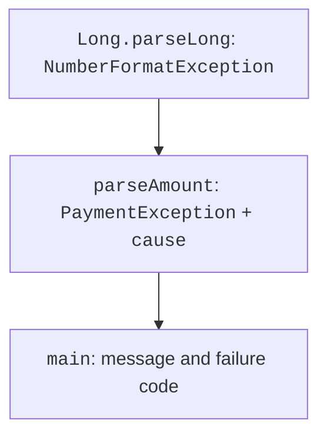
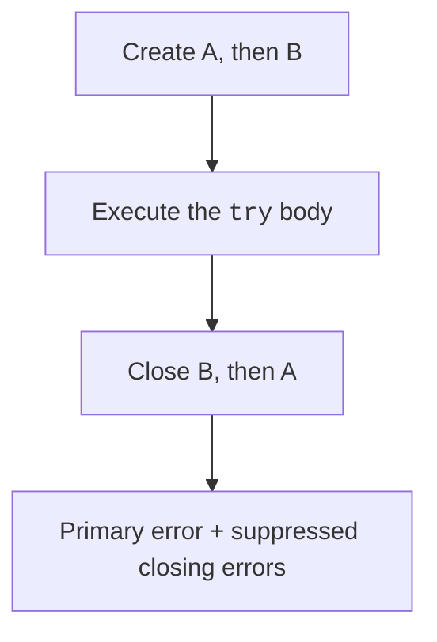

# Custom exceptions and resources

## A custom type and the original cause

A custom exception is needed when the caller must distinguish a domain case by type. Do not create a new class for every message text. The message explains the situation to a person; the fields and type help a programmatic handler.

This topic uses a minimal exception class; the full structure of classes is covered in the next topic. The constructor passes the message and cause to the base `Exception`. This preserves the original stack and the type of parsing error.

### Example 3. Parsing and withdrawing an amount

```java
class PaymentException extends Exception {
    PaymentException(String message, Throwable cause) {
        super(message, cause);
    }
}

class InsufficientFundsException extends Exception {
    InsufficientFundsException(long available, long requested) {
        super("Available " + available + ", required " + requested);
    }
}

public class Payment {
    static long parseAmount(String text) throws PaymentException {
        try {
            long amount = Long.parseLong(text);
            if (amount <= 0 || amount > 1_000_000) {
                throw new IllegalArgumentException("Amount 1..1000000");
            }
            return amount;
        } catch (IllegalArgumentException e) {
            throw new PaymentException(
                    "Could not read the amount", e);
        }
    }

    static long withdraw(long balance, long amount)
            throws InsufficientFundsException {
        if (balance < 0 || amount <= 0) {
            throw new IllegalArgumentException(
                    "Invalid arguments");
        }
        if (amount > balance) {
            throw new InsufficientFundsException(balance, amount);
        }
        return balance - amount;
    }

    public static void main(String[] args) {
        long balance = 5_000;
        try {
            balance = withdraw(balance, parseAmount("7000"));
        } catch (PaymentException | InsufficientFundsException e) {
            System.out.println(e.getMessage());
        }
        System.out.println("Balance: " + balance);
        try {
            parseAmount("abc");
        } catch (PaymentException e) {
            String type = e.getCause().getClass().getSimpleName();
            System.out.println(type);
        }
    }
}
```

The failed withdrawal leaves the balance at 5000. The parsing error preserves `NumberFormatException` as its cause. The expression on the right side of the assignment must complete successfully before `balance` changes. This ensures that this particular local variable remains unchanged on failure.

Writing `throw new PaymentException(e.getMessage(), null)` would lose the cause's type and stack. Logging only the text is also no substitute for a correct contract between methods. Do not print secret arguments, passwords, or full account details in an exception.



Figure 4.3. Passing the cause from parsing to the program boundary {.caption}

## Automatic resource closing

A file, network stream, and database connection have a lifecycle distinct from an object's memory. `try`-with-resources works with `AutoCloseable`: declared resources are closed in reverse order. This happens both on success and when the body throws an exception.

The first example needs no external file: we will use `StringReader` and `BufferedReader`. Each nonblank line must contain a valid `int`; the sum is accumulated in `long`.

```java
import java.io.BufferedReader;
import java.io.IOException;
import java.io.StringReader;

public class ReaderSum {
    static long sum(String text) throws IOException {
        long total = 0;
        try (var reader =
                new BufferedReader(new StringReader(text))) {
            String line;
            while ((line = reader.readLine()) != null) {
                if (!line.isBlank()) {
                    total = Math.addExact(total,
                            Integer.parseInt(line.strip()));
                }
            }
        }
        return total;
    }

    public static void main(String[] args) throws IOException {
        System.out.println(sum("10\n20\n30\n"));
    }
}
```

The result is `60`. `throws IOException` in `main` is acceptable for a small demonstration, but a finished user-facing program must define a clear response at the CLI boundary. The resource will close even if one line is not a number.



Figure 4.4. Reverse closing order and additional errors {.caption}

If the `try` body has already thrown an exception and `close` also fails, the closing error is added to the primary one as **suppressed**. It is not a `cause`: this is a different relationship between errors. We will demonstrate it with a simple teaching resource.

```java
class Probe implements AutoCloseable {
    private final String name;

    Probe(String name) {
        this.name = name;
    }

    public void close() {
        System.out.println("Closed: " + name);
        throw new IllegalStateException("close " + name);
    }
}

public class SuppressedDemo {
    public static void main(String[] args) {
        try (var first = new Probe("A");
                var second = new Probe("B")) {
            throw new IllegalArgumentException("body");
        } catch (IllegalArgumentException e) {
            System.out.println("Primary: " + e.getMessage());
            for (Throwable extra : e.getSuppressed()) {
                System.out.println(
                        "Additional: " + extra.getMessage());
            }
        }
    }
}
```

The order is: closed B, closed A, primary `body`, additional `close B` and `close A`. This check explains behavior that is easy to miss when reading only the first line of a stack trace. In your own resource, `close` should have a clear contract instead of deliberately throwing an exception as in this demonstration.
