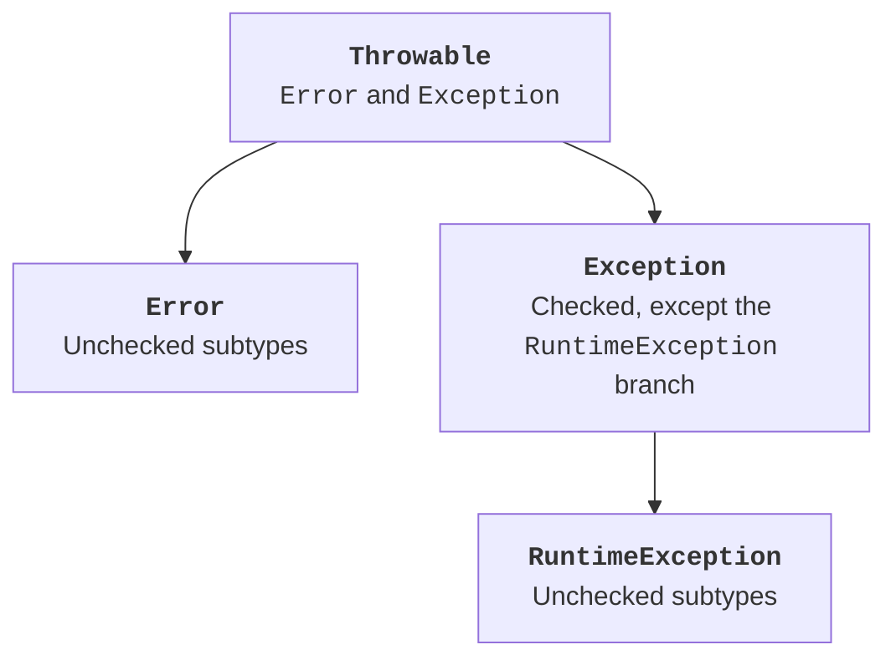

# Exceptions and the Throwable hierarchy

## Errors as part of a contract

A successful result is only one possible program behavior. A user may enter an invalid string, a file may be unavailable, or a domain operation may be invalid in the current state. A correct program must not silently turn such a situation into an ordinary number that looks plausible.

Distinguish compilation errors, runtime exceptions, and logic errors. A missing parenthesis cannot be fixed with `catch`, and an incorrect denominator in an average may not cause any exception. Each kind requires its own checks.

An **exception** is an object that signals abnormal completion of an operation. After `throw`, the normal execution path is interrupted. The JVM searches for a compatible handler in the current call and then in calls higher up the stack. Local variable values are not rolled back automatically.

Material on exceptions: <https://dev.java/learn/exceptions/>. Throwable API: <https://docs.oracle.com/en/java/javase/26/docs/api/java.base/java/lang/Throwable.html>. All complete examples in this topic are tested on JDK 27.

## The Throwable hierarchy

`Throwable` is the base of `Exception` and `Error`. `RuntimeException` belongs to the `Exception` branch. `RuntimeException` and its subtypes, along with `Error` and its subtypes, are **unchecked** by the compiler. Other exceptions are **checked**.



Figure 4.1. Checked and unchecked exceptions {.caption}

A method that can propagate a checked exception must declare it in `throws` or catch it. This is a compiler rule, not a measure of how serious a situation is. `NumberFormatException` is unchecked, but an invalid string is entirely expected in a CLI. `IOException` is checked, but is not always recoverable within a particular helper method.

Do not use `catch (Throwable error)` as a universal input check. Such a handler also catches serious environment errors after which continuing may be incorrect. Choose a type that matches the known contract.

`NullPointerException` often signals a programming error or a violated null contract. `IllegalArgumentException` indicates an invalid argument. `IllegalStateException` indicates a state in which an operation is not allowed. Choosing the right type helps callers distinguish these situations without searching for words in a message.

## try and catch order

`try` surrounds an operation, and `catch` describes the response to a compatible exception. The first matching handler runs once. Place a subtype before a supertype; otherwise, the narrower handler becomes unreachable. Java checks many such errors at compile time.

`multi-catch` lets you combine several independent types using `|`. You cannot combine a type and its subtype, such as `Exception` and `NumberFormatException`: the broader type already covers the narrower one.

### Example 1. Integer division

Contract: two arguments, each a valid `int`. Print the quotient and remainder. Invalid format and a zero divisor have different causes but the same CLI failure code. The pair `Integer.MIN_VALUE` and `-1` is also prohibited: the mathematical quotient does not fit in `int`.

```java
public class SafeDivide {
    static int run(String[] args) {
        if (args.length != 2) {
            System.err.println("Usage: SafeDivide a b");
            return 2;
        }
        try {
            int a = Integer.parseInt(args[0]);
            int b = Integer.parseInt(args[1]);
            if (a == Integer.MIN_VALUE && b == -1) {
                throw new ArithmeticException("Quotient too large");
            }
            System.out.println("Quotient: " + a / b);
            System.out.println("Remainder: " + a % b);
            return 0;
        } catch (NumberFormatException | ArithmeticException e) {
            System.err.println("Error: " + e.getMessage());
            return 2;
        } finally {
            System.err.println("Attempt completed");
        }
    }

    public static void main(String[] args) {
        System.exit(run(args));
    }
}
```

For `17 5`, stdout contains a quotient of 3 and a remainder of 2, with exit code 0. For `17 0` or `abc 5`, no successful result is printed, and the code is 2. The system's cause message may depend on the JDK; focus on checking your own contract, streams, and code.

In this example, division is the first operation used to form the result. In a more complex report, calculate all required values first and then print the summary so that an error halfway through does not leave a misleading partial success.
