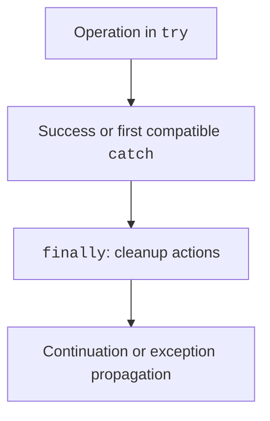

# finally, throw, and throws

## finally and control flow completion

`finally` runs when `try` exits normally and when an exception propagates. It also runs before a `return` from `try` or `catch` completes. However, this is not guaranteed if the process is forcibly terminated, the OS crashes, or power is lost.



Figure 4.2. Handler selection and cleanup actions {.caption}

Do not return a value from `finally`: such a `return` can hide the previous result or exception. Likewise, a new exception from `finally` can mask the original cause. For resources, prefer `try`-with-resources to manually closing them in several program branches.

Calling `System.exit` terminates the process and should not be used to exit from unfinished work with resources. In a CLI, it is convenient to have a `run` method that returns a code and call `System.exit` only after it returns, as in the division example.

### Controlled program termination

In the course examples, code 0 means success or displaying help, code 2 means invalid user data, and code 1 means an operational error, such as an unavailable file. This is the contract of an educational CLI program, not a universal meaning of each code for every program in the world. For automated runs, the code is more reliable than analyzing the message's language.

In PowerShell, the most recent external process code is available through `$LASTEXITCODE`. Check it immediately after the relevant command, before another run. Stdout is for results, and stderr is for diagnostics. The shell may display both streams together, but that does not make them a single stream.

## throw, throws, and preconditions

`throw` passes a specific exception object. `throws` is part of a method declaration and indicates that an exception may propagate outward. A `throws` declaration alone does not throw or handle anything.

A precondition describes valid arguments. Check it before changing state. If a method reduces a balance first and then checks a limit, an exception will not restore the balance automatically. You must ensure the atomicity of a domain operation through the order of its actions.

### Example 2. Argument validation

The method calculates the cost of tickets in kopiykas. The name cannot be null or blank; the quantity is from 1 to 100, and the price is from 0 to 1 000 000 kopiykas.

```java
import java.util.Objects;

public class TicketCost {
    static long cost(String event, int count, long price) {
        Objects.requireNonNull(event, "event");
        if (event.isBlank()) {
            throw new IllegalArgumentException("Blank name");
        }
        if (count < 1 || count > 100) {
            throw new IllegalArgumentException("Quantity 1..100");
        }
        if (price < 0 || price > 1_000_000) {
            throw new IllegalArgumentException("Invalid price");
        }
        return Math.multiplyExact(price, count);
    }

    public static void main(String[] args) {
        System.out.println(cost("Concert", 3, 12_500));
        try {
            cost("Concert", 0, 12_500);
        } catch (IllegalArgumentException e) {
            System.out.println(e.getMessage());
        }
    }
}
```

The result is `37500`, followed by `Quantity 1..100`. The bounds guarantee that a valid product fits in `long`; `multiplyExact` additionally makes the overflow policy explicit. The method does not print the result, so it can be used from a console, GUI, or test.

`Objects.requireNonNull` returns the checked reference, but here only its validation effect is used. Null and an empty string are different states. Converting null to an empty string without a domain reason hides that distinction.
