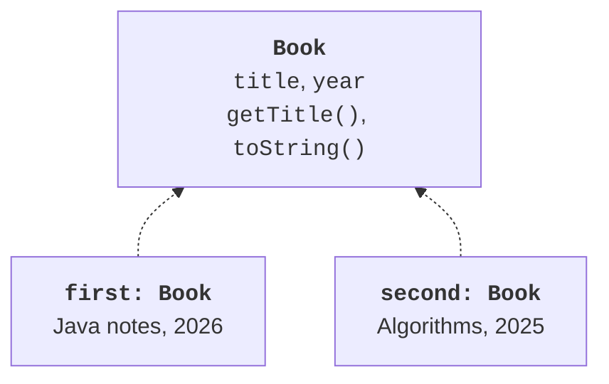
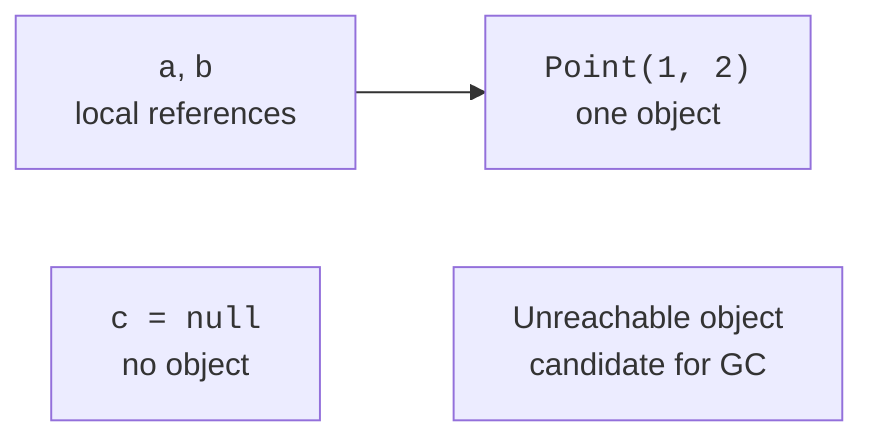
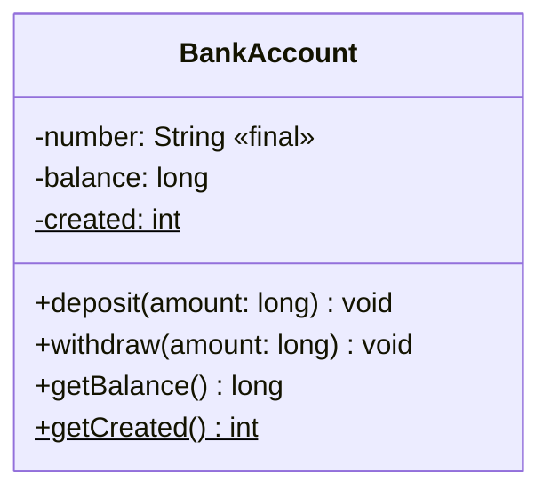

# Classes, fields, and constructors

## A class combines data and rules

An account management program works with an account number, owner, and balance. If these values are stored in independent variables, every part of the program must remember which data belongs together. Ensuring that the balance never becomes negative is even harder. A class combines state and actions on it so that correctness can be checked in one place.

A **class** describes a type of object, its fields, methods, and ways to create it. An **object** is a particular instance with its own identity and state. A **method** defines an action or query, and a **field** stores part of the state. Official introduction: <https://dev.java/learn/classes-objects/>.

A class should have a clear responsibility. BankAccount validates amounts and changes the balance; the console interface reads lines and displays messages. An account constructor should not request keyboard input. This model works for both tests and a future graphical interface.



Figure 5.1. A class and particular instances {.caption}

An **invariant** is a condition that holds after successful creation and after each completed public operation. For an account, this means a valid number and a nonnegative balance. The precondition of an individual withdraw operation additionally requires a positive amount. After failure, the state must remain unchanged.

## Fields, references, and memory

The expression `new Point(1, 2)` creates an instance and returns a reference. The assignment `Point b = a` copies the reference, not the object itself. If b is used to modify the shared instance, client a will also see it. For references, `==` checks identity, while equals defines meaningful equality. The detailed equals contract is covered in Topic 6.

Numeric fields initially contain zero, boolean contains false, char contains the null character, and references contain null. This does not apply to local variables: they must be explicitly assigned a value before being read. The compiler analyzes definite assignment. An initial null does not automatically create a nested object.



Figure 5.2. Two references to one object and a missing reference {.caption}

It is useful to picture the call stack as the place for local variables and method context, and the heap as object storage. This is an explanatory model, not a requirement for every JVM optimization. The garbage collector frees memory belonging to unreachable objects, but it is not guaranteed to run immediately after null is assigned. Files and other resources are closed explicitly, including through try-with-resources from Topic 4.

Calling a method through null produces NullPointerException. At the model boundary, check required references with `Objects.requireNonNull` or an explicitly defined message. Do not use null as a universal substitute for every invalid state: the client must understand its meaning.

## Constructors and this

A constructor has the class name and no return type, not even void. If no constructor is declared, the compiler may provide a default constructor. Once you declare your own constructor, a no-argument version is not added automatically. Create it explicitly if needed.

`this.field` means the current instance's field. This resolves shadowing by a parameter with the same name. Writing `balance = balance` in a constructor only assigns the parameter to itself if the field is not qualified. The IDE may warn about this error, but the author remains responsible.

Overloaded constructors have different parameter lists. `this(...)` delegates to another constructor of the same class and helps avoid duplicating checks. A cyclic delegation chain is prohibited. A constructor is not an ordinary method that can be called again to “restart” an instance.

### Example 1. A validated bank account

The sample model stores amounts as integer kopiykas in long. An upper bound allows addition to be checked before the operation is performed. The counter counts successfully created instances, not live objects: the garbage collector does not decrement it. Save examples with multiple classes in Main.java.

```java
class BankAccount {
    private static int created;
    private static final long LIMIT = 1_000_000_000L;
    private final String number;
    private long balance;

    BankAccount(String number, long initial) {
        if (number == null || number.isBlank()) {
            throw new IllegalArgumentException("Empty number");
        }
        if (initial < 0 || initial > LIMIT) {
            throw new IllegalArgumentException("Invalid balance");
        }
        this.number = number;
        this.balance = initial;
        created++;
    }

    BankAccount(String number) {
        this(number, 0);
    }

    public long getBalance() { return balance; }
    public static int getCreated() { return created; }

    public void deposit(long amount) {
        if (amount <= 0 || amount > LIMIT - balance) {
            throw new IllegalArgumentException("Invalid deposit");
        }
        balance += amount;
    }

    public void withdraw(long amount) {
        if (amount <= 0 || amount > balance) {
            throw new IllegalArgumentException("Invalid withdrawal");
        }
        balance -= amount;
    }

    public String toString() { return number + ": " + balance; }
}

public class Main {
    public static void main(String[] args) {
        BankAccount a = new BankAccount("A1", 1000);
        BankAccount b = a;
        BankAccount c = new BankAccount("A2");
        b.deposit(500);
        a.withdraw(200);
        System.out.println(a);
        System.out.println(c);
        System.out.println(a == b);
        try {
            a.withdraw(2000);
        } catch (IllegalArgumentException error) {
            System.out.println(error.getMessage());
        }
        System.out.println(a.getBalance());
        System.out.println(BankAccount.getCreated());
    }
}
```

```text
A1: 1300
A2: 0
true
Invalid withdrawal
1300
2
```

Failure does not change the balance because all conditions precede the assignment. There is no setter for balance: the client cannot bypass the rule through a direct write. The getter exposes only the necessary reading. ToString provides diagnostic text; it is not a storage format or proof of account equality.



Figure 5.3. The account's public contract and private state {.caption}
