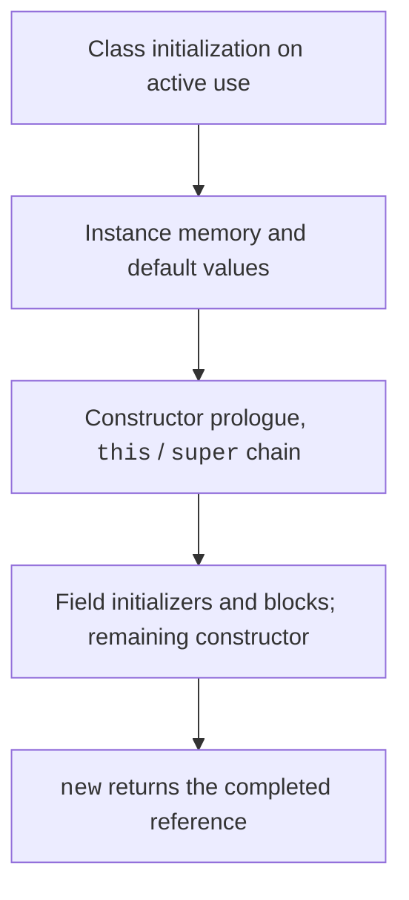

# Initialization, access, and static members

## Initialization order and modern constructors

A class is initialized on its first active use, not necessarily simply when it is loaded. Static initializers run once for the corresponding class in the context of its class loader. For an instance, memory with default values is allocated first, followed by the constructor chain, field initializers and instance blocks, and the rest of the constructor body.



Figure 5.4. Main stages of constructing an instance {.caption}

Since the feature was finalized in JDK 25, statements in an early construction context are allowed before an explicit this or super. This lets you validate and prepare arguments. You cannot read the instance's unfinished state or call its methods. There are special allowances for early assignment to the class's own fields; for introductory study, we use simple argument validation without accessing this. <https://docs.oracle.com/en/java/javase/26/language/flexible-constructor-bodies.html>.

```java
class Student {
    private final String name;
    private final int year;

    Student(String name, int year) {
        if (name == null || name.isBlank() || year < 1 || year > 6) {
            throw new IllegalArgumentException("Invalid student");
        }
        this.name = name;
        this.year = year;
    }

    Student(String name, String yearText) {
        int parsed = Integer.parseInt(yearText);
        if (parsed < 1 || parsed > 6) {
            throw new IllegalArgumentException("Invalid year");
        }
        this(name, parsed);
    }

    public String toString() { return name + ": " + year; }
}

public class Main {
    public static void main(String[] args) {
        System.out.println(new Student("Olena", "2"));
        try {
            new Student("Taras", "9");
        } catch (IllegalArgumentException error) {
            System.out.println(error.getMessage());
        }
    }
}
```

```text
Olena: 2
Invalid year
```

This is stable JDK 27 syntax; the enable-preview option is unnecessary. The main name and year validation remains in the logically primary constructor so that every construction path ensures the same invariant. Text input validation supplements this contract rather than replacing it.

## Access and encapsulation

Public exposes an API to clients, while private restricts access to the class implementation. No modifier means package access, not public. Protected and cross-package rules are covered in Topic 6. A top-level class can be public or have package access; a public class in an ordinary file has a name matching the file.

Getters and setters are ordinary methods with conventional names. Java does not generate them automatically for an ordinary class. Do not mechanically generate a setter for every field: an immutable number and a balance that changes only through operations have different access rules. A withdraw method expresses intent better than a general setBalance.

Encapsulation does not mean cryptographic secrecy. Private reduces source code dependencies but does not make a password safe on its own. Use fictional data in teaching examples and do not expose private secrets through toString. It is also important not to hand a mutable internal array to external code, even if the field itself is private.

## Static members and factories

A static field belongs to the class, while an instance field belongs to each object. Thus, balance cannot be static: all accounts would share one balance. A static method has no this and cannot access an instance field without a reference. Call it through the class name so readers can see this.

`static final` is often used for constants. Final prevents reassignment, but a final reference does not guarantee that the referenced object is immutable. A static factory has a meaningful name and can return a controlled instance. Unlike a constructor, a factory does not have to create a new object every time; its contract should define this.

### Example 2. An immutable point

The coordinates are final, there are no setters, and moving returns a new object. Coordinate bounds are also checked for the new result. Origin is a factory for the origin, not a public mutable field. The toString representation simplifies testing.

```java
final class Point {
    private final int x;
    private final int y;

    Point(int x, int y) {
        if (x < -1_000_000 || x > 1_000_000
                || y < -1_000_000 || y > 1_000_000) {
            throw new IllegalArgumentException("Invalid coordinate");
        }
        this.x = x;
        this.y = y;
    }

    public static Point origin() { return new Point(0, 0); }
    public int getX() { return x; }
    public int getY() { return y; }

    public Point move(int dx, int dy) {
        return new Point(Math.addExact(x, dx), Math.addExact(y, dy));
    }

    public double distanceTo(Point other) {
        java.util.Objects.requireNonNull(other);
        return Math.hypot(x - other.x, y - other.y);
    }

    public String toString() { return "(" + x + ", " + y + ")"; }
}

public class Main {
    public static void main(String[] args) {
        Point start = Point.origin();
        Point moved = start.move(3, 4);
        System.out.println(start);
        System.out.println(moved);
        System.out.println(start.distanceTo(moved));
        System.out.println(start == moved);
    }
}
```

```text
(0, 0)
(3, 4)
5.0
false
```

A final class prevents a subclass from adding mutable state under the same contract. The next topic covers final and inheritance. Defensive copies are also important for an immutable model: if a constructor accepts an array, copy it; if a getter returns an array, return a copy. Copying only the array reference does not protect its elements.
