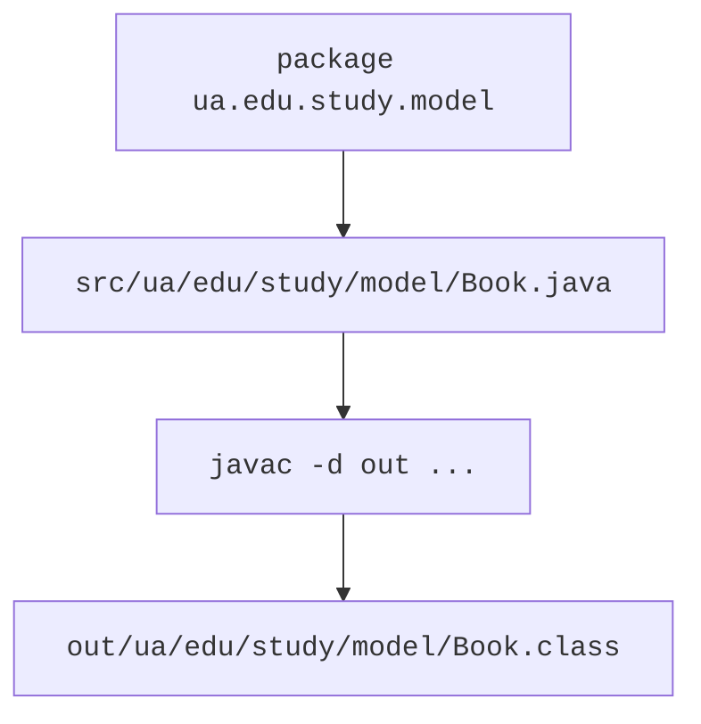
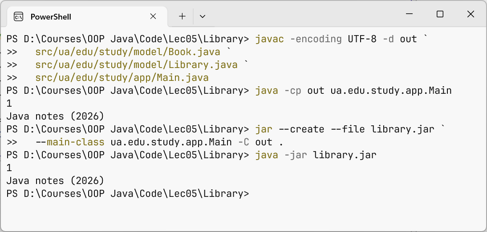

# Packages, classpath, and JAR

## Packages and paths

A package provides a namespace and a package access boundary. The package declaration precedes import. Names use lowercase letters, often based on an organization's reversed domain. For the course project, we use ua.edu.study without claiming ownership of an actual external service. <https://dev.java/learn/packages/>.

Import lets you use a type's short name, but it does not copy code or create an object. The java.lang import is implicit. Importing a package with an asterisk does not include its subpackages. If two classes have the same simple name, use the fully qualified name for one of them; Java has no import-as.



Figure 5.5. Source code packages and compilation output {.caption}

### Example 3. Books in packages

Create Book.java in src/ua/edu/study/model. The book's fields are immutable, and its title is validated. The public type is accessible to the console package. The library's array is copied so that clients cannot replace its internal references through their own array.

```java
package ua.edu.study.model;

public final class Book {
    private final String title;
    private final int year;

    public Book(String title, int year) {
        if (title == null || title.isBlank()
                || year < 1450 || year > 2100) {
            throw new IllegalArgumentException("Invalid book");
        }
        this.title = title;
        this.year = year;
    }

    public String getTitle() { return title; }
    public String toString() { return title + " (" + year + ")"; }
}
```

Place Library.java in the same model package. The array copy is shallow, but Book is immutable, so shared book references do not violate the contract.

```java
package ua.edu.study.model;

public final class Library {
    private final Book[] books;

    public Library(Book[] books) {
        this.books = java.util.Objects.requireNonNull(books).clone();
        for (Book book : this.books) {
            java.util.Objects.requireNonNull(book);
        }
    }

    public Book[] getBooks() { return books.clone(); }
    public int size() { return books.length; }
}
```

The Main.java entry point belongs to the ua.edu.study.app package.

```java
package ua.edu.study.app;

import ua.edu.study.model.Book;
import ua.edu.study.model.Library;

public class Main {
    public static void main(String[] args) {
        Book[] source = {new Book("Java notes", 2026)};
        Library library = new Library(source);
        source[0] = new Book("Other", 2025);
        Book[] snapshot = library.getBooks();
        snapshot[0] = null;
        System.out.println(library.size());
        System.out.println(library.getBooks()[0]);
    }
}
```

```text
1
Java notes (2026)
```

This check covers both ownership boundaries: the original array and the getter's result. Cloning an array creates a new array but does not perform an arbitrary deep copy of its elements. Mutable Book objects would require a different copying contract.

## Compilation, classpath, and JAR

Compile all three files from the project root. The -d option specifies the output directory, where javac recreates the packages. The classpath points to the package tree's root, not the directory containing a particular Main.class. In the commands below, backtick line continuation is PowerShell syntax, not part of Java.

```powershell
javac -encoding UTF-8 -d out `
  src/ua/edu/study/model/Book.java `
  src/ua/edu/study/model/Library.java `
  src/ua/edu/study/app/Main.java
java -cp out ua.edu.study.app.Main
jar --create --file library.jar `
  --main-class ua.edu.study.app.Main -C out .
java -jar library.jar
```

A JAR packages class files and resources. Main-Class in the manifest defines the entry point for java -jar. The JAR itself does not automatically include an installed JVM; application distribution will be covered in more detail later. An empty classpath or an incorrect fully qualified name does not indicate a constructor error.



Figure 5.6. Compiling packages and running a JAR {.caption}
