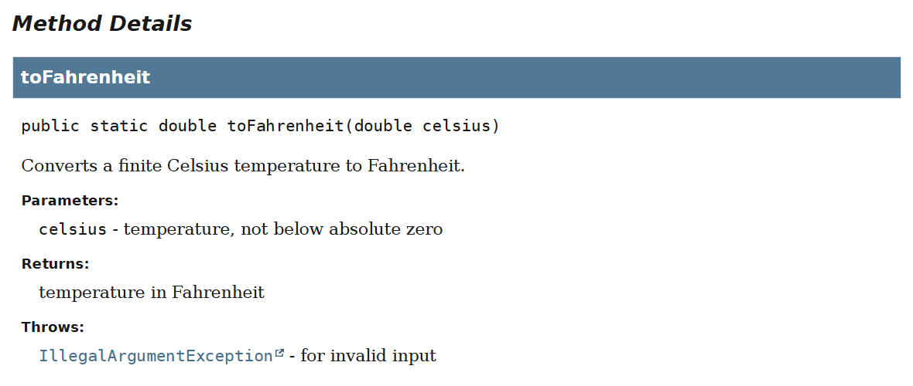
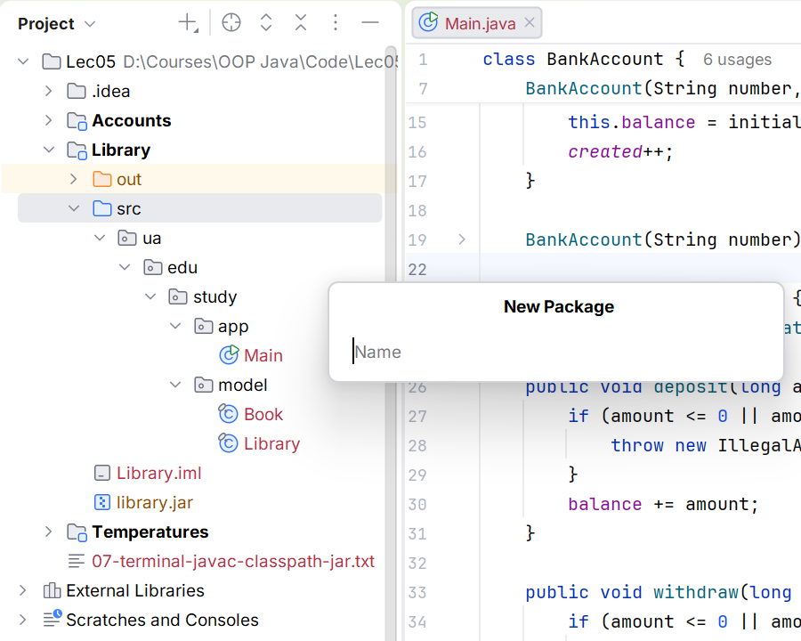
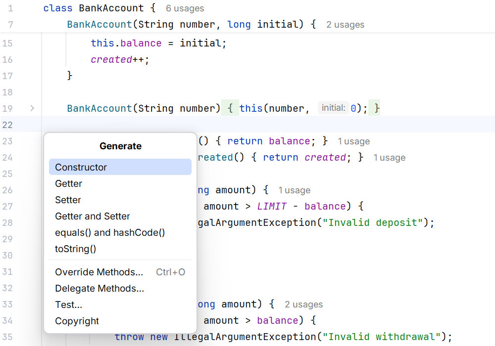

# Utility classes and code quality

## Utility classes and static imports

A class containing only static operations does not need an instance. A private constructor prevents accidental new calls. Such a class should not accumulate hidden mutable state if its methods describe pure value transformations. A static import shortens a method name but can make code harder to read when many functions share the same name.

### Example 4. Temperature utility

The file Temperatures.java is in the ua.edu.study.util package.

```java
package ua.edu.study.util;

public final class Temperatures {
    private Temperatures() { }

    /**
     * Converts a finite Celsius temperature to Fahrenheit.
     * @param celsius temperature, not below absolute zero
     * @return temperature in Fahrenheit
     * @throws IllegalArgumentException for invalid input
     */
    public static double toFahrenheit(double celsius) {
        if (!Double.isFinite(celsius) || celsius < -273.15
                || celsius > 1_000_000) {
            throw new IllegalArgumentException("Invalid temperature");
        }
        return celsius * 9 / 5 + 32;
    }
}
```

The file Main.java is in the ua.edu.study.app package.

```java
package ua.edu.study.app;

import static ua.edu.study.util.Temperatures.toFahrenheit;

public class Main {
    public static void main(String[] args) {
        System.out.println(toFahrenheit(0));
        System.out.println(toFahrenheit(25));
        try {
            toFahrenheit(Double.NaN);
        } catch (IllegalArgumentException error) {
            System.out.println(error.getMessage());
        }
    }
}
```

```text
32.0
77.0
Invalid temperature
```

The stable import module feature, finalized in JDK 25, lets you import accessible types exported by a module. This does not replace dependencies, module-info, or classpath. In this topic, we use explicit type imports so that each name's origin is clear; modules are covered separately.

## Javadoc, IDE, and quality checks

A documentation comment begins with `/**`. Param describes the argument's meaning, return describes the result, and throws describes failure conditions. Write the contract and units rather than repeating the method name in different words. Javadoc is useful specifically to clients who should not have to read the implementation body.

You can generate documentation with the javadoc command using -encoding UTF-8 and -d docs, or through the corresponding IDE action. In IntelliJ IDEA, look for *Tools → Generate JavaDoc…*; the action's availability depends on the project configuration. <https://docs.oracle.com/en/java/javase/27/docs/specs/man/javadoc.html>.



Figure 5.7. Documentation for a public method {.caption}

The *Generate* menu (**Alt+Insert**) helps create a constructor, getter, or toString, but it does not know the invariants. Review generated code, especially setters and fields in toString. *Rename* (**Shift+F6**) updates related uses, while moving a class between packages requires updating package and import. Use refactoring rather than an arbitrary global string replacement.



Figure 5.8. Organizing the model and entry point {.caption}



Figure 5.9. Generating class members {.caption}

The test table should include a normal state, both boundaries, an invalid value, a successful action, and a failure without partial changes. Separately test two independent objects and two references to one object. For arrays, check protection at both the input and output ownership boundaries.
