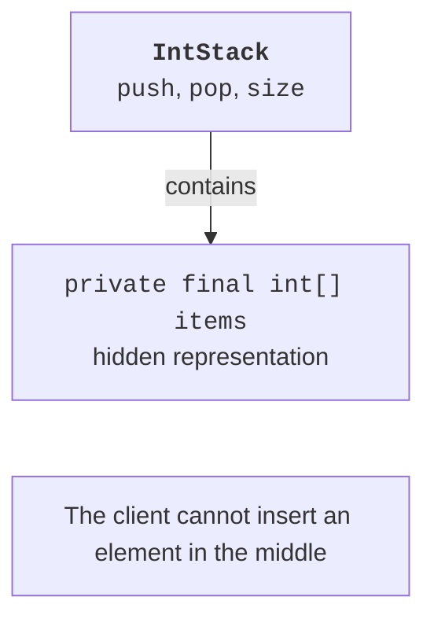

# Composition and the substitution principle

## Composition and the substitution principle

The **Liskov substitution principle** means that a subtype can be used in place of its base type while preserving its promised behavior. A subclass should not require more for a permitted base operation or guarantee less after successful execution. Compiler signature checks do not prove that this principle holds.

For example, a mutable square with independent `setWidth` and `setHeight` methods is a poor substitute for a rectangle: changing only its width may unexpectedly change its height. The mathematical relationship between shapes does not automatically define a correct contract for mutable objects. You can make the shapes immutable or change their shared interface to remove independent setters.

A **fragile base class** arises when a subclass depends on the base class's internal call order. Changing a base operation's implementation may call an overridden method twice and break the subclass's counter. Composition reduces this dependency: an object contains a helper and explicitly delegates only the required actions.



Figure 6.5. A stack provides a narrow contract over a container {.caption}

## Example 4. A stack through composition

`IntStack` hides an array and exposes only stack operations. It does not inherit arbitrary list operations that would allow insertion in the middle. Checks occur before changing `size`, so failure leaves the state unchanged. An empty stack and a full stack are different situations with different messages.

```java
final class IntStack {
    private final int[] items;
    private int size;
    IntStack(int capacity) {
        if (capacity < 1 || capacity > 1000) {
            throw new IllegalArgumentException("Invalid capacity");
        }
        items = new int[capacity];
    }
    public void push(int value) {
        if (size == items.length) {
            throw new IllegalStateException("Full stack");
        }
        items[size++] = value;
    }
    public int pop() {
        if (size == 0) {
            throw new IllegalStateException("Empty stack");
        }
        return items[--size];
    }
    public int size() { return size; }
}

public class Main {
    public static void main(String[] args) {
        IntStack stack = new IntStack(2);
        stack.push(10);
        stack.push(20);
        try {
            stack.push(30);
        } catch (IllegalStateException ex) {
            System.out.println(ex.getMessage());
        }
        System.out.println(stack.size());
        System.out.println(stack.pop());
        System.out.println(stack.pop());
        try {
            stack.pop();
        } catch (IllegalStateException ex) {
            System.out.println(ex.getMessage());
        }
        System.out.println(stack.size());
    }
}
```

```text
Full stack
2
20
10
Empty stack
0
```

The complexity of `push` and `pop` here is constant: neither operation traverses the entire array. Capacity is fixed, so the class rejects operations when no space remains. Automatic expansion could be added later without changing the public contract, provided fixed capacity was not originally promised. A hidden representation lets the implementation change.

## Inspecting the hierarchy in IntelliJ IDEA

Icons beside overridden methods in the editor gutter lead to the base declaration or implementations. The hierarchy window helps find indirect subclasses that may depend on a method being changed. Documentation: <https://www.jetbrains.com/help/idea/viewing-structure-and-hierarchy-of-the-source-code.html>.

::: info Screenshot
Open Employee and HourlyEmployee. Show the gutter override icon beside salary and its navigation popup.
:::

Figure 6.6. Navigating between base and overridden methods {.caption}

::: info Screenshot
Select HourlyEmployee. Open Navigate &gt; Type Hierarchy. Expand Employee and Object; keep source visible.
:::

Figure 6.7. The employee type hierarchy {.caption}

::: info Screenshot
In Point use Code &gt; Generate &gt; equals() and hashCode(). Show selected x and y fields; review generated source afterwards.
:::

Figure 6.8. Generating equality methods {.caption}

A code generator saves typing, but it does not choose domain semantics for the programmer. Check whether an administrative field participates in equality, whether a subclass violates symmetry, and whether `equals` and `hashCode` use the same fields. To test, create three equal values, a different value, `null`, and an object of another type. Separately check that two copies are not the same reference.

When debugging, distinguish the variable's type from the object's type. Pause inside the `Employee[]` loop: the variable is declared as Employee, but the debugger shows HourlyEmployee for the second element. Stepping into `salary` should reach the subclass implementation. Stepping into `super.salary()` should reach the base class implementation.
