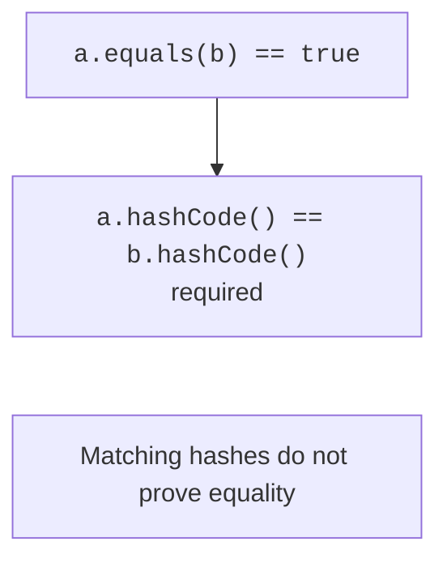

# Object, equality, and copying

## Object and logical equality

Every ordinary object has `Object` methods, including `toString`, `equals`, `hashCode`, and `getClass`. API description: <https://docs.oracle.com/en/java/javase/27/docs/api/java.base/java/lang/Object.html>. The default `toString` contains the class name and a hexadecimal hash representation; it is not a guaranteed memory address. An override should show useful state without exposing passwords or other private data.

For references, `==` checks whether they refer to the same object or are both `null`. The `equals` method can define logical value equality. Two points with coordinates 2 and 3 may be equal even though they were created by two `new` operations. Choose meaningful fields deliberately: an administrative view counter usually does not determine a domain value's identity.

The `equals` contract requires reflexivity, symmetry, transitivity, and consistency while meaningful fields remain unchanged. Any non-null object is unequal to `null`. If `a.equals(b)` is true, the hashes must match. The reverse is false: different values may have the same hash. A collision is normal, not proof of a faulty hash function.



Figure 6.4. Value equality and required hash consistency {.caption}

## Example 3. An immutable point as a value

The `Point` class is final, so `instanceof Point` does not create comparison problems with future subclasses. The coordinates are immutable, so the hash will not change while the object is in a collection. `Objects.hash` is convenient for a teaching model; it is not a cryptographic hash and is not intended to protect data.

```java
import java.util.Arrays;
import java.util.Objects;

final class Point {
    private final int x;
    private final int y;
    Point(int x, int y) {
        this.x = x;
        this.y = y;
    }
    Point(Point other) {
        this(Objects.requireNonNull(other).x, other.y);
    }
    @Override
    public boolean equals(Object other) {
        if (this == other) { return true; }
        return other instanceof Point point
                && x == point.x && y == point.y;
    }
    @Override
    public int hashCode() { return Objects.hash(x, y); }
    @Override
    public String toString() { return "(" + x + ", " + y + ")"; }
}

public class Main {
    public static void main(String[] args) {
        Point a = new Point(2, 3);
        Point b = new Point(a);
        System.out.println(a == b);
        System.out.println(a.equals(b));
        System.out.println(a.hashCode() == b.hashCode());
        System.out.println(a.equals(null));
        System.out.println(a.equals("(2, 3)"));
        Point[] first = {a};
        Point[] second = {b};
        System.out.println(first.equals(second));
        System.out.println(Arrays.equals(first, second));
        System.out.println(b);
    }
}
```

```text
false
true
true
false
false
false
true
(2, 3)
```

Arrays do not override `equals` to compare contents: the two distinct arrays here are unequal. `Arrays.equals` checks corresponding elements of a one-dimensional array. For nested arrays, there is `Arrays.deepEquals`. `Objects.equals(a, b)` helps compare values when either argument may be `null`.

If a class is open to inheritance, an `instanceof Base` comparison may consider a base object equal to a derived object, while the derived object considers an additional field. This violates symmetry. Checking `getClass() == other.getClass()` defines equality only within the same exact class. This is a deliberate semantic choice, not a universal replacement for `instanceof`. For simple value objects, a final class often avoids the entire problem.

## Copying: references, fields, and nested objects

The assignment `b = a` copies a reference. The copy constructor `new Point(a)` creates a new instance and lets you explicitly define which data is copied. This is sufficient for primitive coordinates. If a field contains a mutable array or object, simply copying the field leaves shared nested state.

`Object.clone()` performs a shallow field copy and is associated with the `Cloneable` marker. The method in `Object` is protected, and the marker itself does not declare a public `clone`. Supporting cloning therefore requires an additional contract and exception handling. For our own teaching classes, we prefer a copy constructor or factory: the rules are visible in code and can be checked.

A deep copy is not always needed. An immutable `String` or point can be shared safely. An array of points can be copied with `clone`, retaining the same immutable elements. By contrast, an array of mutable accounts still refers to shared accounts after copying the container. The word “copy” should be accompanied by an explanation of the level of independence.
