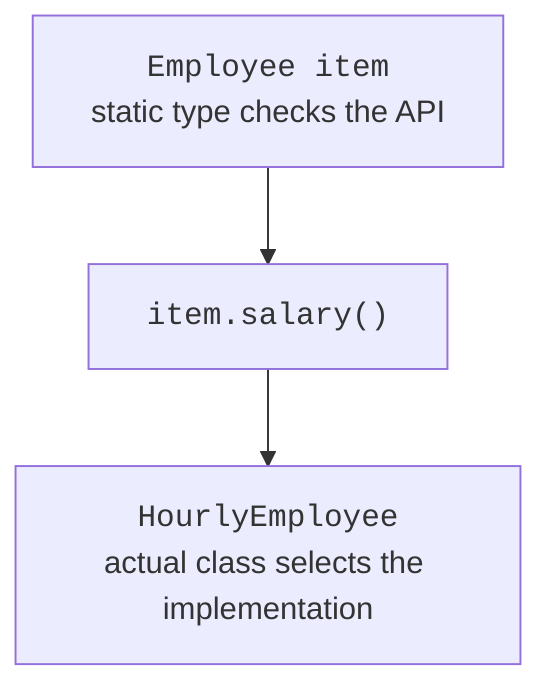

# Overriding and type casts

## Protected access does not mean public

`private` confines a member to its class, package access allows use within the package, and `public` allows access wherever the type itself is accessible. `protected` additionally grants special access to subclasses in other packages. It does not let arbitrary external code work with the field through any object of the base type.

Within the same package, `protected` also acts as package access. In another package, a subclass accessing a protected instance member through a reference faces an additional restriction: the qualifier's type must be that subclass or one of its subtypes. For example, `SavingsAccount` code can access its own protected operation through `this`, but does not gain a general right to modify any `Account` passed as a parameter.

In practice, it is better to keep fields private and expose a narrow protected operation to subclasses. A `protected deposit` that validates amounts is safer than `protected balance`: the subclass cannot assign a negative balance while bypassing validation. Access is part of a contract that is difficult to narrow once external subclasses exist.

## Overriding, overloading, and hiding

**Overriding** replaces an inherited instance implementation for a particular subtype. The name and parameters must match the signature. The return type may be covariant: a subtype may be used instead of the base reference type. Such narrowing does not work for primitive types. Access cannot be narrowed, and the list of checked exceptions cannot be arbitrarily expanded beyond the base contract.

The `@Override` annotation asks the compiler to check the programmer's intent. Without it, accidentally replacing the `Object` parameter with `Point` in `equals` creates an overload rather than the required override. The program may compile, but library code will continue calling the inherited `equals(Object)`.

**Overloading** means different parameter lists with the same name. The compiler selects the matching signature based on expression types. Then, for an overridable instance method, the JVM selects the implementation based on the object's actual class. These are two separate steps; an argument's dynamic type alone does not switch overloads.

Static methods are not overridden. A subclass's static method with the same name hides the base method, and selection depends on the specified type. Fields do not have polymorphic selection either. Do not declare identical fields in the base and derived classes: the object will have two fields, and readers can easily mistake which one is used.

For a method, `final` prohibits overriding; for a class, it prohibits inheritance; for a variable, it prohibits reassignment. These are different guarantees. A final class with mutable fields does not automatically become immutable. A private method is not overridden either; a subclass method with the same name is separate and does not change calls inside the base class.



Figure 6.3. Static type and dynamic method selection {.caption}

## Example 2. Shapes and safe casts

The base `Shape` describes a shape with zero area. In the next topic, we will replace this illustrative implementation with an abstract method if a direct instance is unnecessary. For now, the example shows how an existing shared method works with different subtypes.

An *upcast* from `Circle` to `Shape` is safe and does not create a new object. A *downcast* requires a check. The pattern `instanceof Circle circle` checks the type and introduces a local reference of the required type at the same time.

```java
class Shape {
    public double area() { return 0; }
    @Override
    public String toString() { return "Shape: " + area(); }
}

final class Circle extends Shape {
    private final double radius;
    Circle(double radius) {
        if (!Double.isFinite(radius) || radius <= 0
                || radius > 10_000) {
            throw new IllegalArgumentException("Invalid radius");
        }
        this.radius = radius;
    }
    public double radius() { return radius; }
    @Override
    public double area() { return Math.PI * radius * radius; }
    @Override
    public String toString() { return "Circle(" + radius + ")"; }
}

final class Rectangle extends Shape {
    private final double width;
    private final double height;
    Rectangle(double width, double height) {
        if (!Double.isFinite(width) || !Double.isFinite(height)
                || width <= 0 || height <= 0
                || width > 10_000 || height > 10_000) {
            throw new IllegalArgumentException("Invalid sides");
        }
        this.width = width;
        this.height = height;
    }
    @Override
    public double area() { return width * height; }
}

public class Main {
    public static void main(String[] args) {
        Shape[] shapes = {new Circle(1), new Rectangle(3, 4)};
        for (Shape shape : shapes) {
            System.out.println(shape);
            System.out.printf(java.util.Locale.ROOT,
                    "Area: %.2f%n", shape.area());
            if (shape instanceof Circle circle) {
                System.out.println("Radius: " + circle.radius());
            }
        }
        Shape absent = null;
        System.out.println(absent instanceof Circle);
    }
}
```

```text
Circle(1.0)
Area: 3.14
Radius: 1.0
Shape: 12.0
Area: 12.00
false
```

`Locale.ROOT` fixes the decimal point in the expected result. The second shape uses the base `toString` but an overridden area. The variable `circle` is available only where the compiler can prove the check succeeded. `null instanceof Circle` is `false`, so no separate null check is needed beforehand.

Casting `(Circle) shape` without a check does not turn a Rectangle object into a circle: it throws `ClassCastException`. If code often branches by type merely to call the same operation, move that operation into the shared contract. `instanceof` remains useful for a genuinely special capability that not every subtype has.
