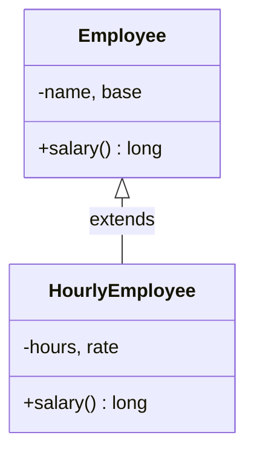
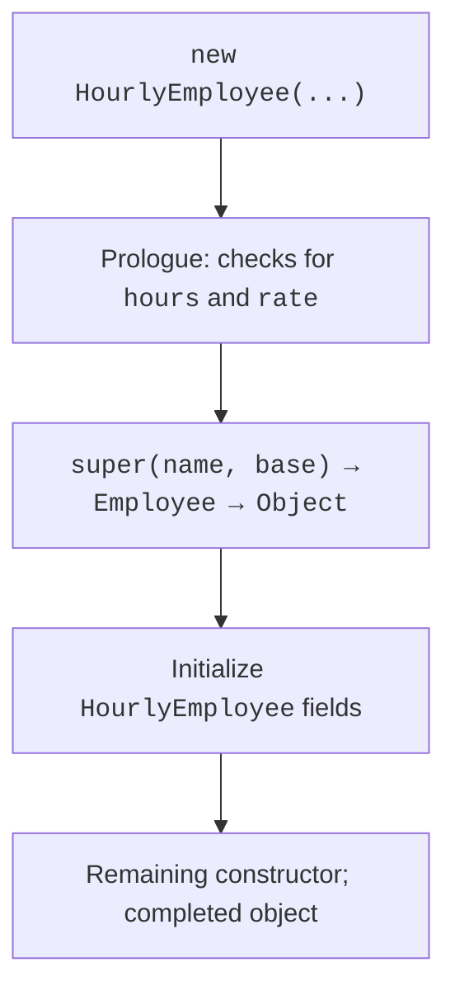

# Subclasses and their constructors

## Shared behavior of domain types

A company's payroll includes employees with fixed pay and employees with hourly pay. Both have names and can report their salaries. The calculation formula differs, but the code that prints payroll should not check the name of every concrete class. A shared contract is needed for this.

**Inheritance** creates a subtype based on an existing class. In Java, a class has at most one direct superclass, specified after `extends`. If none is specified, an ordinary class directly inherits from `Object`. The chain can have several levels, but a deep hierarchy makes behavior harder to understand.

A subclass is not a copy of its superclass's source file. Its instance also contains the state of the base portion; access to that state is determined by modifiers. A private superclass field exists in the object but is not directly accessible from subclass code. Constructors are not inherited. If `Employee` has a constructor taking a name, `HourlyEmployee` needs its own constructor that calls the base constructor.

An “is-a” relationship should mean that substitution is possible in a program. A circle is a shape, while a printer has a cartridge. The second relationship is expressed with a field, through composition, rather than by inheriting a printer from a cartridge. Similar fields alone do not establish a subtype relationship.

Official introduction to inheritance: <https://dev.java/learn/inheritance/>. This lecture uses a concrete base class with meaningful default behavior. We will cover abstract contracts without implementations of some operations later.



Figure 6.1. Employee as a shared type for pay {.caption}

## The subclass constructor and base portion

A constructor is responsible for the entire new object, not just the current class's fields. It directly or indirectly calls a superclass constructor through `super(...)`. If there is no explicit `this(...)` or `super(...)` call, the compiler inserts `super()`. Thus, a superclass without an accessible no-argument constructor requires an explicit choice of a constructor with arguments.

`this(...)` delegates to another constructor in the same class. The chain must eventually reach `super(...)`, not form a cycle. `super` does not mean a separate object: it is a way to access the base implementation within the current instance. An ordinary `new HourlyEmployee` creates one object containing both base and derived fields.

In JDK 27, an allowed prologue can run before an explicit constructor call: for example, validating an argument or calculating a local variable. This is a stable feature, not preview mode. However, the early context does not allow arbitrary reads of the not-yet-initialized object, calls to its methods, or passing `this` outside. In teaching examples, the prologue only validates parameters.

The general sequence is: memory receives default values, prologues and constructor calls execute along the chain, and after the base constructor returns, the current class's initializers and the rest of its constructor execute. An assignment in a field initializer can overwrite a value set earlier in the prologue; do not use such a dependency as a teaching technique.



Figure 6.2. Construction chain for a subclass object {.caption}

Do not call an overridable method from a base class constructor. Dynamic selection already works during construction, when subclass fields may still contain zeros or `null`. The error looks like a broken method, although its cause is a call made too early. A private constructor helper method cannot be overridden and is easier to analyze, but it must not expose `this` either.

## Example 1. Employee payroll

We store amounts in kopiykas as `long`. A fixed-pay employee receives the base amount; an hourly employee adds hourly pay to that amount. The sample model's bounds guarantee that multiplication does not overflow `long`. These are illustrative rules, not rules for calculating actual salaries.

Each class validates its own parameters. The subclass checks the rate and hours in its prologue, then delegates validation of the name and base amount to the superclass. The base class's `salary()` method is reused through an explicit `super.salary()` call.

```java
class Employee {
    private final String name;
    private final long base;

    Employee(String name, long base) {
        if (name == null || name.isBlank()
                || base < 0 || base > 100_000_000) {
            throw new IllegalArgumentException("Invalid employee");
        }
        this.name = name.strip();
        this.base = base;
    }

    public long salary() { return base; }
    public final String getName() { return name; }

    @Override
    public String toString() {
        return name + ": " + salary();
    }
}

final class HourlyEmployee extends Employee {
    private final int hours;
    private final long rate;

    HourlyEmployee(String name, long base, int hours, long rate) {
        if (hours < 0 || hours > 250 || rate < 0
                || rate > 1_000_000) {
            throw new IllegalArgumentException("Invalid hours/rate");
        }
        super(name, base);
        this.hours = hours;
        this.rate = rate;
    }

    @Override
    public long salary() {
        return super.salary() + hours * rate;
    }
}

public class Main {
    public static void main(String[] args) {
        Employee[] staff = {
            new Employee("Olena", 200_000),
            new HourlyEmployee("Taras", 100_000, 20, 5_000)
        };
        long total = 0;
        for (Employee employee : staff) {
            System.out.println(employee);
            total += employee.salary();
        }
        System.out.println("Total: " + total);
        try {
            new HourlyEmployee("Ivan", 0, -1, 5_000);
        } catch (IllegalArgumentException ex) {
            System.out.println(ex.getMessage());
        }
    }
}
```

```text
Olena: 200000
Taras: 200000
Total: 400000
Invalid hours/rate
```

The array has type `Employee[]`, but its second element refers to an `HourlyEmployee`. The loop does not know the rate or hours: it calls the common operation. Even the base `toString()` calls the overridden `salary()` for an hourly employee. This is why base code must document which methods it calls and what guarantees it expects from subclasses.

For a boundary check, set hours and rate to zero: the result equals the base amount. Negative hours and 251 must be rejected before object creation. An empty name is rejected by the `Employee` constructor, regardless of how the concrete subtype is created.
