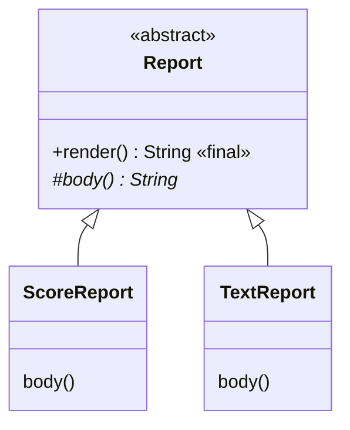

# Abstract classes and the template method

## A contract without a ready implementation

In the previous topic, the base shape returned an area of zero. This value illustrates inheritance, but in a real model, a shape without specific geometry has no meaningful formula. You need to declare the operation and require every concrete subtype to implement it.

An **abstract class** is marked `abstract`. You cannot create a direct instance with `new`. It can contain fields, constructors, implemented methods, and abstract methods without bodies. If a subclass does not implement all inherited abstract operations, it must also be abstract. A concrete subclass completes the contract and can be instantiated.

An abstract method has a signature followed by a semicolon, for example, `public abstract double area();`. It cannot also be `private`, `static`, or `final`: these modifiers would conflict with the need for an instance method override in a subclass. An abstract class need not have abstract methods if its author deliberately prohibits direct instantiation of the base type.

The abstract class's constructor is called through `super` when a subclass is instantiated. Validation of a shared name or identifier therefore stays in one place. Prohibiting `new Report(...)` does not mean that the base part of the object needs no initialization. Do not call abstract or overridable methods from a constructor: the subclass's state may not be ready yet.



Figure 7.1. An abstract contract and concrete implementations {.caption}

## Example 1. A report template method

A template method fixes the sequence of steps while leaving one variable part to the subclass. `render` constructs the header, body, and ending; `body` defines only the content. The `render` method is final, so a subclass cannot accidentally replace the format. The input array is copied so that external changes do not affect an existing report.

```java
import java.util.Arrays;

abstract class Report {
    private final String title;
    Report(String title) {
        if (title == null || title.isBlank()) {
            throw new IllegalArgumentException("Empty title");
        }
        this.title = title.strip();
    }
    protected abstract String body();
    public final String render() {
        return "[" + title + "]\n" + body() + "\nEND";
    }
}
final class ScoreReport extends Report {
    private final int[] scores;
    ScoreReport(String title, int[] scores) {
        super(title);
        if (scores == null || scores.length == 0
                || scores.length > 100) {
            throw new IllegalArgumentException("Invalid scores");
        }
        this.scores = scores.clone();
        for (int score : this.scores) {
            if (score < 0 || score > 100) {
                throw new IllegalArgumentException("Invalid score");
            }
        }
    }
    @Override
    protected String body() {
        int total = 0;
        for (int score : scores) { total += score; }
        return Arrays.toString(scores) + "\nTotal: " + total;
    }
}
public class Main {
    public static void main(String[] args) {
        int[] source = {80, 90, 100};
        Report report = new ScoreReport("Group A", source);
        source[0] = 0;
        System.out.println(report.render());
        try {
            new ScoreReport("Bad", new int[]{101});
        } catch (IllegalArgumentException ex) {
            System.out.println(ex.getMessage());
        }
    }
}
```

```text
[Group A]
[80, 90, 100]
Total: 270
END
Invalid score
```

The variable has type Report, while the object is a ScoreReport. The client knows only the public render method. The protected body method is an extension point for subclasses, rather than a public operation for external code. The body contract must specify whether an empty result is allowed and whether exceptions can occur; otherwise, the template method cannot reliably combine the steps.

The check involving source after construction demonstrates the defensive copy: the report still contains 80. The constructor rejects an invalid score. An empty array causes an explicit failure, rather than an unexpected division by zero when calculating an average later.
