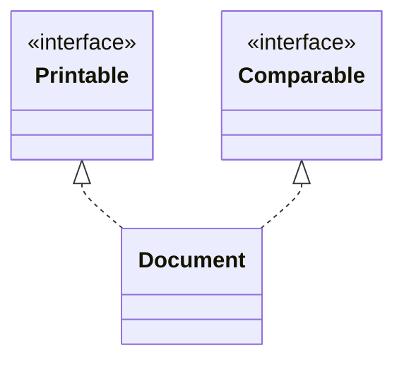
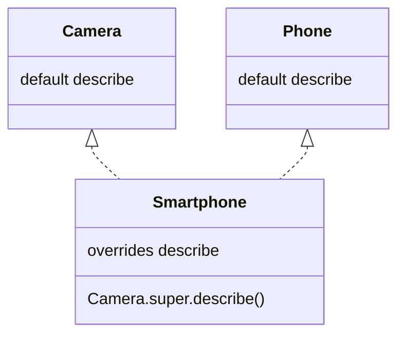

# Interfaces and their methods

## An interface as an object's role

An **interface** describes a role that different classes can fulfill. Declare it with `interface` and a class's implementation with `implements`. A class can extend only one class but implement multiple interfaces. For example, a document can support printing, comparison, and closing without being a subclass of a printer.

A regular interface method without a body is implicitly `public abstract`. Its implementation in a class must be public, even if public is omitted from the interface declaration. Interface fields are implicitly `public static final` and require initialization. They are constants, rather than the state of an individual instance. Do not use an interface solely as a container of constants to inherit their names.

An interface can extend one or more interfaces with `extends`. A class implementing a derived interface must satisfy all inherited contracts. A variable of an interface type can refer to any implementation of that interface. It exposes only the operations of that role, rather than every method of the concrete class.

Official material: <https://dev.java/learn/interfaces/>. Separate interfaces by behavior: a small `Printable` is easier to implement and test than an interface with dozens of unrelated operations. A method that only needs to print should accept Printable rather than a specific large document class.



Figure 7.2. One class can fulfill multiple roles {.caption}

## Default, static, and private

A `default` method has an implementation in the interface and can be inherited by a class. It is useful for behavior that can be expressed through other contract operations without state of its own. A class can override it. A `static` method belongs to the interface itself and is called through its name, rather than through an instance.

Private interface methods help avoid repeating code inside default or static implementations. They are not part of the external contract and are not inherited by implementations as accessible operations. A private static helper has no instance; a private instance helper can use methods of the current implementation.

If a class inherits a concrete method from its superclass, that method takes precedence over a default method. If one interface extends another and overrides a default method, the more specific contract takes precedence. Two independent default methods with the same signature create a conflict: the class must explicitly choose or combine their behavior.

```java
interface Camera {
    default String describe() { return label("camera"); }
    private String label(String text) { return "[" + text + "]"; }
}
interface Phone {
    default String describe() { return "[phone]"; }
    static boolean validNumber(String value) {
        return value != null && value.matches("[0-9]{10}");
    }
}
final class Smartphone implements Camera, Phone {
    @Override
    public String describe() {
        return Camera.super.describe() + Phone.super.describe();
    }
}
public class Main {
    public static void main(String[] args) {
        Camera item = new Smartphone();
        System.out.println(item.describe());
        System.out.println(Phone.validNumber("0123456789"));
        System.out.println(Phone.validNumber("abc"));
    }
}
```

```text
[camera][phone]
true
false
```

`Camera.super.describe()` calls a specific default implementation without creating a Camera object. This syntax applies to the corresponding direct superinterface. You should not choose an arbitrary older implementation by bypassing a more specific inherited contract.



Figure 7.3. Explicitly resolving a default method conflict {.caption}

## Abstract class or interface

Both mechanisms can define a parameter type and require operations to be implemented. The choice depends on shared state and the nature of the relationship, rather than the number of lines. An abstract class suits related implementations with shared invariants; an interface suits an independent role fulfilled by different types.

Table 7.1. Abstract class and interface {.caption}

| Feature | Abstract class | Interface |
| --- | --- | --- |
| Instance state | Fields and a constructor | No instance fields |
| Inheritance by a class | One superclass | Multiple roles |
| Implemented behavior | Regular methods | default, static, private |
| Visibility | Various levels | The contract is public |
| Typical purpose | A shared base for a family | A capability or strategy |

A large abstract class with many protected fields ties subclasses to its representation. An interface with too many default methods can hide complex dependencies between operations. Start with the smallest contract that lets the client do its work; shared code can be moved to a separate helper.
