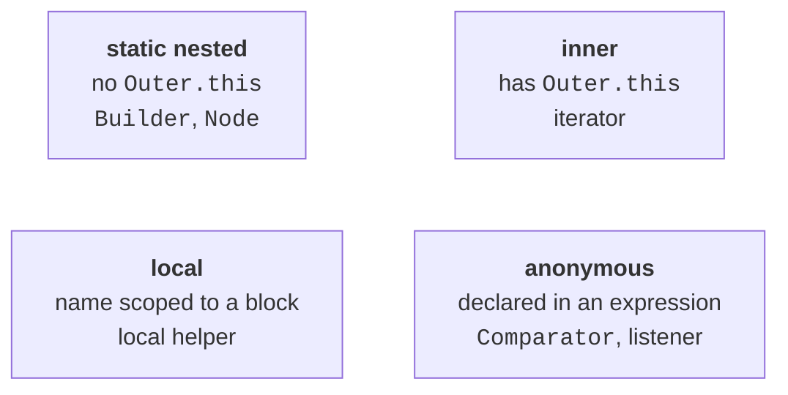
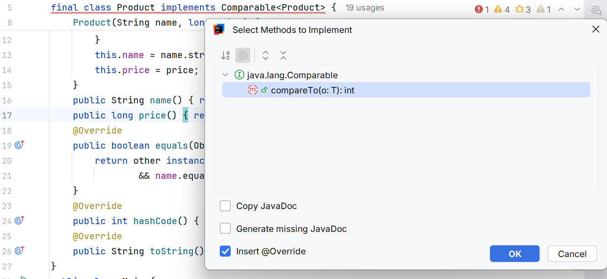
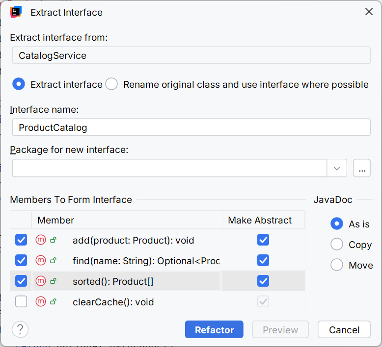

# Nested classes and standard contracts

## Four kinds of nested classes

A static nested class is declared inside another class with the static modifier. It has no implicit reference to a particular enclosing instance. You create it with syntax such as `new Order.Builder(...)`. This kind of class is useful for a node, the result of a helper operation, or a builder that logically belongs to the model.

An inner class without static is associated with an enclosing object. In RangeIterator, `Range.this` refers to that object, while plain `this` refers to the iterator. If the inner class is accessible to the client, the creation syntax is `outer.new Inner()`. In our example, the class is private, so the client obtains it through the iterator factory without knowing the creation details.

Both kinds of nested classes can access private members of the enclosing class, subject to the rules for instance availability. A static class cannot access a nonstatic field without an explicit object. An inner class's implicit link can extend the enclosing object's lifetime: as long as the iterator is needed, its Range is needed too.

A local class is declared inside a method or block. Its name is available only within that scope. An anonymous class is declared directly in a creation expression and has no constructor name of its own. In the sorting example, `new Comparator<Product>() { ... }` creates one object of a separate class implementing Comparator.



Figure 7.5. Kinds of nested classes and where they are used {.caption}

Local and anonymous classes can capture local variables that are final or *effectively final*: no other value is assigned to them after initialization. The object can outlive the method call, so it does not work with an arbitrarily mutable local stack slot. If an array reference is captured, the array itself can change; an immutable reference does not make the data immutable.

An anonymous class has its own this. This matters for an event listener that calls methods on the enclosing object: explicitly write Outer.this when needed. Lambdas, covered in Topic 11, have different rules for this. Until then, we write comparators and listeners as classes to see the full contract and avoid mixing mechanisms.

## Example 4. A static order builder

An order has a required customer, a quantity, and an optional note. A chain of builder methods is readable through names rather than the positions of many parameters. The builder is mutable; the completed order is immutable. Subsequent changes to builder must not change an existing Order.

```java
final class Order {
    private final String customer;
    private final int quantity;
    private final String note;

    private Order(Builder builder) {
        customer = builder.customer;
        quantity = builder.quantity;
        note = builder.note;
    }

    @Override
    public String toString() {
        return customer + ": " + quantity + " [" + note + "]";
    }

    public static final class Builder {
        private final String customer;
        private int quantity = 1;
        private String note = "";

        public Builder(String customer) {
            if (customer == null || customer.isBlank()) {
                throw new IllegalArgumentException("Empty customer");
            }
            this.customer = customer.strip();
        }

        public Builder quantity(int quantity) {
            if (quantity < 1 || quantity > 100) {
                throw new IllegalArgumentException(
                        "Invalid quantity");
            }
            this.quantity = quantity;
            return this;
        }

        public Builder note(String note) {
            if (note == null || note.length() > 100) {
                throw new IllegalArgumentException("Invalid note");
            }
            this.note = note.strip();
            return this;
        }

        public Order build() { return new Order(this); }
    }
}

public class Main {
    public static void main(String[] args) {
        Order.Builder builder = new Order.Builder("Olena");
        Order first = builder.quantity(3).note("pickup").build();
        Order second = builder.quantity(5).build();
        System.out.println(first);
        System.out.println(second);
        try {
            builder.quantity(0);
        } catch (IllegalArgumentException ex) {
            System.out.println(ex.getMessage());
        }
        System.out.println(builder.build());
    }
}
```

```text
Olena: 3 [pickup]
Olena: 5 [pickup]
Invalid quantity
Olena: 5 [pickup]
```

Validation happens before assignment, so a failed quantity(0) call does not damage builder's previous state. If an invariant depends on several fields, perform final validation in build or the Order constructor as well. For an array or list in builder, make a defensive copy when creating the result.

## Other standard contracts and strategies

`AutoCloseable` defines close for a resource and allows its use in try-with-resources. This is not a command to remove an object from memory, but to finish using an external resource: a file, connection, or stream. Multiple resources are closed in reverse order of creation. Exception mechanics were covered in Topic 4.

`CharSequence` defines access to a sequence of characters, including length and charAt. String and StringBuilder implement it, but the interface itself does not promise immutability. A method accepting CharSequence must specify whether it reads immediately or retains a reference for later. In the latter case, modifying StringBuilder can affect the result unless a string snapshot is created.

A marker interface has no methods but marks a property of a type for another mechanism. Cloneable is an example. The marker's presence does not automatically provide a public clone method. In your own program, an explicit method or annotation is often preferable if the role needs testable behavior rather than just a marker.

The Strategy pattern passes an algorithm as an object of an interface type. Sorting has already used this approach: the array does not know why one product precedes another, so it asks Comparator. Similarly, Invoice can accept DiscountPolicy and call its method without depending on a particular kind of discount. The strategy can be replaced at construction time without a new Invoice hierarchy.

A strategy's contract must describe allowed values, units, and side effects. For a discount, it matters whether the result represents the discount amount or the final price, how kopiykas are rounded, and whether zero is allowed. An interface with the right signature but vague semantics does not ensure interchangeable implementations.

## Working in the IDE and testing contracts

The *Code → Implement Methods* command or **Ctrl+I** shows the required methods. Check the generated visibility and types; an automatic body returning zero is a stub, rather than a finished implementation. Navigating to implementations with **Ctrl+Alt+B** helps find all classes fulfilling the role.



Figure 7.6. Selecting methods to implement {.caption}



Figure 7.7. Extracting a focused interface {.caption}

Extracting an interface should begin with the client's needs. Do not mechanically select every method: cache cleanup or an internal setter may not belong to the role. After refactoring, check that the client compiles against the interface and that a second implementation can be substituted.

For an iterator, test empty, single-element, and ordinary ranges, two independent iterations, and next after exhaustion. For a comparator, test equal keys, reverse order, and minimum and maximum numbers. For a builder, test required fields, quantity boundaries, and the immutability of an existing result after reconfiguring the builder.
