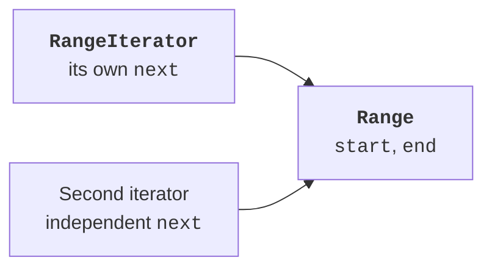

# Comparison and iteration

## Example 2. Natural and external ordering

`Comparable<Product>` defines the natural ordering of products. This example compares the name first, then the price. `Comparator<Product>` defines a separate ordering strategy: price first, then name. The parameter in angle brackets indicates the element type; we will study custom generic types later. For now, simply use Product.

A comparison returns a negative number, zero, or a positive number. You do not have to return exactly −1 or 1. Do not subtract integer values to compare them: subtraction can overflow. `Long.compare` and `Integer.compare` express the intent and work across the type's entire range.

```java
import java.util.Arrays;
import java.util.Comparator;
import java.util.Objects;

final class Product implements Comparable<Product> {
    private final String name;
    private final long price;

    Product(String name, long price) {
        if (name == null || name.isBlank()
                || price < 0 || price > 1_000_000) {
            throw new IllegalArgumentException("Invalid product");
        }
        this.name = name.strip();
        this.price = price;
    }

    public String name() { return name; }
    public long price() { return price; }

    @Override
    public int compareTo(Product other) {
        int byName = name.compareTo(other.name);
        return byName != 0 ? byName
                : Long.compare(price, other.price);
    }

    @Override
    public boolean equals(Object other) {
        return other instanceof Product p
                && name.equals(p.name) && price == p.price;
    }

    @Override
    public int hashCode() { return Objects.hash(name, price); }
    @Override
    public String toString() { return name + ":" + price; }
}

public class Main {
    public static void main(String[] args) {
        Product[] items = {
            new Product("Pen", 500),
            new Product("Book", 2000),
            new Product("Pen", 300)
        };
        Arrays.sort(items);
        System.out.println(Arrays.toString(items));
        Comparator<Product> byPrice = new Comparator<Product>() {
            @Override
            public int compare(Product a, Product b) {
                int result = Long.compare(a.price(), b.price());
                return result != 0 ? result
                        : a.name().compareTo(b.name());
            }
        };
        Arrays.sort(items, byPrice);
        System.out.println(Arrays.toString(items));
        System.out.println(new Product("Pen", 500)
                .compareTo(new Product("Pen", 500)));
    }
}
```

```text
[Book:2000, Pen:300, Pen:500]
[Pen:300, Pen:500, Book:2000]
0
```

`Arrays.sort` modifies the array passed to it. To preserve the input order, first create `items.clone()`. A comparator must not modify products or depend on a call counter. For the same values, it must produce consistent results and a transitive ordering. Otherwise, sorting has no well-defined goal.

The natural ordering should preferably be consistent with equals: a zero compareTo result means logical equality. In this class, both use the name and price. With a separate comparator that considers only price, two different products could compare as equal; document this, especially before using a sorted set. Comparator documentation: <https://docs.oracle.com/en/java/javase/27/docs/api/java.base/java/util/Comparator.html>.

## Iterable and Iterator

`Iterable<Integer>` means that an object can provide an iterator of integer values. The `iterator()` method creates an `Iterator<Integer>` with `hasNext()` and `next()`. The for-each loop uses this contract; the client does not need to know whether the source stores an array or a linked list, or computes values on demand.

`hasNext()` only reports whether another element is available. `next()` returns that element and advances the position. After exhaustion, it must throw `NoSuchElementException`, rather than return an arbitrary zero or repeat the last value. The remove method need not be supported; the default implementation reports an unsupported operation.

## Example 3. A range with an inner iterator

The range contains integers from start, inclusive, to end, exclusive. An empty range is allowed. The bounds −1000000..1000000 ensure that incrementing the position is safe; the number of elements does not exceed two million. Each call to iterator creates an independent cursor, so two iterations do not interfere with each other.

```java
import java.util.Iterator;
import java.util.NoSuchElementException;

final class Range implements Iterable<Integer> {
    private final int start;
    private final int end;

    Range(int start, int end) {
        if (start < -1_000_000 || end > 1_000_000 || start > end) {
            throw new IllegalArgumentException("Invalid range");
        }
        this.start = start;
        this.end = end;
    }

    @Override
    public Iterator<Integer> iterator() {
        return new RangeIterator();
    }

    private class RangeIterator implements Iterator<Integer> {
        private int next = Range.this.start;
        @Override
        public boolean hasNext() { return next < Range.this.end; }

        @Override
        public Integer next() {
            if (!hasNext()) { throw new NoSuchElementException(); }
            return next++;
        }
    }
}

public class Main {
    public static void main(String[] args) {
        Range range = new Range(2, 5);
        for (int value : range) { System.out.println(value); }
        Iterator<Integer> a = range.iterator();
        Iterator<Integer> b = range.iterator();
        System.out.println(a.next() + ":" + b.next());
        Iterator<Integer> empty = new Range(3, 3).iterator();
        System.out.println(empty.hasNext());
        try {
            empty.next();
        } catch (NoSuchElementException ex) {
            System.out.println("No next element");
        }
    }
}
```

```text
2
3
4
2:2
false
No next element
```

Integer is the wrapper type for int, required as the generic interface's type parameter. Returning `next++` automatically boxes int, and for-each unboxes Integer back to int. This does not mean that null can be safely unboxed: doing so throws an exception. Our iterator never returns null.



Figure 7.4. An iterator has its own cursor and a link to the range {.caption}
