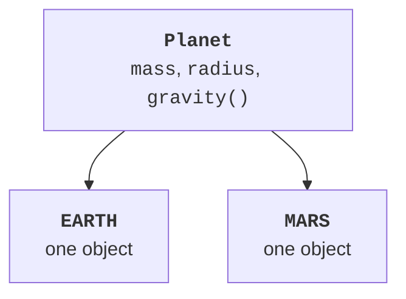

# Enums

## Enum defines a finite set of alternatives

An **enumeration** (*enum*) declares named constants of a type. Instead of the strings `"NEW"`, `"PAID"`, and `"SENT"`, you can use OrderStatus. A misspelled name becomes a compilation error rather than a hidden new state. The constants are objects created by the enum mechanism; arbitrary `new OrderStatus()` calls are prohibited.

`values()` returns an array of constants in declaration order; `valueOf` looks up an exact name and throws IllegalArgumentException if it is absent. `name()` returns the declared name, while `ordinal()` returns its zero-based position. Do not store ordinal as an external identifier: reordering the constants changes its value. An explicit stable code is preferable.

Comparing enum values with `==` is natural: each constant has one identity within its class. `compareTo` compares declaration order, rather than automatically reflecting importance in the domain. If importance differs, define a field or Comparator. A `switch` over an enum reads as a list of allowed cases.

An enum can have private fields, a constructor, and methods, and can implement interfaces. Its constructor must not be public: the enum itself controls creation. For different constant behaviors, you can declare an abstract method and provide a body for each constant. A small formula in a field is often simpler than separate bodies.



Figure 8.2. Enum constants are objects of one type {.caption}

## Example 2. Planets with parameters

We use rounded masses and radii for this educational example to show the relationship between a constant, a constructor, and a method. Surface acceleration is calculated as `G * mass / (radius * radius)`. The input body mass must not be negative or infinite.

```java
import java.util.Locale;

enum Planet {
    EARTH(5.972e24, 6.371e6),
    MARS(6.417e23, 3.390e6);

    private static final double G = 6.67430e-11;
    private final double mass;
    private final double radius;
    Planet(double mass, double radius) {
        this.mass = mass;
        this.radius = radius;
    }
    double gravity() { return G * mass / (radius * radius); }
    double weight(double bodyMass) {
        if (!Double.isFinite(bodyMass) || bodyMass < 0
                || bodyMass > 1_000_000) {
            throw new IllegalArgumentException("Invalid mass");
        }
        return bodyMass * gravity();
    }
}
public class Main {
    public static void main(String[] args) {
        for (Planet planet : Planet.values()) {
            System.out.printf(Locale.ROOT, "%s %.2f %.2f%n",
                    planet.name(), planet.gravity(),
                    planet.weight(10));
        }
        System.out.println(Planet.valueOf("EARTH") == Planet.EARTH);
        try {
            Planet.valueOf("earth");
        } catch (IllegalArgumentException ex) {
            System.out.println("Unknown planet");
        }
    }
}
```

```text
EARTH 9.82 98.20
MARS 3.73 37.27
true
Unknown planet
```

Intermediate calculations are not rounded after each step; the %.2f format rounds only the representation. For tasks with exact financial rules, this double-based approach should not be mechanically applied to money. For this physical formula example, it matches the approximate nature of the input constants.

`EnumSet` and `EnumMap` specialize in sets of enums and enum keys. They will be useful for a set of allowed states or a rule table; collections are covered in detail in Topic 10. At this stage, the values array and switch suffice without introducing container complexity prematurely.
