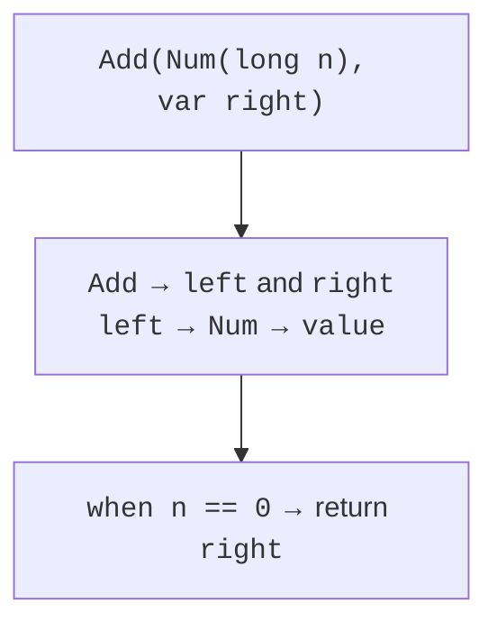
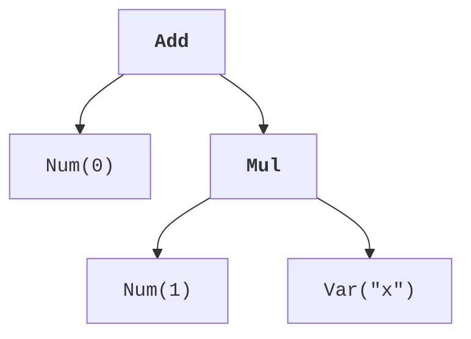
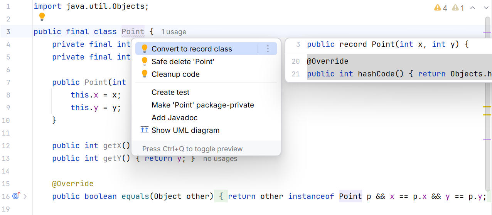
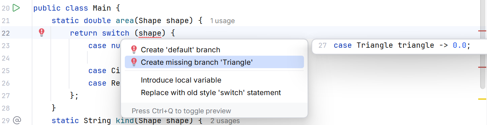

# Record patterns and deconstruction

## Record patterns and deconstruction

A record pattern shows the required components directly in the condition. `var` lets their types be inferred, while a nested pattern deconstructs a component that is itself a record. For example, a pattern for an edge with two points can obtain four coordinates directly without intermediate variables.

The `_` symbol means that the corresponding value is unused. It cannot be read as a variable. This helps distinguish deliberately ignoring a component from accidentally forgetting a name. Do not use it to replace data needed for invariant checks: deconstruction is not automatic validation.



Figure 8.5. A nested pattern extracts the required components {.caption}

A nested type or record pattern does not necessarily match a null component. The simplest model for educational trees is to prohibit null in node constructors. Every edge then leads to a valid subexpression, and the evaluator does not need a hidden set of special cases.

## Example 4. An arithmetic expression tree

Expr describes a number, variable, addition, or multiplication. For simplicity, the environment contains one variable, x; other names are rejected. Evaluation uses exact integer operations with overflow checks. Simplification demonstrates nested patterns and guards for zero and one.

```java
import java.util.Objects;

sealed interface Expr permits Num, Var, Add, Mul { }
record Num(long value) implements Expr { }

record Var(String name) implements Expr {
    Var {
        if (!"x".equals(name)) {
            throw new IllegalArgumentException("Unknown variable");
        }
    }
}

record Add(Expr left, Expr right) implements Expr {
    Add {
        Objects.requireNonNull(left);
        Objects.requireNonNull(right);
    }
}

record Mul(Expr left, Expr right) implements Expr {
    Mul {
        Objects.requireNonNull(left);
        Objects.requireNonNull(right);
    }
}

public class Main {
    static long eval(Expr expr, long x) {
        return switch (Objects.requireNonNull(expr)) {
            case Num(long value) -> value;
            case Var _ -> x;
            case Add(var a, var b) ->
                    Math.addExact(eval(a, x), eval(b, x));
            case Mul(var a, var b) ->
                    Math.multiplyExact(eval(a, x), eval(b, x));
        };
    }

    static Expr simplify(Expr expr) {
        Expr prepared = switch (Objects.requireNonNull(expr)) {
            case Add(var a, var b) ->
                    new Add(simplify(a), simplify(b));
            case Mul(var a, var b) ->
                    new Mul(simplify(a), simplify(b));
            default -> expr;
        };
        return switch (prepared) {
            case Add(Num(long n), var b) when n == 0 -> b;
            case Add(var a, Num(long n)) when n == 0 -> a;
            case Mul(Num(long n), var b) when n == 1 -> b;
            case Mul(var a, Num(long n)) when n == 1 -> a;
            default -> prepared;
        };
    }

    public static void main(String[] args) {
        Expr expression = new Add(new Num(0),
                new Mul(new Num(1), new Var("x")));
        Expr result = simplify(expression);
        System.out.println(eval(expression, 7));
        System.out.println(result);
        System.out.println(eval(result, 7));
        try {
            eval(new Add(new Num(Long.MAX_VALUE), new Num(1)), 0);
        } catch (ArithmeticException ex) {
            System.out.println("Overflow");
        }
    }
}
```

```text
7
Var[name=x]
7
Overflow
```

First, simplify recursively simplifies the children, then applies a local rule. The nested one therefore disappears before the outer addition of zero. We do not apply the rule for multiplying an arbitrary expression by zero: it could hide overflow or another failure while evaluating the subexpression. Simplification must preserve the chosen semantics.



Figure 8.6. The expression zero plus one times x {.caption}

An algebraic data type combines alternatives and components: Expr is one of four forms, while Add contains a pair of Expr values. For a new operation, you can write a new exhaustive switch. For a new form, you must update all such operations. This is a useful tradeoff to consider when designing a model.

A recursive tree must have a depth limit if it is built by the user. A very deep expression can overflow the call stack even without arithmetic overflow. In lab tasks, limit the depth, for example to 20, and the number of nodes, for example to 1000; the input format must be explicitly defined.

## Preview features and IDE tools

In JDK 27, primitive type patterns in broader contexts remain a preview feature (*Primitive Types in Patterns, instanceof, and switch, Fifth Preview*). Do not confuse them with stable record and component patterns. All complete programs in this topic compile without `--enable-preview`. Official experimental specification: <https://docs.oracle.com/javase/specs/jls/se27/preview/specs/primitive-types-in-patterns-instanceof-switch-jls.html>.

A separate preview experiment requires matching compilation flags, `--enable-preview --release 27`, and the runtime flag `--enable-preview`, along with the corresponding IDE language level. Such classes are tied to the preview version; do not silently include them in regular lab examples or require them at the basic level.



Figure 8.7. Converting a data carrier to a record {.caption}



Figure 8.8. Adding a missing switch alternative {.caption}

Automatic conversion to a record requires checking external calls: getX and x have different names. Also check equality, the toString format, and defensive copying. If the class had a hidden instance cache, conversion may require changing the model rather than just replacing syntax.

A negative check is useful for a sealed switch: add a temporary subtype and confirm that the exhaustive evaluator no longer compiles. Then add the necessary branch. This experiment explains why default sometimes hides a useful completeness check as the model evolves.
