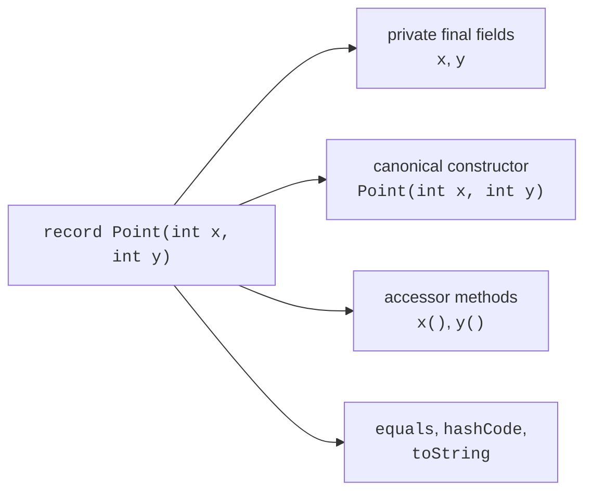

# Records and immutability

## Values instead of boilerplate

For a point, a monetary amount, or a measurement result, you often need a class whose main purpose is to hold a group of data. A regular class requires fields, a constructor, accessors, equals, hashCode, and toString. When all these operations follow directly from the components, Java lets you declare a **record** (*record*).

The header `record Point(int x, int y)` defines two components. The compiler creates private final fields, a canonical constructor with these parameters, accessors `x()` and `y()`, and methods for equality, hashing, and text representation. The accessor is named x, rather than getX: this is part of the standard record contract.

A record is implicitly final and extends `java.lang.Record`. It cannot extend an arbitrary other class, but it can implement interfaces. Additional instance fields outside the components are prohibited; static fields, methods, nested types, and additional constructors are allowed. An additional constructor delegates to the canonical constructor so that every creation initializes all components.

A record is not the automatic choice for every entity. If an object has hidden mutable identity or must freely change its internal representation without changing the public API, a regular class may be more suitable. Record components are part of its public contract and participate in equality.

Official introduction: <https://dev.java/learn/records/>. The examples below use records as validated values that can be safely passed between parts of a program and compared by content.



Figure 8.1. Components determine the standard record members {.caption}

## Compact constructors and invariants

The canonical constructor has the same parameter types and order as the components. A compact constructor avoids repeating this list: write a body after the record name without parentheses. The component parameters are available inside it. After successful completion, they are automatically assigned to the fields.

In a compact constructor, you can validate a number, normalize a string, or replace a parameter with a copy. Direct assignment with `this.component = ...` is prohibited in such a constructor. Modify the component parameter, and the record mechanism performs the final assignment. Do not call an accessor to validate a field that has not yet been assigned: validate the parameter.

A constructor should not silently repair every invalid value. Trimming leading and trailing whitespace from a currency code may be a defined normalization rule, while converting a negative amount to zero would hide a user error. Document bounds and normalization rules as part of the contract.

## Example 1. A monetary value

Money contains a currency code for the educational model and a nonnegative number of kopiykas. The currencies are deliberately limited to UAH and EUR here; the program performs no conversion or payments. Only matching currencies can be added, and the constructor of the new result enforces the upper limit.

```java
import java.util.Locale;
import java.util.Objects;

record Money(String currency, long cents) {
    Money {
        if (currency == null) {
            throw new IllegalArgumentException("Missing currency");
        }
        currency = currency.strip().toUpperCase(Locale.ROOT);
        if (!currency.equals("UAH") && !currency.equals("EUR")) {
            throw new IllegalArgumentException("Unknown currency");
        }
        if (cents < 0 || cents > 1_000_000_000) {
            throw new IllegalArgumentException("Invalid amount");
        }
    }
    static Money ofUnits(String currency, long units) {
        return new Money(currency, Math.multiplyExact(units, 100));
    }
    Money plus(Money other) {
        Objects.requireNonNull(other);
        if (!currency.equals(other.currency)) {
            throw new IllegalArgumentException(
                    "Different currencies");
        }
        return new Money(currency, Math.addExact(cents, other.cents));
    }
}
public class Main {
    public static void main(String[] args) {
        Money first = new Money(" uah ", 1250);
        Money second = Money.ofUnits("UAH", 5);
        System.out.println(first);
        System.out.println(first.plus(second));
        System.out.println(first.equals(new Money("UAH", 1250)));
        System.out.println(first.currency());
        try {
            first.plus(new Money("EUR", 100));
        } catch (IllegalArgumentException ex) {
            System.out.println(ex.getMessage());
        }
    }
}
```

```text
Money[currency=UAH, cents=1250]
Money[currency=UAH, cents=1750]
true
UAH
Different currencies
```

The generated toString is suitable for demonstrations and debugging, but it is not a stable data exchange protocol. Do not parse it back as a file format. The ofUnits factory expresses the input units in its name and uses multiplyExact so that overflow cannot turn a large positive amount into an incorrect number.

Addition creates a new record, so first remains

1. Boundary checks require zero, the upper

limit, an amount above the limit, an unknown currency, and null. Equality checks must account for normalization: `" uah "` and `"UAH"` produce the same component.

## Shallow immutability and defensive copies

A final field prevents reassignment of the reference, but does not prevent modifying the object it refers to. A record with an unprotected array can change its visible state through the input array or the accessor. An immutable value requires copies on both input and output.

Generated equals and hashCode use component semantics. For an array, this means reference equality rather than element comparison. A record with an array intended to represent a sequence value therefore requires explicit Arrays.equals and Arrays.hashCode. The following example demonstrates both aspects together.

```java
import java.util.Arrays;

record Scores(int[] values) {
    Scores {
        if (values == null || values.length > 100) {
            throw new IllegalArgumentException("Invalid scores");
        }
        values = values.clone();
        for (int value : values) {
            if (value < 0 || value > 100) {
                throw new IllegalArgumentException("Invalid score");
            }
        }
    }
    @Override
    public int[] values() { return values.clone(); }
    @Override
    public boolean equals(Object other) {
        return other instanceof Scores scores
                && Arrays.equals(values, scores.values);
    }
    @Override
    public int hashCode() { return Arrays.hashCode(values); }
    @Override
    public String toString() { return Arrays.toString(values); }
}
public class Main {
    public static void main(String[] args) {
        int[] input = {80, 90};
        Scores scores = new Scores(input);
        input[0] = 0;
        scores.values()[1] = 0;
        Scores equal = new Scores(new int[]{80, 90});
        System.out.println(scores);
        System.out.println(scores.equals(equal));
        System.out.println(scores.hashCode() == equal.hashCode());
        System.out.println(new Scores(new int[0]));
    }
}
```

```text
[80, 90]
true
true
[]
```

An empty sequence is allowed here because there is no average operation with undefined behavior for an empty set. Copying an array of primitives fully separates its elements. An array of mutable objects requires a separate decision for each element; clone copies only the container.
