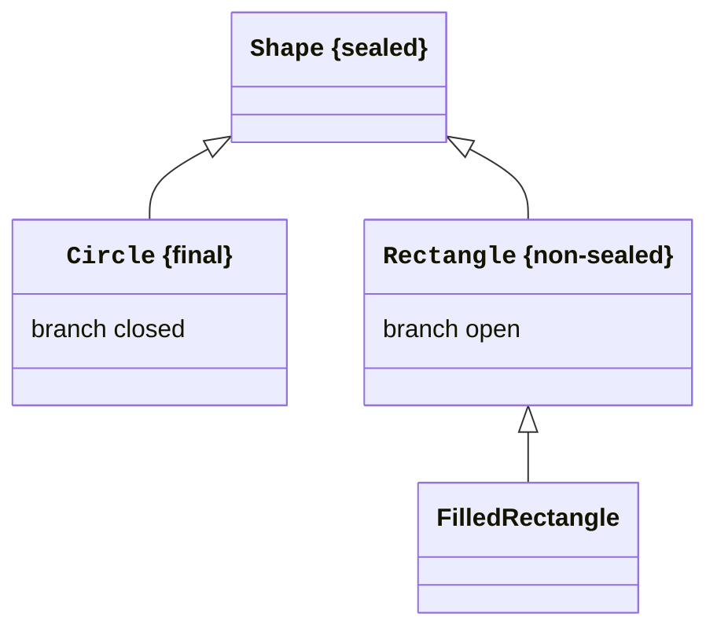
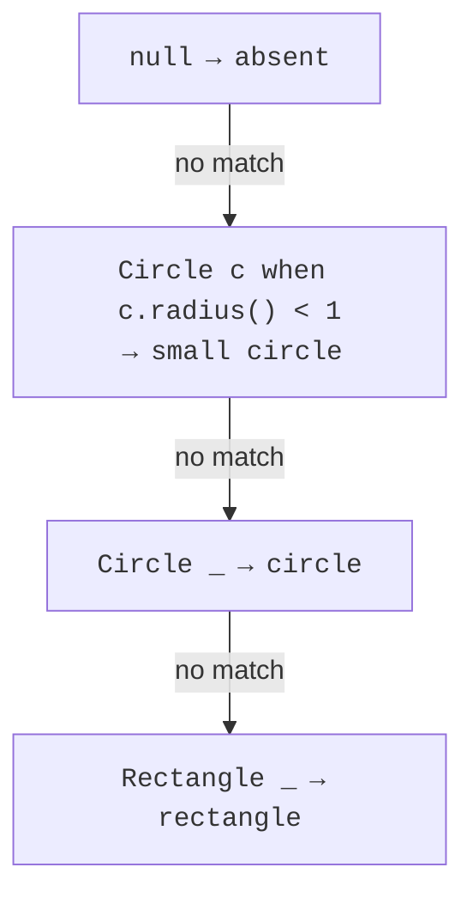

# Sealed types and patterns

## Sealed restricts direct subtypes

A regular open class allows new subclasses outside the current file. `final` prohibits all subclasses. `sealed` takes an intermediate position: a type explicitly defines its permitted direct subtypes with `permits`. This is useful when the model should have a controlled set of alternatives.

A direct subclass of a sealed class must be `final`, `sealed`, or `non-sealed`. A final subclass ends the branch, sealed continues a controlled list, and non-sealed reopens its branch. A record naturally suits implementation of a sealed interface: record is already implicitly final. A regular subinterface can be sealed or non-sealed, but not final.

Permitted subtypes must belong to the same named module; in an unnamed module, they must be in the same package. If all direct subtypes are declared in one file, permits can be inferred, but an explicit list often makes the model's boundaries clearer to beginners.



Figure 8.3. Closed and open branches of a sealed hierarchy {.caption}

The diagram shows the general possibility of an open Rectangle branch. In the complete program below, both concrete shapes are records and therefore final: this is a different, fully closed version of the model.

Sealed does not make fields immutable or validate invariants. It controls the subtype structure. Component immutability, the absence of null, and valid dimensions must be ensured separately. Combining a sealed interface with records often produces a compact model of alternatives with validated data.

## Type patterns, scope, and null

`instanceof Circle circle` checks the type and introduces the circle reference where control flow proves success. The variable is available on the right side of a logical `&&` because the left check is already true. After a negated check with an early return, the variable may be available afterward: the nonmatching branch has ended.

A pattern `switch` moves this branching into a list of cases. `case Circle c ->` works with objects of the corresponding type. A `when` guard additionally checks a value, such as a small radius. A guarded case does not replace the general branch for that type if the condition can be false.

Order matters. A general type case before a narrower one makes the latter unreachable: it dominates it. The compiler rejects this structure. Write special cases and guards first, then general cases. `case null` defines explicit behavior for an absent object; an ordinary default alone does not imply null handling.



Figure 8.4. Type, guard, and general case {.caption}

## Example 3. Sealed shapes

Shape has only Circle and Rectangle. Each record checks that dimensions are finite and positive. The switch in area is exhaustive without default: the compiler knows both direct subtypes. If you add a new shape, recompilation will require extending the calculation.

```java
sealed interface Shape permits Circle, Rectangle { }
record Circle(double radius) implements Shape {
    Circle { Dimensions.check(radius); }
}
record Rectangle(double width, double height) implements Shape {
    Rectangle {
        Dimensions.check(width);
        Dimensions.check(height);
    }
}
final class Dimensions {
    private Dimensions() { }
    static void check(double value) {
        if (!Double.isFinite(value) || value <= 0 || value > 10_000) {
            throw new IllegalArgumentException("Invalid dimension");
        }
    }
}
public class Main {
    static double area(Shape shape) {
        return switch (shape) {
            case null -> throw new IllegalArgumentException(
                    "No shape");
            case Circle(double r) -> Math.PI * r * r;
            case Rectangle(double w, double h) -> w * h;
        };
    }
    static String kind(Shape shape) {
        return switch (shape) {
            case null -> "absent";
            case Circle c when c.radius() < 1 -> "small circle";
            case Circle _ -> "circle";
            case Rectangle _ -> "rectangle";
        };
    }
    public static void main(String[] args) {
        Shape[] shapes = {new Circle(0.5), new Rectangle(3, 4)};
        for (Shape shape : shapes) {
            System.out.printf(java.util.Locale.ROOT, "%s %.2f%n",
                    kind(shape), area(shape));
        }
        System.out.println(kind(null));
        try {
            new Circle(Double.NaN);
        } catch (IllegalArgumentException ex) {
            System.out.println(ex.getMessage());
        }
    }
}
```

```text
small circle 0.79
rectangle 12.00
absent
Invalid dimension
```

`case Circle(double r)` is a record pattern that deconstructs the component through its accessor. Here the component type is already double; this is a stable use of a record pattern, rather than a preview check of an arbitrary Object against a primitive type. `Circle _` checks the type without introducing a name because the body does not need the object.

Exhaustiveness covers all non-null alternatives in the sealed model; we added null handling explicitly. In production code, a container constructor often prohibits null, but a public function must still document its policy on accepting it.
