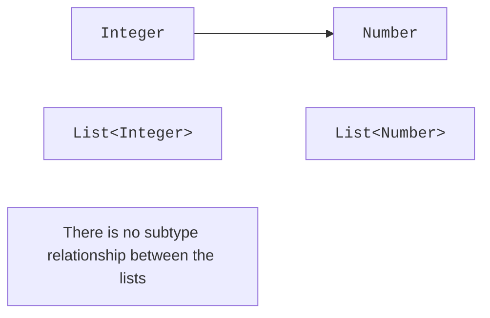

# Bounds and invariance

## Bounded type parameters

The declaration `<T extends Number>` lets you use `Number` methods such as `doubleValue`. The word `extends` applies to both class bounds and interface bounds. Without an explicit bound, `Object` is used, so an arbitrary `T` has no arithmetic or comparison methods.

Natural ordering often requires the bound `<T extends Comparable<? super T>>`. It allows a type to be compared not only with exactly itself but also with its supertype. This is useful when a subclass inherits comparison from its base class without declaring a new Comparable for the subclass.

### Example 2. The maximum of three values

```java
import java.time.LocalDate;
import java.util.Objects;

public class Main {
    static <T extends Comparable<? super T>> T maximum(
            T first, T second, T third) {
        Objects.requireNonNull(first);
        Objects.requireNonNull(second);
        Objects.requireNonNull(third);
        T best = first;
        if (second.compareTo(best) > 0) best = second;
        if (third.compareTo(best) > 0) best = third;
        return best;
    }

    public static void main(String[] args) {
        System.out.println(maximum(4, 9, 2));
        System.out.println(maximum("pear", "apple", "plum"));
        var first = LocalDate.of(2026, 9, 1);
        System.out.println(maximum(
            first, first.plusDays(2), first.plusDays(1)));
    }
}
```

```text
9
plum
2026-09-03
```

On a tie, the method keeps the first maximum. This tie rule is not expressed in the type, but it is part of the behavior. String comparison is lexicographic and is not full linguistic sorting of names in a natural language. For a different order, pass a separate `Comparator`.

Multiple bounds are separated with `&`: `<T extends Base & Named & Runnable>`. If there is a class bound, it comes first; the rest are interfaces. This way, an algorithm declares the capabilities it needs instead of listing every acceptable concrete class. Unnecessary bounds narrow the API for no reason.

### From a bound to a computation contract

The `Number` bound does not let you write `a + b` for an arbitrary `T`. Different numeric classes have different precision and overflow rules. Converting everything with `doubleValue()` gives a common operation but can lose the precision of a large `Long` or a `BigDecimal`. Such a conversion should be called an approximate computation.

A generic numeric algorithm sometimes needs to receive an addition strategy and a zero value as a separate object. This is more complex than a `Number` bound, but it honestly describes the required operations. In this topic, it is enough not to promise mathematical guarantees that the static bound does not actually provide.

## Invariance and the difference from arrays

`Integer` is a subtype of `Number`, but `Box<Integer>` is not a subtype of `Box<Number>`. If such an assignment were allowed, you could write a `Double` through the second reference while the first one still promised an `Integer`. Java makes ordinary generics invariant to close this path.

Java arrays are historically covariant. An `Integer[]` can be assigned to a `Number[]`, but the array remembers the actual component type and checks writes at runtime. An invalid write causes an `ArrayStoreException`. Generics mostly move such errors to the compiler.

```java
public class Main {
    public static void main(String[] args) {
        Number[] values = new Integer[] {1, 2};
        try {
            values[0] = 2.5;
        } catch (ArrayStoreException error) {
            System.out.println("array rejects Double");
        }
        System.out.println(values[0]);
    }
}
```



Figure 9.2. A common upper element type does not create an assignment between invariant containers. {.caption}

A read-only interface does not by itself make a Java class parameter covariant. Java uses use-site wildcards: `Box<? extends Number>`. Unlike some other languages, Java has no `out` and `in` modifiers in the parameter declaration.
