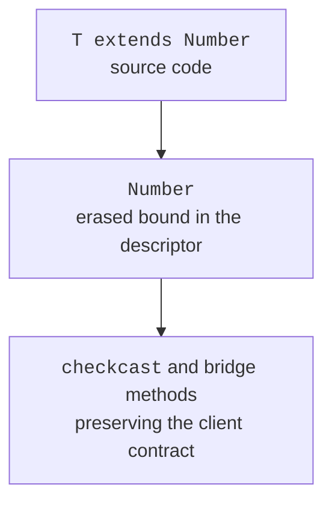

# Type erasure and its consequences

## Type erasure and generated bridges

The compiler checks generics, while for execution the JVM mostly erases type arguments. An unbounded `T` is replaced with `Object`, and a bounded one with its first bound. At the use site, the compiler may insert a cast to the expected type.



Figure 9.4. The checked source contract is compiled with an erased type and a cast in the caller. {.caption}

Information about the generic signature can remain in the class file metadata for tools and reflection. This does not mean that every `ArrayList<String>` instance checks every element against String at runtime. Distinguish between the description of a declaration and the actual type of a value in an arbitrary container.

Bridge methods support polymorphic overriding after erasure. For example, a class with `Comparable<Student>` implements `compareTo(Student)`, and the compiler may add a bridge `compareTo(Object)` that performs a cast and calls the typed method. This is a detail of generated code that you do not need to duplicate manually in an ordinary class.

::: info Screenshot
Terminal: javac -encoding UTF-8 Main.java; javap -c -p Main and generic nested class; show checkcast and erased Object signatures.
:::

Figure 9.5. Javap shows erased signatures and inserted casts. {.caption}

The `javap -c -p` command shows instructions and private members. For details of the bridge/synthetic flags, use `javap -v`. Generated names of local elements may change between compiler versions; check the content of signatures and checks, not an incidental number in the constant pool.

## Generics restrictions

You cannot create `new T()`, because the erased type does not define a constructor. Instead, pass a factory or another explicitly typed creation mechanism. `new T[]` is not allowed either: an array must know the runtime type of its components, and generics erase it.

A static field cannot have the type of a class instance parameter: there is one static scope for all parameterizations. `Box<String>` and `Box<Integer>` do not get separate copies of a static field. A static method can declare its own independent `<T>`.

You cannot overload two methods that differ only as `List<String>` and `List<Integer>` if their signatures coincide after erasure. Choose different names or a different set of parameters. A generic class also cannot be a direct or indirect subclass of `Throwable`. A typed error result is better expressed with a separate model.

Checking an arbitrary `Object` with `instanceof List<String>` does not prove the parameterization and is not a generally available test. `instanceof List<?>` checks the outer container. Newer language rules allow certain checks of parameterized types when the required compatibility has already been proven statically; this does not let you check the arbitrary contents of a list in one step.

## Example 4. An array-based stack

The array is internal storage that is never returned to the client. All writes go through `push(E)`, so they do not violate the element contract. This lets you localize the unchecked cast to the creation of the storage and explain its invariant.

```java
import java.util.Arrays;
import java.util.NoSuchElementException;
import java.util.Objects;

public class Main {
    static final class Stack<E> {
        private E[] elements;
        private int size;

        @SuppressWarnings("unchecked")
        Stack(int capacity) {
            if (capacity < 1) {
                throw new IllegalArgumentException("capacity");
            }
            elements = (E[]) new Object[capacity];
        }

        void push(E value) {
            Objects.requireNonNull(value);
            if (size == elements.length) {
                int capacity = Math.multiplyExact(size, 2);
                elements = Arrays.copyOf(elements, capacity);
            }
            elements[size++] = value;
        }

        E pop() {
            if (size == 0) throw new NoSuchElementException("empty");
            int index = --size;
            E value = elements[index];
            elements[index] = null;
            return value;
        }

        int size() { return size; }
    }

    public static void main(String[] args) {
        var values = new Stack<String>(1);
        values.push("first");
        values.push("second");
        System.out.println(values.pop());
        System.out.println(values.pop());
        System.out.println(values.size());
        try {
            values.pop();
        } catch (NoSuchElementException error) {
            System.out.println(error.getMessage());
        }
    }
}
```

```text
second
first
0
empty
```

Clearing the removed cell drops an unnecessary strong reference to the object. Without it, the array could retain the value after it has been logically removed from the stack. The counter changes only after the emptiness check. Adding with capacity doubling has amortized O(1) complexity, even though an individual growth step copies O(n) elements.

The cast array actually remains an `Object[]`, not a `String[]`. If you hand it to a client as `E[]`, an external cast may fail. That is why the API returns individual `E` values rather than the internal array. The alternative is to store an `Object[]` and localize the cast in the read operation.
