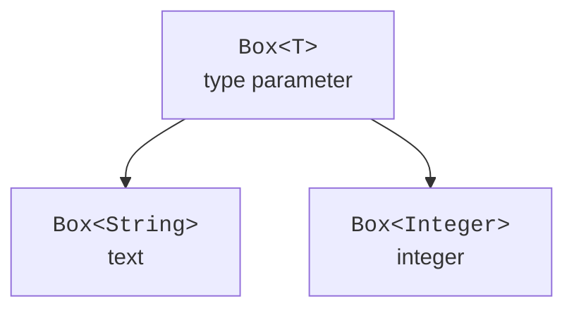

# Type parameters, classes, and methods

## From Object to a type parameter

Consider a container without generics. An `Object` field accepts a string, a boxed integer, or any other object. The compiler does not know what value the read method will return. Casting to `Integer` merely postpones the check until runtime.

```java
public class Main {
    static final class ObjectBox {
        private Object value;
        void put(Object value) { this.value = value; }
        Object get() { return value; }
    }

    public static void main(String[] args) {
        var box = new ObjectBox();
        box.put("Kotlin");
        try {
            Integer number = (Integer) box.get();
            System.out.println(number);
        } catch (ClassCastException error) {
            System.out.println("wrong runtime type");
        }
    }
}
```

This deliberately demonstrates an error, rather than a recommended storage approach. In `Box<T>`, the same parameter is used for writing and reading: `void put(T value)` and `T get()`. Creating `Box<String>` ties these operations to strings and lets `put(42)` be rejected before the program runs.



Figure 9.1. Generics move type compatibility checks to the compiler. {.caption}

`T` is a type parameter, while `String` in `Box<String>` is a type argument. The names `T`, `E`, `K`, and `V` traditionally stand for type, element, key, and value. You can use descriptive names if they make a complex API easier to read. These are not language keywords.

Generic arguments are reference types. `Box<int>` does not compile, but `Box<Integer>` is valid. Autoboxing makes usage more convenient, but `Integer` permits `null`, has an object representation, and is not simply another name for primitive `int`.

## Generic classes, records, and diamond

Type parameters are declared after the class name. They are available in fields, constructors, and instance methods. A constructor does not repeat the type list after its own name. The expression `new Box<>()` uses the diamond operator: the compiler infers the arguments from the context or constructor arguments.

`var` infers a local variable's type but does not disable typing. The expression `var box = new Box<String>()` has the concrete type `Box<String>`. If the required argument cannot be inferred from context, specify it explicitly. An overly general inferred result, such as `Object`, can obscure the author's intent.

### Example 1. A generic pair

A record is convenient for a simple immutable set of components. `Pair<A,B>` has two independent parameters, so swapping returns `Pair<B,A>`. A static factory has its own type parameters: a static context does not use the record instance's parameters.

```java
import java.util.Objects;

public class Main {
    record Pair<A, B>(A first, B second) {
        Pair {
            Objects.requireNonNull(first);
            Objects.requireNonNull(second);
        }

        static <X, Y> Pair<X, Y> of(X first, Y second) {
            return new Pair<>(first, second);
        }

        Pair<B, A> swap() {
            return new Pair<>(second, first);
        }
    }

    public static void main(String[] args) {
        Pair<String, Integer> result = Pair.of("Ada", 95);
        var swapped = result.swap();
        System.out.println(result);
        System.out.println(swapped);
        System.out.println(result.equals(swapped.swap()));
    }
}
```

```text
Pair[first=Ada, second=95]
Pair[first=95, second=Ada]
true
```

The record constructor explicitly prohibits `null`. Generic syntax does not impose that prohibition by itself. Record components are final references, but if they point to mutable objects, the record is not deeply immutable. Defensive copying can be part of a specific model's constructor.

The types `Pair<String,Integer>` and `Pair<Integer,String>` remain different to the compiler even though the record implementation is the same. Do not expect `equals` necessarily to compare generic parameters as separate runtime tags: they are mostly erased.

## Generic methods and type argument inference

A generic method's parameters are declared before its return type: `static <T> T identity(T value)`. This `T` belongs to the method itself. If a class method accidentally declares its own parameter with the same name, it shadows the class parameter and makes the code harder to read. Use different names for independent roles.

A type argument can be specified explicitly: `Main.<String>identity("text")`. Inference usually suffices, but an explicit argument can help explain a complex call. Generics are useful when multiple parameters are related, or when input and output are related; do not add `<T>` to a method that works equally well with `Object`.

For example, `void print(Object value)` already accepts any object. In contrast, `<T> T choose(T first, T second)` preserves the relationship between the return type and the arguments. The compiler can find a common supertype for different arguments, so the expected result's context also matters.
