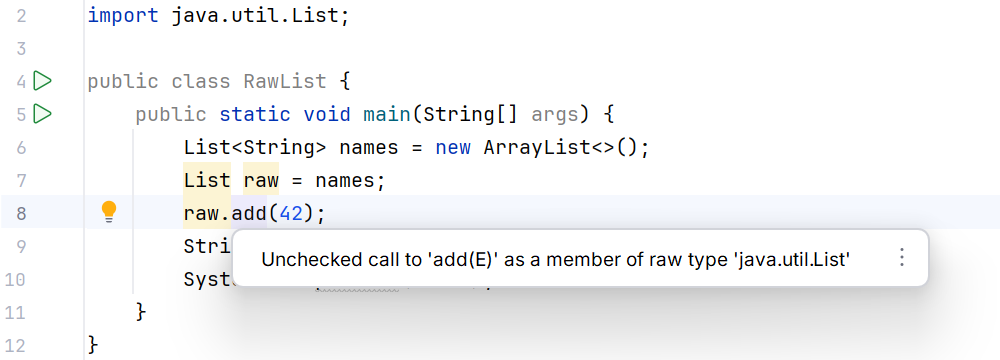

# Raw types and standard contracts

## Raw types and heap pollution

The raw type `List` instead of `List<String>` is kept for compatibility with old code. It disables some checks and produces unchecked warnings. Using a raw reference to write a number into a list of strings may cause an error much later, when other code reads the element as a String.

Figure 9.6. A raw type warning points to a lost contract. {.caption}

Compile the examples with `javac -Xlint:unchecked`. Do not silence warnings with a broad `@SuppressWarnings` on the whole class just to get a clean log. If an unchecked operation is necessary, limit the suppression to the smallest possible region and write down the invariant that guarantees correctness.

Generic varargs combine an array with a type whose arguments are erased. The `@SafeVarargs` annotation is the author's promise that the method does not violate the safety of this array and does not pass it to unsafe code. It adds no runtime checks. It is allowed only on the methods and constructors defined by the language, in particular static, final, or private methods; do not apply it without proof.

## Generic results and standard contracts

`Optional<T>` expresses a present or absent non-null value. It does not replace an error container with an explanation and must never itself be null. In the next topic on the functional API, we will look at its transformations and fallback values.

A sealed interface can have a result parameter and two records for success and failure. Java does not infer covariance of `Result<Subtype>` automatically; the choice of parameters and wildcards remains part of the API. `record` and `sealed` complement generics but do not change the basic invariance rules.

`Comparable<T>` defines natural ordering, `Comparator<T>` an external rule, and `Iterable<T>` a way to obtain an iterator. These contracts will appear in collections and the Stream API. It is important to read not only the method name but also the directions of `extends` and `super` in its parameters.

Testing a generic API has two parts. Executable tests check ordering, the empty state, boundaries, and immutability after a failure. Separate negative compilation files check that an unsafe assignment or write is rejected before the program runs. Such a file is not included in the normal successful build.
