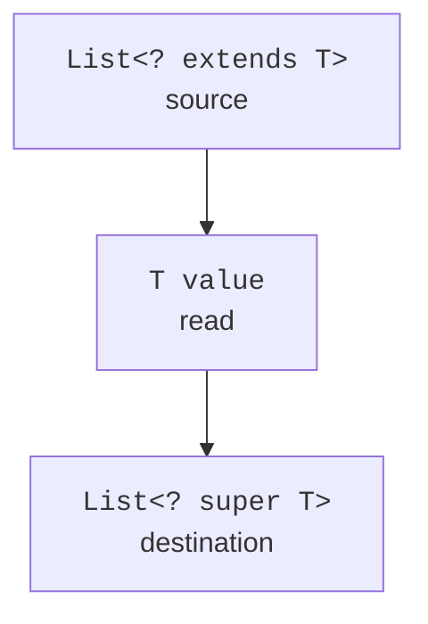

# Wildcards and the PECS principle

## Wildcards and the PECS principle

`?` means an unknown type that is nevertheless specific to this object. `List<?>` is not the same as `List<Object>`: you can add any object to a list of Object, but not to a list of an unknown type. You can read elements as `Object`. Writing `null` into some wildcard containers is usually allowed at the type level, but the collection implementation itself may prohibit it.

`? extends T` bounds the unknown type from above. You can get a `T` from such a source, but you cannot write an arbitrary concrete subtype into it: the actual type may be different. `? super T` bounds the type from below: it accepts `T` values, but without additional information the result of a read has only the general type `Object`.

PECS stands for *Producer Extends, Consumer Super*: a producer of values uses extends, a consumer uses super. This is a rule about the direction of data flow, not a requirement to always use a wildcard. A container that you both read from and write to with the same exact type should often simply be `List<T>`.



Figure 9.3. The source produces T, and the destination allows writing T. {.caption}

### Example 3. A numeric sum and copying

Collections are used here only as ready-made sequences of elements; the full hierarchy comes in the next topic. `List.of` creates a list of values, and `ArrayList` is a mutable list. The copy operation appends elements to the end of the destination.

```java
import java.util.ArrayList;
import java.util.List;

public class Main {
    static double sum(List<? extends Number> source) {
        double total = 0.0;
        for (Number value : source) {
            if (value == null
                    || !Double.isFinite(value.doubleValue())) {
                throw new IllegalArgumentException("finite numbers");
            }
            total += value.doubleValue();
        }
        if (!Double.isFinite(total)) {
            throw new IllegalArgumentException("sum overflow");
        }
        return total;
    }

    static <T> void copy(
            List<? super T> destination,
            List<? extends T> source) {
        var snapshot = new ArrayList<T>(source);
        for (T value : snapshot) destination.add(value);
    }

    public static void main(String[] args) {
        var numbers = List.of(2, 4, 6);
        System.out.println(sum(numbers));
        List<Object> destination = new ArrayList<>();
        copy(destination, numbers);
        copy(destination, List.of("ready"));
        System.out.println(destination);
        var repeated = new ArrayList<>(List.of(1, 2));
        copy(repeated, repeated);
        System.out.println(repeated);
    }
}
```

```text
12.0
[2, 4, 6, ready]
[1, 2, 1, 2]
```

The snapshot of the source is needed not because of generics but because the source and destination may be the same list. Without it, a structural change during traversal could break the operation. A type-safe signature does not automatically guarantee a correct state contract.

If the destination rejects an element or does not support adding, the method may fail after some elements have been written. This is not transactional copying. If you need batch atomicity, design it separately: full validation, a new structure, and replacing the state only after it has been built successfully.

## Wildcard capture and helper methods

The unknown type of a `List<?>` can be temporarily named by a helper method's type parameter. This is called wildcard capture. It lets the compiler prove that an element that was read is written back into the same list without knowing its concrete class.

```java
import java.util.ArrayList;
import java.util.List;

public class Main {
    static void swapFirstTwo(List<?> values) {
        swap(values);
    }

    private static <T> void swap(List<T> values) {
        if (values.size() < 2) return;
        T first = values.get(0);
        values.set(0, values.get(1));
        values.set(1, first);
    }

    public static void main(String[] args) {
        var words = new ArrayList<>(List.of("A", "B", "C"));
        swapFirstTwo(words);
        System.out.println(words);
    }
}
```

No cast to `List<Object>` is needed here: it would lose the very guarantee we are trying to preserve. The helper parameter denotes one and the same unknown type for both reading and writing. A list with zero or one element stays unchanged.
