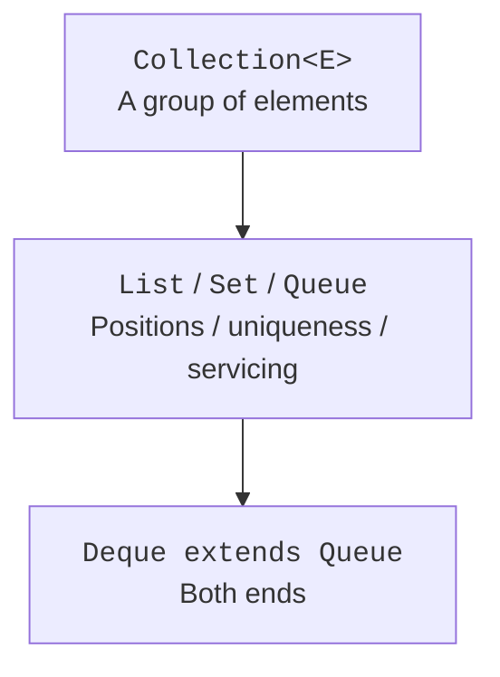
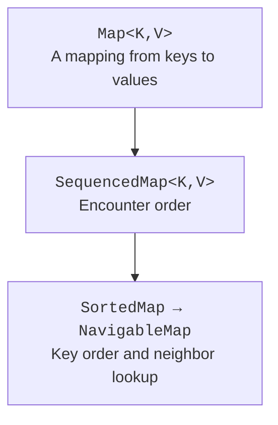
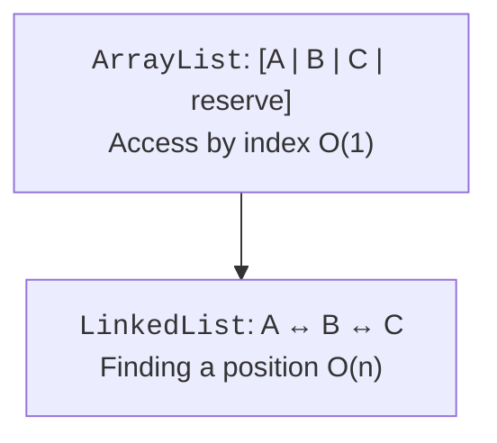

# Collection interfaces and lists

## The interface map

`Collection<E>` describes a group of elements: size, emptiness and membership checks, adding, removing, and iteration. `List<E>` adds positions and allows duplicates; `Set<E>` defines uniqueness; `Queue<E>` describes selecting the next element; `Deque<E>` allows working with both ends. Support for a particular operation may be optional: an unmodifiable collection exists in this hierarchy but rejects modifications.

`Map<K,V>` does not extend `Collection`: its element is logically a mapping from a key to a value. `keySet`, `values`, and `entrySet` provide collection views of different parts of the map. Keys are unique, but values may repeat.



Figure 10.1. The main collection contracts: from a general group to specialized operations. {.caption}

Since Java 21, `SequencedCollection<E>` unifies collections with a defined encounter order. It has first- and last-element operations and `reversed()`. `List` and `Deque` are part of this model; `SequencedSet` combines order with uniqueness. Encounter order is not necessarily sorted order.

`SequencedMap<K,V>` provides `firstEntry`, `lastEntry`, operations that place entries at the ends, and a reversed view. `LinkedHashMap` preserves insertion or access order, and `SortedMap` preserves key order. A sorted structure does not let you arbitrarily move a key to the front with `putFirst`: that would contradict its invariant.



Figure 10.2. Maps with arbitrary, sequenced, and sorted order. {.caption}

## Complexity and access patterns

A complexity estimate describes how the number of operations grows as the data grows. It does not replace measurements. A compact array is often faster than nodes thanks to memory locality, even if both algorithms have the same asymptotic complexity. For small training data sets, first choose the right contract, then eliminate proven bottlenecks.

| Structure | Access by index | Value lookup | Typical addition |
| --- | --- | --- | --- |
| `ArrayList` | O(1) | O(n) | O(1), amortized at the end |
| `LinkedList` | O(n) | O(n) | O(1) at a known end |
| `HashSet` | none | expected O(1) | expected O(1) |
| `TreeSet` | none | O(log n) | O(log n) |
| `ArrayDeque` | none | O(n) | O(1), amortized at an end |

For hash structures, the expected constant complexity requires a good hash distribution. For a list, inserting in the middle requires shifting or finding the position. The phrase "LinkedList inserts quickly" is incomplete: if you first have to find the thousandth position, that search is linear.

## Lists and array views

`ArrayList` stores elements in an array of variable capacity. Logical size and capacity differ: the reserve is not a set of filled elements. `get` and `set` access an existing position; `add` creates a new one, and `remove` changes the size. Preallocating helps when the approximate amount of data is known, but you should not reserve an arbitrarily large array "just in case."

`LinkedList` has doubly linked nodes and implements both `List` and `Deque`. It is not the default choice for all queues: `ArrayDeque` usually has lower overhead if you only need operations at the ends. It is better not to store null values in a queue even where the class permits them: `poll` uses `null` to signal emptiness.



Figure 10.3. An array of references and linked nodes: the same values, different organization. {.caption}

Overloading of `remove` is a common trap. For a `List<Integer>`, the call `remove(1)` removes the element at index 1. To remove the number 1 itself, pass `Integer.valueOf(1)`. In code review, check not only the method name but also the static type of the argument.

`List.of(...)` creates a list that cannot be modified and does not permit `null`. `Arrays.asList(array)` returns a fixed-size list backed by the array: replacement through `set` is allowed, but adding and removing are not. Passing a primitive `int[]` creates a list with one array element, not a list of Integer.

`subList(from, to)` is a view of part of a list, where the right bound is exclusive. Changes made through the view are reflected in the original list. Structural changes to the backing list outside this view can make further work with the view invalid. For an independent result, use `new ArrayList<>(subList)` or `List.copyOf`.

### Example 1. Editing a shopping list

The program removes blank names through an iterator, removes the first occurrence of a specific item, and sorts the result. The input list is mutable: wrapping `List.of` in an `ArrayList` makes this explicit. Sorting uses the natural order of strings.

```java
import java.util.ArrayList;
import java.util.Iterator;
import java.util.List;

public class Main {
    public static void main(String[] args) {
        List<String> items = new ArrayList<>(
            List.of("tea", "", "bread", "tea", "milk")
        );
        Iterator<String> iterator = items.iterator();
        while (iterator.hasNext()) {
            if (iterator.next().isBlank()) iterator.remove();
        }
        items.remove("tea");
        items.sort(null);
        System.out.println(items);
        List<String> snapshot = List.copyOf(items);
        items.addFirst("water");
        System.out.println(items.reversed());
        System.out.println(snapshot);
        List<Integer> numbers = new ArrayList<>(List.of(1, 2, 1));
        numbers.remove(Integer.valueOf(1));
        System.out.println(numbers);
    }
}
```

```text
[bread, milk, tea]
[tea, milk, bread, water]
[bread, milk, tea]
[2, 1]
```

`snapshot` does not change after water is added. The reversed view, in contrast, reflects the current list. These are different contracts, even though both results can be traversed with the same loop.
