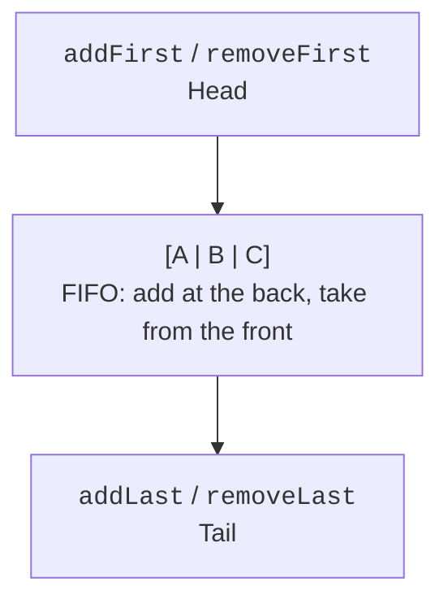

# Iterators, sets, and queues

## Iterators and structural changes

An iterator separates the traversal algorithm from the structure of the container. `hasNext` checks whether there is a next element; `next` returns it or throws `NoSuchElementException`. After a valid `next`, the `remove` method can remove the current element if the implementation supports this operation. Two `remove` calls in a row without a new `next` violate the iterator's state.

An ordinary enhanced for loop uses an iterator behind the scenes. Removing through the list itself inside such a loop is usually detected as a `ConcurrentModificationException`. This can happen in a single thread of execution: the name of the exception does not imply multithreading. Fail-fast behavior is best-effort diagnostics, not a synchronization mechanism or guaranteed detection of all errors.

`ListIterator` lets you move in both directions, replace an element, and insert a new one at a given position. Its cursor sits between elements. After an insertion, carefully check which element `next` or `previous` will return; otherwise it is easy to skip a value or process it twice.

## Sets and equality

A set stores unique elements. `HashSet` determines equality through `equals` and uses `hashCode` to find a candidate. `LinkedHashSet` adds a predictable encounter order. `TreeSet` uses comparison: if the comparator returns zero, the second element is considered already present regardless of its other fields.

This leads to a dangerous case: a comparator that compares students only by score turns two different students with the same score into one TreeSet element. If you need all students, add the id as a second key or use a list. The ordering must be consistent with `equals` if the set is to fulfill the general Set contract.

`NavigableSet` provides neighbors: `lower` and `higher` search for strictly smaller and larger elements, while `floor` and `ceiling` allow equality. `headSet`, `tailSet`, and `subSet` create range views. An attempt to insert an element outside the range through such a view is rejected, even if the underlying tree could store it.

### Example 2. Operations on tags

Copying before `retainAll` or `removeAll` preserves the original sets. In the example, LinkedHashSet makes the order of the result stable, which is useful for reports and automated checks.

```java
import java.util.LinkedHashSet;
import java.util.List;
import java.util.Set;
import java.util.TreeSet;

public class Main {
    public static void main(String[] args) {
        Set<String> first = new LinkedHashSet<>(
            List.of("java", "oop", "java", "test")
        );
        Set<String> second = Set.of("oop", "files");
        Set<String> common = new LinkedHashSet<>(first);
        common.retainAll(second);
        Set<String> onlyFirst = new LinkedHashSet<>(first);
        onlyFirst.removeAll(second);
        System.out.println(first);
        System.out.println(common);
        System.out.println(onlyFirst);
        TreeSet<Integer> marks = new TreeSet<>(List.of(60, 75, 90));
        System.out.println(marks.floor(80));
        System.out.println(marks.ceiling(90));
        System.out.println(marks.higher(90));
    }
}
```

```text
[java, oop, test]
[oop]
[java, test]
75
90
null
```

Do not make a check of HashSet output depend on the incidental order of a particular run. If the task requires an order, choose the appropriate structure or sort the result explicitly.

## Queues and deques

A queue separates the servicing rule from the physical position of an element. In FIFO, whoever arrived first is served first. In a priority queue, the next element is determined by a comparator. `PriorityQueue` does not guarantee a fully sorted iteration order: to get the servicing order, call `poll` repeatedly or sort a separate copy.

| Action | Exception when impossible | Special value |
| --- | --- | --- |
| Add | `add` | `offer` |
| Remove the head | `remove` | `poll` |
| Examine the head | `element` | `peek` |

For an unbounded ArrayDeque, `offer` usually succeeds; the general Queue interface also allows bounded implementations. `poll` and `peek` return `null` for an empty queue. ArrayDeque prohibits null elements, so the result is unambiguous.



Figure 10.4. Operations at both ends make it possible to implement FIFO and LIFO. {.caption}

For a stack, `push`, `pop`, and `peek` through `Deque<E>` are enough. The `Stack` class is a historical descendant of Vector; new code usually chooses ArrayDeque. This decision concerns the contract and overhead, not the old class having stopped working.

### Example 3. Servicing requests

A smaller number means a higher priority. The arrival counter breaks ties and ensures a predictable order for requests with the same priority. The history records the actual servicing.

```java
import java.util.ArrayDeque;
import java.util.Comparator;
import java.util.Deque;
import java.util.PriorityQueue;
import java.util.Queue;

public class Main {
    record Request(String name, int priority, long sequence) {}

    public static void main(String[] args) {
        Comparator<Request> order = Comparator
            .comparingInt(Request::priority)
            .thenComparingLong(Request::sequence);
        Queue<Request> queue = new PriorityQueue<>(order);
        queue.offer(new Request("A", 2, 0));
        queue.offer(new Request("B", 1, 1));
        queue.offer(new Request("C", 1, 2));
        Deque<String> history = new ArrayDeque<>();
        while (!queue.isEmpty()) {
            Request request = queue.remove();
            history.addLast(request.name());
        }
        System.out.println(history);
        System.out.println(history.removeLast());
        System.out.println(history);
        System.out.println(queue.poll());
    }
}
```

```text
[B, C, A]
A
[B, C]
null
```

The method references in the comparator define the comparison keys; the syntax will be covered in detail in the next lecture. The important contract here is to compare all the fields needed for an unambiguous order and not to change an object's priority while it is in the heap.
