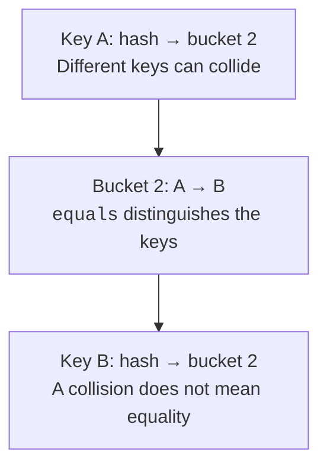
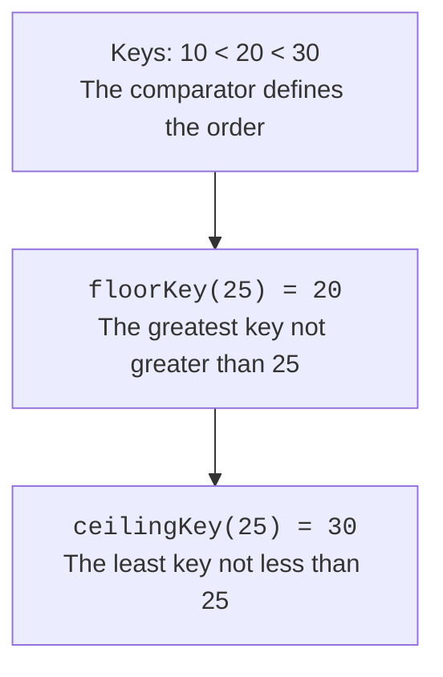

# Maps and hashing

## Maps and hashing

`HashMap` converts a key's hash into a bucket number. Several different keys can land in the same bucket: this is a collision, not an `equals` error. Inside a bucket, the implementation distinguishes keys by equality. Changing the capacity redistributes the entries; the load factor lets you balance memory against how often such growth happens.



Figure 10.5. A collision stores different keys in the same bucket. {.caption}

In modern OpenJDK, long chains are converted into trees under certain conditions. The well-known node-count threshold is not a guarantee by itself: the table capacity is also taken into account, and a small table may grow first. This is an implementation detail, not a contract that application logic should rely on.

Keys must not change while they are stored. If a field that participates in `hashCode` or `equals` changes after `put`, the lookup may go to a different bucket. The entry physically remains in the map, but an ordinary `get` does not find it. Records with truly immutable components are often convenient as keys.

`containsKey` distinguishes a missing key from a present one whose value is `null`. `getOrDefault` substitutes the fallback value only when the key is absent, not when the stored value is null. `putIfAbsent` and `computeIfAbsent` have their own null policy, which should not be equated with `containsKey`.

`merge(key, value, function)` is convenient for accumulation: if there is no value or it is null, the given non-null value is stored; otherwise the merge function is called. If this function returns null, the entry is removed. The function must not unexpectedly modify the same map during the computation.

### Example 4. Word frequencies

The splitting here deliberately has a narrow contract: words consist of Latin letters, and other characters are delimiters. Natural language requires separate rules for apostrophes, hyphens, and normalization. A TreeMap produces a predictable alphabetical report.

```java
import java.util.HashMap;
import java.util.Locale;
import java.util.Map;
import java.util.TreeMap;

public class Main {
    public static void main(String[] args) {
        String text = "Tea, bread; tea. Milk bread tea";
        Map<String, Integer> counts = new HashMap<>();
        for (String word : text.toLowerCase(Locale.ROOT)
                .split("[^a-z]+")) {
            if (!word.isEmpty()) {
                counts.merge(word, 1, Integer::sum);
            }
        }
        Map<String, Integer> ordered = new TreeMap<>(counts);
        int total = 0;
        for (Map.Entry<String, Integer> entry : ordered.entrySet()) {
            System.out.println(entry.getKey()
                + ": " + entry.getValue());
            total += entry.getValue();
        }
        System.out.println("total: " + total);
    }
}
```

```text
bread: 2
milk: 1
tea: 3
total: 6
```

Iterating over `entrySet` gives you the key and the value without a repeated lookup. The `keySet` and `values` views are backed by the map; removing through a supported view operation removes the entry. Adding a key by itself through keySet is impossible: the value is unknown.

## Key order and access order

`TreeMap` keeps keys in comparison order and guarantees logarithmic complexity for the basic operations. `floorEntry` and `ceilingEntry` find neighboring entries, and range views let you work with part of the map. For timestamps, this is a natural way to find the last known state before a given moment.



Figure 10.6. Key order, not insertion time, determines the neighbor lookup. {.caption}

By default, `LinkedHashMap` preserves insertion order. The constructor with `accessOrder=true` moves entries to the end of the order after certain access operations, including `get`. Such a map can be the basis of an LRU cache. The eviction policy must take into account updates of an existing key and a zero or invalid capacity.

`reversed()` returns a live view, not a snapshot. Changes made through the available operations are visible from both sides. For an access-order map, even a read can change the order, so you should not perform arbitrary `get` calls on the same map during traversal. The LinkedHashMap documentation defines the detailed rules for which operations count as access.
