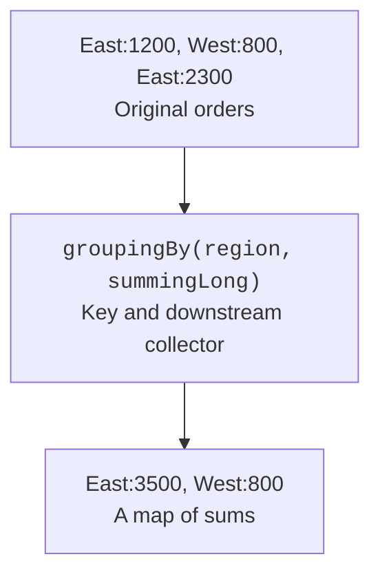

# Collectors and Gatherers

## Collectors and grouping

`Collectors.groupingBy` builds a map of groups. The downstream collector determines what to keep for each group: a list, a count, a sum, a set of transformed values, or statistics. `partitioningBy` creates two logical parts by a Predicate and provides both boolean keys, even if one part is empty.



Figure 11.6. The classifier determines the key, and the downstream collector determines the group's result. {.caption}

`toMap` without a merge function rejects a repeated key. This is a useful uniqueness check, not an error that always has to be removed. If repeats are expected, specify the policy explicitly: sum, first, last, or merge. For a predictable order, specify a map factory such as TreeMap.

### Example 3. An order report

Orders are grouped by region, and amounts are stored in cents. A separate partitioning counts expensive orders and the rest. Each report creates a new stream from the same immutable list.

```java
import java.util.List;
import java.util.LongSummaryStatistics;
import java.util.Map;
import java.util.TreeMap;
import java.util.stream.Collectors;

public class Main {
    record Order(String region, long cents) {}

    public static void main(String[] args) {
        List<Order> orders = List.of(
            new Order("East", 1200), new Order("West", 800),
            new Order("East", 2300), new Order("West", 700)
        );
        Map<String, Long> sums = orders.stream().collect(
            Collectors.groupingBy(Order::region, TreeMap::new,
                Collectors.summingLong(Order::cents))
        );
        sums.forEach((key, value) ->
            System.out.println(key + ": " + value));
        Map<Boolean, Long> groups = orders.stream().collect(
            Collectors.partitioningBy(o -> o.cents() >= 1000,
                Collectors.counting())
        );
        System.out.println("large: " + groups.get(true));
        System.out.println("other: " + groups.get(false));
        LongSummaryStatistics stats = orders.stream()
            .mapToLong(Order::cents).summaryStatistics();
        System.out.println("total: " + stats.getSum());
        System.out.println("count: " + stats.getCount());
    }
}
```

```text
East: 3500
West: 1500
large: 2
other: 2
total: 5000
count: 4
```

For empty statistics, count is zero, but the sentinel min and max values should not be shown as real measurements. Check the count before printing the extremes. For large sums, long can also overflow; a domain system must limit the range or use exact arithmetic with checks.

## Primitive streams and Gatherers

IntStream, LongStream, and DoubleStream have specialized sum, average, and summaryStatistics. The average is returned as an OptionalDouble, because an empty set has no defined average. `boxed()` returns a stream of objects; use it only where the next operation really needs the object model.

Gatherers became a stable part of the Stream API in JDK 24. They extend intermediate operations, including stateful transformations. `windowFixed` creates non-overlapping windows, and `windowSliding` creates overlapping ones. `scan` returns intermediate accumulations, whereas an ordinary reduce returns only the final result.

### Example 4. A moving average

A window of size three moves by one element. The windowSliding contract has an important edge case: if the whole nonempty stream is shorter than the window, a single incomplete window is returned. The example shows this behavior explicitly instead of silently discarding a short series.

```java
import java.util.List;
import java.util.Locale;
import java.util.stream.Gatherers;
import java.util.stream.IntStream;

public class Main {
    static List<Double> averages(int[] values, int window) {
        if (window <= 0) {
            throw new IllegalArgumentException("window");
        }
        return IntStream.of(values).boxed()
            .gather(Gatherers.windowSliding(window))
            .map(items -> items.stream().mapToInt(Integer::intValue)
                .average().orElseThrow())
            .toList();
    }

    public static void main(String[] args) {
        for (double value : averages(new int[]{2, 4, 6, 8}, 3)) {
            System.out.printf(Locale.ROOT, "%.1f%n", value);
        }
        System.out.println(averages(new int[]{2, 4}, 3));
        System.out.println(averages(new int[0], 3));
        System.out.println(IntStream.rangeClosed(1, 4).sum());
    }
}
```

```text
4.0
6.0
[3.0]
[]
10
```

If the domain task allows only full windows, add a filter by size after gather. This is a deliberate refinement of the contract. Windows are unmodifiable lists; trying to modify them is not a way to affect the source. Custom Gatherers require a careful description of their state and the rules for combining partial results.
