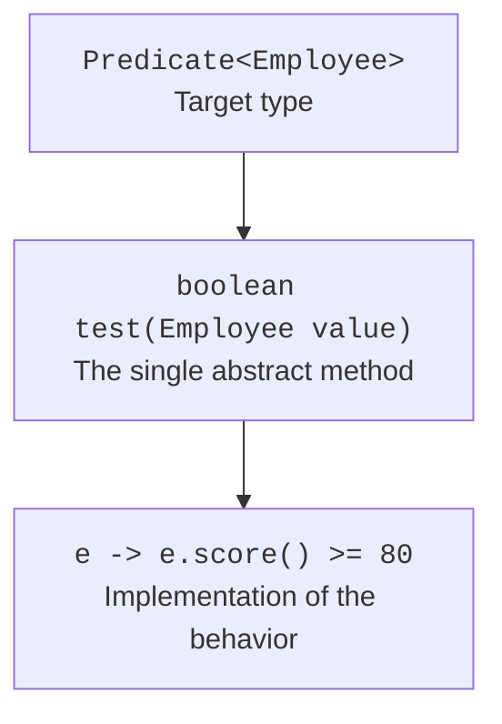

# Functional interfaces

## Functional interfaces and target types

A functional interface has a single abstract method that defines a behavior contract. Default and static methods do not interfere with this. Declarations that match public methods of Object do not add a second functional contract. The `@FunctionalInterface` annotation asks the compiler to check the author's intent.

A lambda has no independent type such as "a function of two arguments." Its type is determined by the context: a method parameter, a variable, or an explicit cast to a functional interface. That is why the declaration `var rule = x -> x > 0` does not give enough type information. Two interfaces with identical signatures do not automatically become interchangeable types.



Figure 11.1. The target interface determines the lambda's parameters and result. {.caption}

The body can be a single expression or a block. A block that must return a value needs a `return` on every valid path. Parentheses can be omitted for a single untyped parameter, but they are required for zero or several parameters. Explicit types or `var` are applied consistently to all parameters.

An anonymous class and a lambda differ in an important way: `this` inside a lambda refers to the current object of the enclosing context. An anonymous class has its own `this`. A lambda is not a way to declare new object state with fields and an arbitrary number of methods.

A local variable captured by a lambda must be final or effectively final: it is not reassigned after initialization. This rule concerns the reference. The state of the object behind that reference can be mutable, but such changes create side effects and require separate justification, especially in a parallel stream.

## Standard functional interfaces

The `java.util.function` package contains names for common forms of behavior. A custom interface is appropriate if the domain contract has a meaningful name or special requirements, such as a checked exception. Creating your own copy of Function without additional meaning is usually unnecessary.

| Interface | Method | Contract |
| --- | --- | --- |
| `Predicate<T>` | `test` | T → boolean |
| `Function<T,R>` | `apply` | T → R |
| `Consumer<T>` | `accept` | T → an action without a result |
| `Supplier<T>` | `get` | no arguments → T |
| `UnaryOperator<T>` | `apply` | T → T |
| `BinaryOperator<T>` | `apply` | (T, T) → T |
| `BiFunction<T,U,R>` | `apply` | (T, U) → R |

Primitive specializations such as `IntPredicate`, `ToIntFunction`, and `IntUnaryOperator` let you avoid boxing every value into an Integer. This can matter for large numeric data sets, but the choice should remain readable and measurable. Do not confuse `Function<Integer,Integer>` with `IntUnaryOperator`: they are different interfaces with different abstract method names.

`Predicate.and`, `or`, and `negate` build new conditions. `and` and `or` short-circuit, so the second condition may not run. `Function.andThen` runs the current function first and then the given one; `compose` specifies the reverse order. A validation condition should come before an operation that assumes valid data.

### Example 1. Selecting employees by a rule

A custom selection interface accepts behavior, while standard Predicates compose domain conditions. The minimum score is captured as effectively final. The program does not modify the original list.

```java
import java.util.ArrayList;
import java.util.List;
import java.util.function.Predicate;

public class Main {
    record Employee(String name, int score, boolean active) {}

    @FunctionalInterface
    interface Rule<T> {
        boolean accepts(T value);
    }

    static <T> List<T> select(List<T> source, Rule<? super T> rule) {
        List<T> result = new ArrayList<>();
        for (T item : source) {
            if (rule.accepts(item)) result.add(item);
        }
        return result;
    }

    public static void main(String[] args) {
        List<Employee> staff = List.of(
            new Employee("Ada", 90, true),
            new Employee("Bohdan", 95, false),
            new Employee("Ira", 70, true)
        );
        int minimum = 80;
        Predicate<Employee> active = Employee::active;
        Predicate<Employee> enough = e -> e.score() >= minimum;
        Predicate<Employee> combined = active.and(enough);
        List<Employee> result = select(staff, combined::test);
        result.forEach(e -> System.out.println(e.name()));
        System.out.println("source size: " + staff.size());
    }
}
```

```text
Ada
source size: 3
```

The reference `combined::test` adapts the call to Rule; it does not turn the Predicate object itself into a subtype of Rule. If the domain name Rule adds no value, the select method can accept a `Predicate<? super T>` directly.
