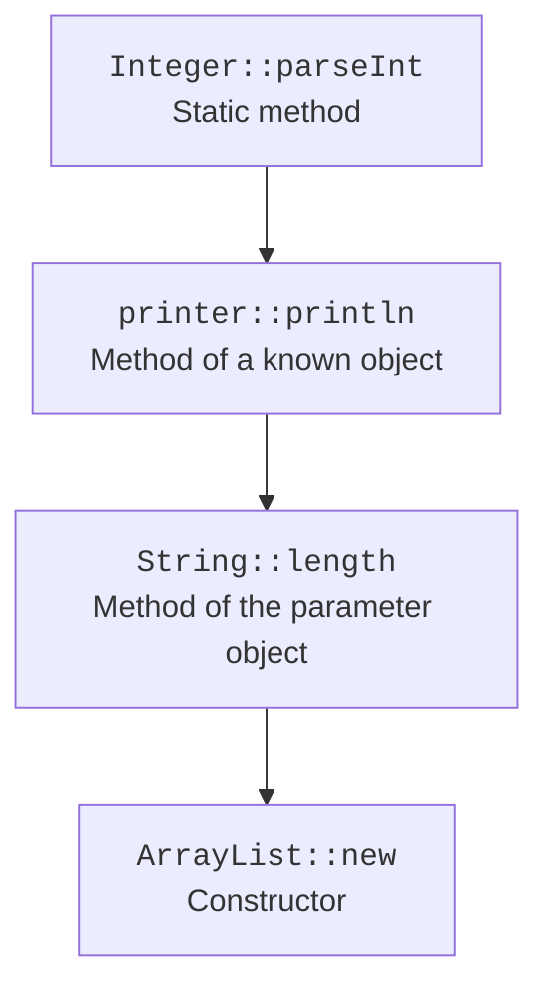

# Method references and Optional

## Method references and comparators

A method reference is a short form of a lambda that delegates the call to an existing method. It also needs a target type. There are references to static methods, to methods of a particular object, to methods of an arbitrary object of a given type, and to constructors.



Figure 11.2. Four forms of referring to existing behavior. {.caption}

In `String::length`, the function's first parameter becomes the object on which the method is called. In `printer::println`, the printer object is already known, and the parameter becomes the argument of println. Overloads are resolved by the target signature, so an ambiguous call sometimes needs an explicit type or an ordinary lambda.

`Comparator.comparing` and its primitive variants build an ordering by key. `thenComparing` defines the next key only when the previous one is equal. Where you call `reversed()` matters: it can reverse the whole ordering built so far or only a single comparator. `nullsFirst` or `nullsLast` define a policy for null but do not automatically handle missing nested fields.

### Example 2. A product catalog

Prices are stored in whole cents. A product with a lower price comes first; on a tie, we compare names. A transforming lambda and method references play different roles in the same example.

```java
import java.util.ArrayList;
import java.util.Comparator;
import java.util.List;
import java.util.function.Function;

public class Main {
    record Product(String name, long cents) {}

    public static void main(String[] args) {
        List<Product> products = new ArrayList<>(List.of(
            new Product("Tea", 2500),
            new Product("Bread", 1800),
            new Product("Apple", 1800)
        ));
        products.sort(Comparator.comparingLong(Product::cents)
            .thenComparing(Product::name));
        Function<Product, String> name = Product::name;
        Function<String, String> bracket = value -> "[" + value + "]";
        Function<Product, String> label = name.andThen(bracket);
        products.forEach(p -> System.out.println(label.apply(p)));
        List<String> words = new ArrayList<>(
            List.of(" a ", " ", "b"));
        words.replaceAll(String::trim);
        words.removeIf(String::isEmpty);
        System.out.println(words);
    }
}
```

```text
[Apple]
[Bread]
[Tea]
[a, b]
```

The methods `forEach`, `removeIf`, `replaceAll`, `sort`, and `Map.merge` show that lambdas are useful even without the Stream API. They do not necessarily mean a functional style without state changes: replaceAll explicitly modifies the collection, and that is fine when the contract is defined exactly that way.

## Optional and the absence of a result

`Optional<T>` denotes either a present non-null result or its absence. `of` requires a non-null argument; `ofNullable` turns null into an empty Optional. The Optional object itself must not be null: otherwise it merely adds yet another way to express absence.

`map` transforms a present value, `filter` keeps it if a condition holds, and `flatMap` chains an operation that already returns an Optional. A plain `get` without a check just turns the null problem into a missing-value exception. It is better to state the policy through `orElseThrow`, `orElseGet`, or `ifPresentOrElse`.

The argument of `orElse(buildDefault())` is evaluated before the call, even when a value is present. `orElseGet(() -> buildDefault())` calls the supplier only for an empty Optional. The difference matters if the fallback value is expensive or its computation has a side effect. A Supplier defers the behavior, not its result.

Optional is mostly useful as a return type for ordinary absence. It does not replace an empty collection, a domain error with an explanation, or a file-reading exception. Optional fields and parameters need a separate reason: automatically wrapping every nullable field complicates the model without clear benefit.
