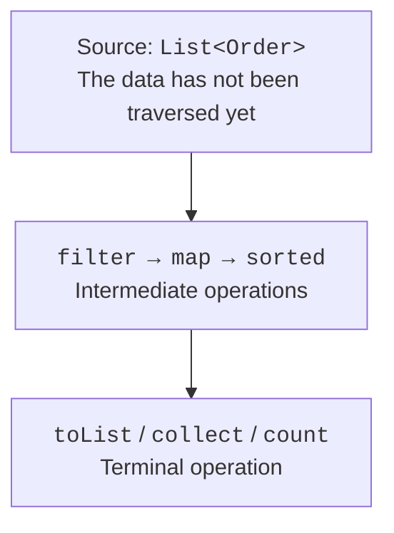
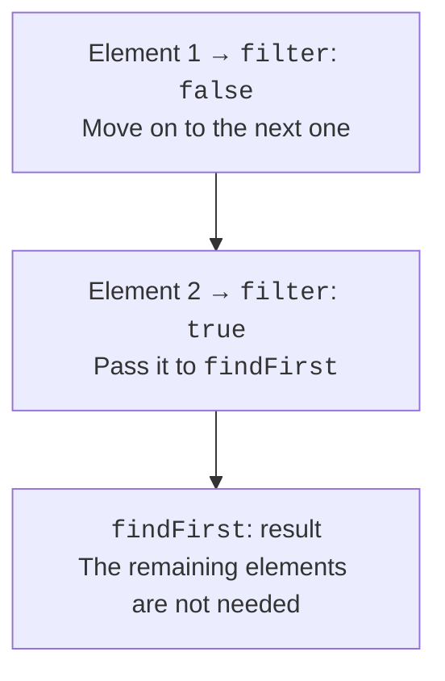
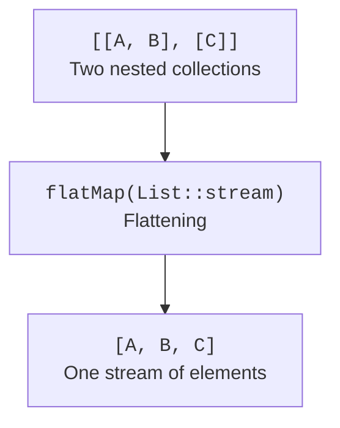

# The Stream API pipeline

## Source, pipeline, and terminal operation

A stream can be obtained from a collection, an array, `Stream.of`, `Stream.iterate`, `Stream.generate`, or a primitive range. `IntStream.range(a,b)` excludes b, and `rangeClosed` includes it. An infinite source needs a limit if the terminal operation is to finish in finite time.

Figure 11.3. Intermediate operations describe the work, and the terminal operation starts it. {.caption}

An intermediate operation returns a stream and usually does not traverse the source immediately. A terminal operation such as `toList`, `count`, or `forEach` starts the computation. After that, the same stream cannot be reused. For a second report, create a new stream from the source or keep the materialized result of the first pass.

A pipeline often processes elements vertically: one element passes through filter, map, and so on before the next one is read. Stateful operations such as sorted may accumulate data before producing a result. `limit` and short-circuiting terminal operations make it possible not to read the whole source.

Figure 11.4. Short-circuiting can end the traversal after the first match. {.caption}

A stream must not modify its source during traversal. Behavioral parameters should generally be independent of mutable external state. `peek` is intended mainly for observation, but it is not guaranteed to be called for every element under all optimizations. Do not put essential data storage or the only correctness check inside peek.

## Transformation and flattening

`filter` keeps elements that satisfy a condition, and `map` transforms each element into one result. `flatMap` lets one element produce zero, one, or many results and flattens nested streams into one. For example, a list of orders is turned into a single stream of the line items of all orders.

Figure 11.5. Flattening two nested sets into one stream of elements. {.caption}

`mapMulti` passes a consumer of results to the mapper and can be convenient for a small variable number of values without creating a separate Stream for each element. Do not use it just for shorter code; flatMap often shows more clearly that the source already has a nested structure.

`distinct` determines uniqueness through equals, and `sorted` determines order through natural comparison or a Comparator. `skip` skips the first elements, and `limit` keeps a bounded number. `takeWhile` on an ordered stream takes the initial prefix up to the first mismatch; it is not a synonym for filter, which checks the whole set. `dropWhile` skips only the initial prefix.

The order of operations changes the meaning of the result. `sorted().limit(3)` finds the three smallest elements of the whole set; `limit(3).sorted()` sorts only the first three. Moving filter before an expensive map can save work, but only if the condition has the same meaning for the original type and does not change the contract.

## Terminal operations and reduction

`anyMatch`, `allMatch`, `noneMatch`, `findFirst`, and `findAny` can finish early. For an empty stream, allMatch and noneMatch return true, and anyMatch returns false. This is the logic of universal and existential statements, not an accidental quirk of the library. Validation of the form "there is at least one, and all are valid" requires a separate non-emptiness check.

`reduce` folds elements with an associative operation. Adding integers with an agreed overflow policy is a typical example; subtraction is not associative and is unsuitable for arbitrary splitting. The identity value must be neutral for the operation, not an arbitrary starting bonus that parallel execution might count several times.

For mutable accumulation, use collect, not reduce with a single shared ArrayList. `Stream.toList()` returns a structurally unmodifiable list. `Collectors.toList()` promises no particular class or mutability; if you need an ArrayList, specify `Collectors.toCollection(ArrayList::new)`.
