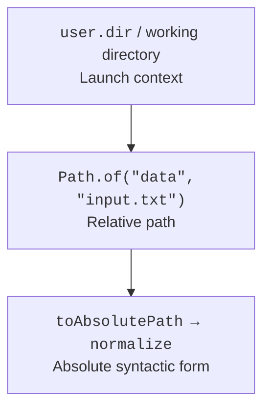
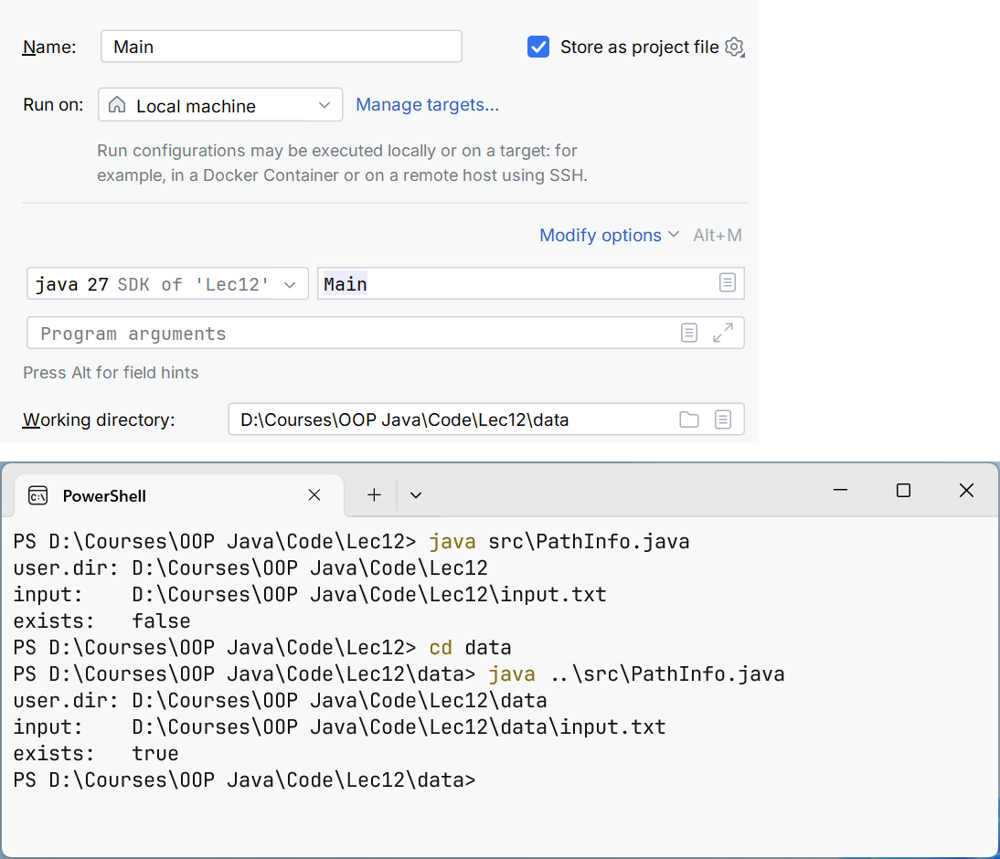
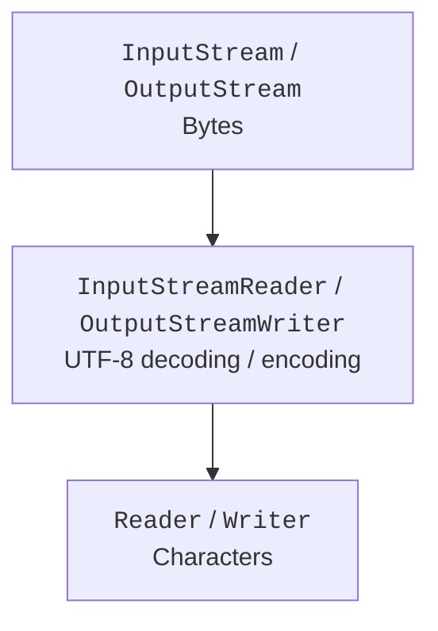
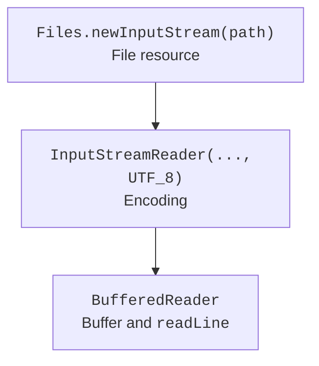
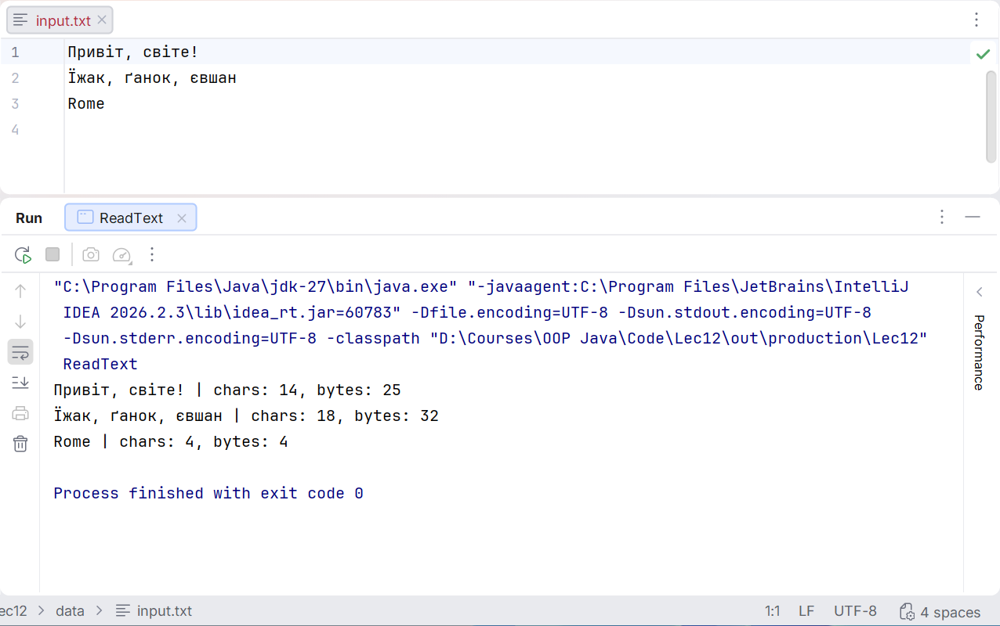

# Paths, streams, and encoding

## Paths and the working directory

`Path` represents a path in the file system. `Path.of("data", "input.txt")` builds one from components without manually choosing a slash or a backslash. `java.io.File` remains as a compatible legacy API, but for new operations Path and Files from NIO.2 are usually more convenient.

Figure 12.1. A relative path gets its meaning in the context of the working directory. {.caption}

A relative path is resolved against the process's current working directory, not against the folder containing the Main.java source. The IDE and the terminal may launch the program from different directories. For diagnostics, print `Path.of("").toAbsolutePath()` or `user.dir`; for portability, accept the working path as a configuration parameter.

`resolve` appends a relative path, `getFileName` returns the last component, and `getParent` may return null for a path without a parent. `normalize` removes syntactic dot and double-dot segments but does not access the file system. `toRealPath` checks existence and, depending on its options, resolves symbolic links. These operations are not interchangeable security checks.

A path received from a user should not be arbitrarily combined with a directory root and written to immediately. For a restricted working directory, check the normalized result and the symbolic link policy. The check and the subsequent use can be separated by a change to the file system made by another program.

Figure 12.2. The working directory of a run configuration {.caption}

## Bytes, characters, and resources

`InputStream` and `OutputStream` work with bytes. `Reader` and `Writer` work with characters. Converting between them requires an encoding: InputStreamReader decodes bytes, and OutputStreamWriter encodes characters. Buffered wrappers reduce the number of small calls to the lower level but do not change the data format.

Figure 12.3. Two families of streams and an explicit encoding bridge. {.caption}

A resource must be closed even if an exception occurs inside the loop. `try-with-resources` calls close in the reverse order of resource declaration. If both the main operation and the closing end with an exception, the closing exception is kept as suppressed; do not silently lose it with your own empty catch.

Closing the outer standard wrapper usually closes the inner resource. At the same time, a library method should not on its own initiative close a stream owned by its caller unless the contract says so. Be especially careful with System.in, System.out, and streams shared by several actions.

Figure 12.4. Each wrapper adds one responsibility to reading. {.caption}

`read()` returns an int so that, alongside a byte or a character, it can represent -1 – the end. Do not convert the result to char before checking for the end. When reading into a buffer, the number of bytes read may be less than the buffer size; you must write exactly the range from zero to the number actually received.

`flush` passes buffered data to the lower level but is not a universal guarantee of physical writing to the storage medium. Closing a Writer performs the necessary completion of encoding. Reliable persistence after a sudden power-off requires separate analysis of the file system, channels, and synchronization operations.

## Encodings and lines

In a modern JDK, the default charset is UTF-8, but it is better to specify an external format explicitly with `StandardCharsets.UTF_8`. The console has its own peculiarities; do not draw conclusions about a file's contents just from how the terminal rendered Cyrillic text. A file without a BOM and a file with a BOM may also need different rules for reading the first field.

`BufferedReader.readLine` returns a line without the terminating characters, or null at the end. `newLine` in BufferedWriter uses the system line separator. If the protocol requires exactly LF, write `"\n"` explicitly. Do not use readLine for an arbitrary binary file: decoding can corrupt or reject bytes.

`Files.readString` and `readAllLines` are convenient for small files but load everything into memory. `Files.lines` returns a Stream that holds an open resource and requires try-with-resources. An exception during lazy traversal may be wrapped in an UncheckedIOException; it does not necessarily occur when the stream is created.

`PrintWriter` has convenient print and printf methods, but it stores some write errors in an internal flag. After an important write, check checkError or choose a Writer that propagates IOException. Scanner is useful for tokens but has its own locale and delimiter rules; it should not be treated as a universal CSV parser.

Figure 12.5. Checking the encoding of a text file {.caption}
