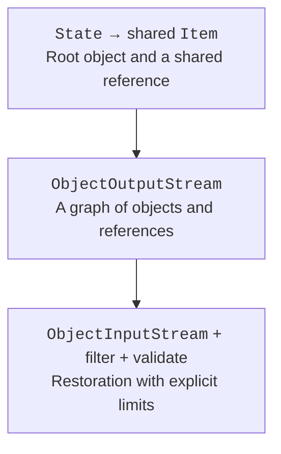

# Object serialization

## Serializing an object graph

Serializable marks a class as participating in Java's standard binary mechanism. ObjectOutputStream stores the graph of reachable objects, not just a flat set of fields. Shared references and cycles can be preserved. Objects in the graph must also support serialization unless the corresponding field is transient.



Figure 12.6. A shared reference is part of the graph, not two independent objects. {.caption}

`serialVersionUID` specifies the compatibility identifier of an ordinary serializable class. It is not an automatic migration system: changing the meaning of fields may require separate logic even with the same UID. Static fields are not instance state, and transient fields are not stored by the standard mechanism.

When an ordinary Serializable class is deserialized, its normal constructor does not re-validate the fields. The restored state needs to be checked. For serializable records, the canonical constructor plays a special role in restoration, but that does not mean an arbitrary graph from the network becomes safe.

### Example 4. Saving a training state

The example works only with its own local file and allows a single state class. File limits and an ObjectInputFilter complement the validation of domain fields after reading. The transient field token is not stored; in a real system, secrets should not be included in the saved object at all.

```java
import java.io.IOException;
import java.io.ObjectInputFilter;
import java.io.ObjectInputStream;
import java.io.ObjectOutputStream;
import java.io.Serial;
import java.io.Serializable;
import java.nio.file.Files;
import java.nio.file.Path;

public class Main {
    static final class State implements Serializable {
        @Serial private static final long serialVersionUID = 1L;
        final String name;
        final int level;
        transient String token;

        State(String name, int level) {
            this.name = name;
            this.level = level;
            validate();
        }

        void validate() {
            if (name == null || name.isBlank() || name.length() > 80
                    || level < 0 || level > 100) {
                throw new IllegalArgumentException("invalid state");
            }
        }
    }

    static State load(Path path) throws IOException,
            ClassNotFoundException {
        if (Files.size(path) > 100_000) {
            throw new IOException("file too large");
        }
        try (ObjectInputStream input = new ObjectInputStream(
                Files.newInputStream(path))) {
            input.setObjectInputFilter(info -> {
                if (info.depth() > 5 || info.references() > 20
                        || info.streamBytes() > 100_000
                        || info.arrayLength() > 1000) {
                    return ObjectInputFilter.Status.REJECTED;
                }

                Class<?> type = info.serialClass();
                if (type == null) {
                    return ObjectInputFilter.Status.UNDECIDED;
                }
                return type == State.class || type == String.class
                    ? ObjectInputFilter.Status.ALLOWED
                    : ObjectInputFilter.Status.REJECTED;
            });
            Object value = input.readObject();
            if (!(value instanceof State state)) {
                throw new IOException("unexpected root type");
            }
            state.validate();
            return state;
        }
    }

    public static void main(String[] args) throws Exception {
        Path path = Files.createTempFile("java12-state-", ".bin");
        try {
            State source = new State("Ada", 3);
            source.token = "temporary";
            try (ObjectOutputStream output = new ObjectOutputStream(
                    Files.newOutputStream(path))) {
                output.writeObject(source);
            }

            State restored = load(path);
            System.out.println(restored.name + ": " + restored.level);
            System.out.println("token: " + restored.token);
        } finally {
            Files.deleteIfExists(path);
        }
    }
}
```

```text
Ada: 3
token: null
```

The filter is not called for all primitive values and specially encoded Strings the same way it is for ordinary objects. That is why checks of serialClass or streamBytes in the callback alone are not enough for universal size control. The Files.size check also leaves a time gap before reading; for an untrusted or concurrently modified source, you need a bounded input stream or a prior bounded snapshot, or better yet a different format.

Standard Java serialization is not a recommended universal format for exchange with unknown parties. CSV or JSON with a schema, explicit limits, and field validation are often easier to verify and evolve. A database solves a different class of problems – consistent changes to many records, searching, and concurrent access.

## Testing a file-processing program

A test must run in a separate temporary directory and must not depend on the user's personal files. It checks not only the console lines but also the bytes of the result, the number of records, the encoding, and that the previous file is preserved after a failed update. A normal scenario, an empty file, an invalid header, a truncated record, and a missing path are different cases.

The exit code and messages must distinguish an invalid data format from an operational failure. A full stack trace is useful to the developer, but the user needs the path, the action, and a clear reason without revealing secrets. Catching Exception and printing "done" after a failure is unacceptable.
