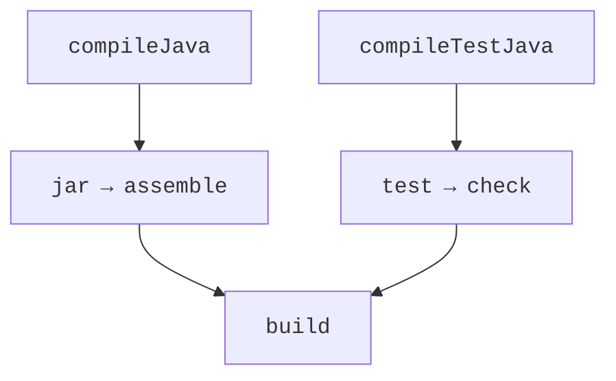

# The same project in Gradle

## Example 3. The same code in Gradle

The Loan and LoanTest code stays unchanged. For comparison, create a separate copy of the project and replace the POM with the files below. This shows that the build rules are separate from the domain logic. Do not maintain two independent build files for one product without a designated primary source of versions.

`settings.gradle.kts`:

```kotlin
rootProject.name = "loan"
```

`build.gradle.kts`:

```kotlin
plugins { java; application }
repositories { mavenCentral() }
java {
    toolchain {
        languageVersion.set(JavaLanguageVersion.of(27))
    }
}
tasks.withType<JavaCompile>().configureEach {
    options.release.set(27)
    options.encoding = "UTF-8"
}
dependencies {
    testImplementation(platform("org.junit:junit-bom:6.1.3"))
    testImplementation("org.junit.jupiter:junit-jupiter")
    testRuntimeOnly("org.junit.platform:junit-platform-launcher")
}
tasks.test { useJUnitPlatform() }
application { mainClass.set("ua.knu.loan.Loan") }
```

In the verified configuration, Gradle 9.7.0 runs on JDK 25, while the Java toolchain compiles and tests on JDK 27. These are two different choices. For a local JDK, you can set `org.gradle.java.installations.paths` in `gradle.properties`. Do not copy another machine's absolute path unchanged. <https://docs.gradle.org/current/userguide/compatibility.html>.

```powershell
gradle wrapper --gradle-version 9.7.0
.\gradlew.bat test
.\gradlew.bat run
.\gradlew.bat build
```

The **Wrapper** pins Gradle in the project. The wrapper files are stored in Git, but the local `.gradle` caches are not. To trust the download, you can pin the distribution checksum. After changing the wrapper, check that the build runs in CI too, not just in your own IDE.



Figure 13.7. Gradle executes a graph of task dependencies {.caption}

`implementation` adds a dependency of the main code; `testImplementation` adds one for test code. Gradle plans a graph of tasks rather than a sequence of Maven phases. `build` depends on assembling and checks; `run` is a separate task of the application plugin. UP-TO-DATE means that the tracked inputs and outputs have not changed, not that the task is unnecessary altogether.

### A version catalog and multiple projects

In `gradle/libs.versions.toml`, you can define versions and library aliases. This centralizes how coordinates are written; no automatic update to the newest release happens. Large projects are split into `core` and `cli`, and the dependency between them is declared with `implementation(project(":core"))`.

```toml
[versions]
junit = "6.1.3"

[libraries]
junit-bom = { module = "org.junit:junit-bom", version.ref = "junit" }
junit-jupiter = { module = "org.junit.jupiter:junit-jupiter" }
```

After the catalog is declared, you can use `testImplementation(platform(libs.junit.bom))` and `testImplementation(libs.junit.jupiter)`. The accessor names come from the catalog keys. An entry in the TOML file does not yet add the library to any module.
