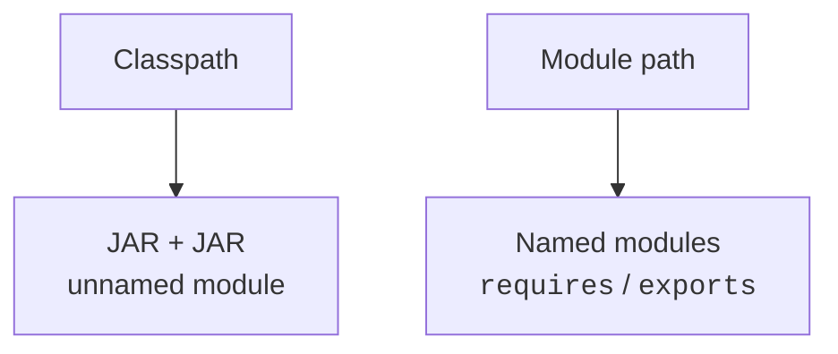
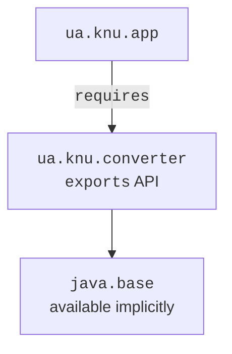
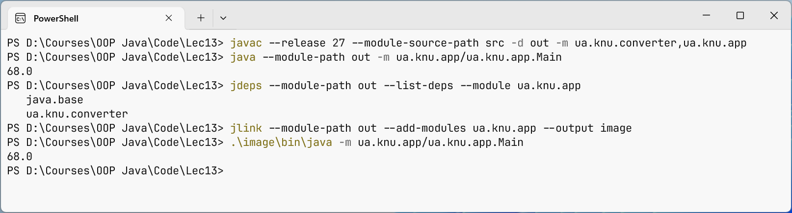

# Classpath and JPMS modules

## From separate files to a reproducible project

The command `javac Main.java` explains compilation well, but a large project has resources, tests, several libraries, and packaging rules. If each developer picks JAR files and launch parameters on their own, the same sources may behave differently. A **build system** records these rules in a file that is stored together with the code.

The **Java Platform Module System** (JPMS) solves a different problem: which modules an application needs and which packages they expose. A Maven module, a Gradle project, and a JPMS module are not synonyms. One Gradle project can build an ordinary JAR without module-info, and a JPMS program can be built manually without Maven.

In this topic, the main tool is Maven 3.9.16, and we look at Gradle 9.7.0 on the same code. JDK 27 compiles and runs the Java code; JUnit 6.1.3 verifies its behavior. As of the verification date, Maven 4.0.0-rc-6 is a pre-release, so the reproducible examples use the stable 3.9 line. <https://maven.apache.org/download.cgi>.

## Classpath and JPMS

The **classpath** is a list of directories and archives in which the JVM looks for classes. Classes from the classpath belong to the unnamed module. Conflicts between identical classes, accidental dependencies on an internal package, and a missing library are often discovered only at launch. A module description makes some of these conditions explicit earlier.



Figure 13.1. The classpath and the module path define different access boundaries {.caption}

A named module has a `module-info.java` file at the root of its sources. The module name is stable and usually resembles a package name, for example `ua.knu.converter`. It does not have to match the JAR file name. A package is a namespace for classes; a module is a unit of dependencies and encapsulation for several packages.

`requires other.module` makes another module readable. `exports some.package` exposes its public API to other modules. The `public` modifier by itself does not get around a closed package. The `java.base` module is available implicitly and needs no requires; for `java.sql` or `java.logging`, the dependency is declared explicitly.

`requires transitive` passes readability on to the users of your API. It is appropriate if a public method returns a type from another module that the client also needs to see. It does not mean "export all classes of the dependency," nor is it an analog of Maven's transitive library download.

`opens` allows deep reflection at runtime. For JavaFX FXML, a controller often opens its package only `to javafx.fxml`, not to all modules. `exports` does not grant reflective access to private fields, and `opens` is not an ordinary permission to import types at compile time.



Figure 13.2. An explicit dependency and the public surface of a library {.caption}

The official JPMS guide: <https://dev.java/learn/modules/>. The command `java --list-modules` shows the modules of the current runtime. Do not assume that a minimal jlink image contains as many modules as a full installed JDK.

## Example 1. Two converter modules

Create the four files shown. The `src` directory contains folders with the exact module names; inside them, packages match the `package` declarations. The public function validates its input before computing, so it can be reused outside the console UI.

`src/ua.knu.converter/module-info.java`:

```java
module ua.knu.converter {
    exports ua.knu.converter;
}
```

`src/ua.knu.converter/ua/knu/converter/Temperature.java`:

```java
package ua.knu.converter;

public final class Temperature {
    private Temperature() {}

    public static double fahrenheit(double celsius) {
        if (!Double.isFinite(celsius) || celsius < -273.15) {
            throw new IllegalArgumentException("Invalid temperature");
        }
        double value = celsius * 9 / 5 + 32;
        if (!Double.isFinite(value)) {
            throw new IllegalArgumentException("Result overflow");
        }
        return value;
    }
}
```

`src/ua.knu.app/module-info.java`:

```java
module ua.knu.app {
    requires ua.knu.converter;
}
```

`src/ua.knu.app/ua/knu/app/Main.java`:

```java
package ua.knu.app;

import ua.knu.converter.Temperature;

public final class Main {
    public static void main(String[] args) {
        System.out.println(Temperature.fahrenheit(20));
    }
}
```

Run the commands in the project root with JDK 27 on the PATH. The `image` directory must not exist before jlink; for a repeated experiment, choose a different name and keep the previous image.

```powershell
javac --release 27 --module-source-path src -d out `
  -m ua.knu.converter,ua.knu.app
java --module-path out -m ua.knu.app/ua.knu.app.Main
jdeps --module-path out --list-deps --module ua.knu.app
jlink --module-path out --add-modules ua.knu.app `
  --output image
.\image\bin\java -m ua.knu.app/ua.knu.app.Main
```

Both program launches print `68.0`. `jdeps` analyzes the static dependencies of the bytecode; it will not guess every class name built from strings for reflection. A jlink image is created for a specific platform and is not a universal Windows/Linux archive. `jpackage` adds the application and a platform launcher to the runtime.



Figure 13.3. Compiling modules and running a custom runtime {.caption}

### Unnamed and automatic modules

A JAR without module-info on the module path becomes an **automatic module**. Its name is determined by `Automatic-Module-Name` or derived from the archive name. For a dependency, it is better to check it with `jar --describe-module --file library.jar` than to guess. The same JAR on the classpath has a different role – the unnamed module.

Automatic modules help with gradual migration, but they have broader access and do not solve every jlink problem. Packages split across modules and dependency cycles should be eliminated. The `--add-opens` and `--add-reads` options are useful for special compatibility scenarios but do not replace a well-thought-out architecture.

`uses` declares consumption of a service, and `provides ... with ...` registers an implementation. `ServiceLoader` finds providers without a hard import of a concrete class. The lab example shows separate API, provider, and client modules.
