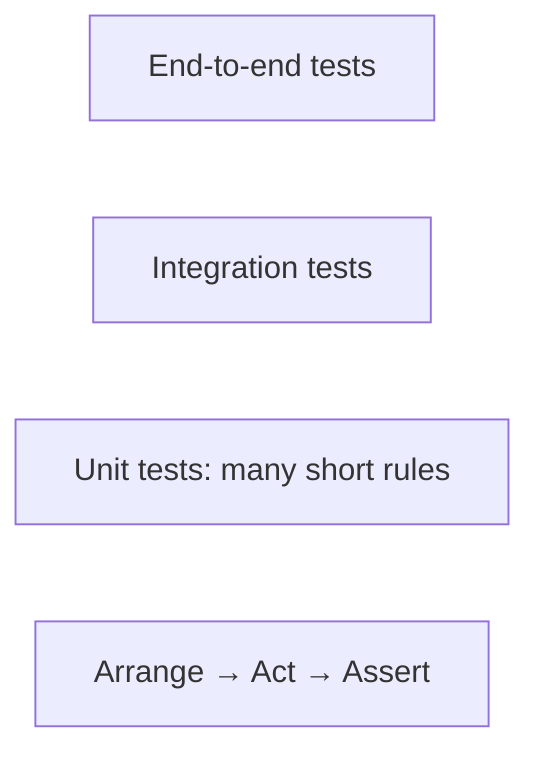

# Testing with JUnit

## JUnit: verifying behavior

The **JUnit Platform** runs test engines, and **Jupiter** provides the programming model for modern tests. JUnit 6 requires Java 17 or later; the course's JDK 27 satisfies this requirement. Do not mix the old `org.junit.Test` import with `org.junit.jupiter.api.Test`. <https://docs.junit.org/current/user-guide/>.

A test following the **Arrange–Act–Assert** pattern first prepares data, performs an action, and then checks the result. The name describes a rule, not a number: `rejectsNegativeAmount` is more useful than `test3`. The expected value should not be computed by the same implementation that is being tested: such a check will repeat its bug.



Figure 13.8. Levels of testing and the structure of a single test {.caption}

`assertTrue` checks a condition, `assertEquals` a value, and `assertThrows` the expected exception type. It also returns the exception for further checks. `assertAll` runs a group of checks and shows all of its failures, not just the first one. A test message should explain the rule, not duplicate the actual result.

`assertTimeout` checks the time after the action has finished; it is not a mechanism for forcibly interrupting a hung service. The preemptive variant uses a different thread and has consequences for thread-local state. Networks and databases need their own driver timeouts. Tests should not depend on the random load of a laptop.

### Lifecycle and independence

`@BeforeEach` prepares a fresh state before each test, and `@AfterEach` cleans up resources. With the default model, `@BeforeAll` must be static. `@DisplayName` sets a readable name; `@Nested` groups scenarios. `@Tag` lets you select checks. `@Disabled` documents a temporary skip, but it does not mean success.

Tests should be fast, independent, repeatable, self-validating, and written in a timely manner – the FIRST principles. Dependence on execution order or on a shared mutable list violates independence. Temporary files and a separate database for the test are better than data from the developer's personal profile.

## Example 4. A parameterized validator

Add the class in `src/main/java/ua/knu/loan/NameValidator.java` and the test in the corresponding package in `src/test/java`. The rule is deliberately simple: after trim, 2–40 characters are required. This is not a universal check of people's names but a training contract for a text field.

```java
package ua.knu.loan;

public final class NameValidator {
    private NameValidator() {}
    public static String normalize(String value) {
        if (value == null) {
            throw new IllegalArgumentException("Missing name");
        }
        String text = value.trim();
        if (text.length() < 2 || text.length() > 40) {
            throw new IllegalArgumentException("Length 2..40");
        }
        return text;
    }
}
```

```java
package ua.knu.loan;

import org.junit.jupiter.api.Nested;
import org.junit.jupiter.api.Test;
import org.junit.jupiter.params.ParameterizedTest;
import org.junit.jupiter.params.provider.CsvSource;
import static org.junit.jupiter.api.Assertions.*;

class NameValidatorTest {
    @ParameterizedTest
    @CsvSource({"'  Olena  ', Olena", "Taras, Taras", "AB, AB"})
    void trimsValidNames(String input, String expected) {
        assertEquals(expected, NameValidator.normalize(input));
    }

    @Nested
    class Invalid {
        @Test
        void rejectsMissing() {
            assertThrows(IllegalArgumentException.class,
                () -> NameValidator.normalize(null));
        }
        @Test
        void rejectsShort() {
            assertThrows(IllegalArgumentException.class,
                () -> NameValidator.normalize(" A "));
        }
    }
}
```

`@CsvSource` creates a separate run for each line. `@ValueSource` is suitable for a single argument, `@EnumSource` for enums, and `@MethodSource` for complex objects. A parameterized test should not hide many different rules in one: each table of examples should check one clear contract.

## IDE, reports, and coverage

In IntelliJ IDEA, open the POM or the Gradle project and wait for synchronization. The Maven tool window shows Lifecycle, Plugins, and Dependencies; the Gradle window shows the task tree. After changing a dependency, run Reload. Adding a JAR manually through Project Structure does not make the command-line build reproducible.

::: info Screenshot
New Project, Maven, JDK 27, groupId and artifactId.
:::

Figure 13.9. Choosing Maven and the JDK when creating a project {.caption}

::: info Screenshot
Maven tool window; expand Lifecycle and JUnit dependency.
:::

Figure 13.10. Maven phases, plugins, and dependencies {.caption}

::: info Screenshot
Gradle Tasks verification/test and application/run.
:::

Figure 13.11. Gradle verification tasks {.caption}

::: info Screenshot
Build file, Add dependency; search junit-jupiter.
:::

Figure 13.12. Searching for a library in the development environment {.caption}

Running a test with the green icon next to it is convenient for a single scenario. Before submitting, run the wrapper from the terminal: the IDE may use a different JDK or its own runner. Surefire reports are in `target/surefire-reports`, and Gradle reports are in `build/reports/tests/test`. Zero tests found is not a confirmation that the program is correct.

::: info Screenshot
Run real tests; temporarily change expected value, show diff.
:::

Figure 13.13. Test results and mismatch diagnostics {.caption}

::: info Screenshot
Run with Coverage; show Loan/NameValidator classes.
:::

Figure 13.14. Coverage of lines executed by the tests {.caption}

High coverage means that the code was executed, but it does not prove the strength of the assertions. A test without any checks can execute every line. The TDD cycle "red → green → refactor" first captures missing behavior with a failing test, then implements it and cleans up the code without changing the contract. Do not deliberately leave a red test in the submitted main suite just for a nice screenshot.

## Common problems

`module not found` means that the required module was not found on the module path or has a different name. `package is not visible` may indicate a missing exports or requires. Putting a modular JAR on the classpath is not equivalent to properly fixing the dependencies, although it sometimes helps with diagnosis.

If no tests are found, check the directory, the class name, the Test import, the Jupiter dependency, and the Surefire configuration or `useJUnitPlatform`. If the program works only in the IDE, compare the JDK, the working directory, resources, and the actual launch arguments. If versions conflict, start with the dependency tree rather than manually deleting random JARs from the cache.
